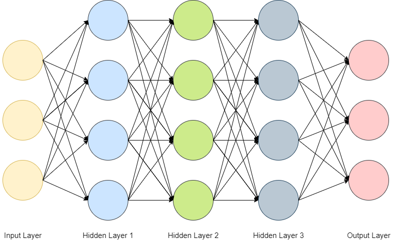
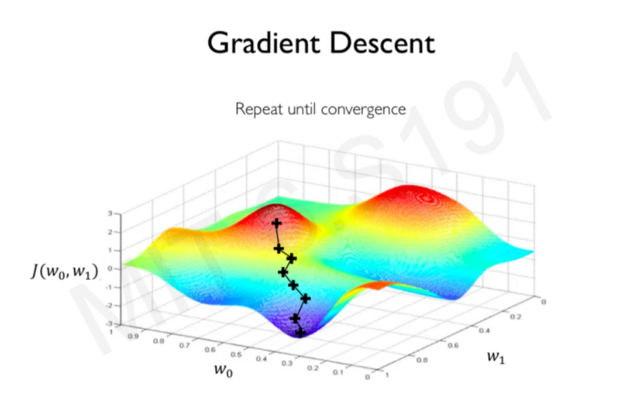

# Contoh Regression 


# Sekilas Tentang Neural Network

### Library yang dibutuhkan

Di sini menggunakan Framework Tensorflow
Library yang akan digunakan adalah **pandas, numpy, matplotlib, seaborn, sklearn, dan tensorflow**. Jika belum diinstall, silahkan diinstal dahulu dengan mengetikkan `pip install nama-library` pada anaconda prompt.

note: Library tensorflow cukup besar sizenya, sekitar 300MB.


```python
%matplotlib inline
import numpy as np
import pandas as pd
import seaborn as sns
import matplotlib.pyplot as plt
import tensorflow as tf
```

  

### Sedikit penjelasan mengenai Deep Neural Network

**Neural network** adalah sebuah model yang berisikan node atau neuron atau perceptron yang saling terhubung dengan dengan node lain melalui koneksi yang disebut penimbang atau weight. Neural network terbagi menjadi tiga bagian utama:
Input Layer
Hidden Layer
Output Layer

Deep Neural Network (DNN) adalah perluasan dari metode neural network. Perbedaannya adalah dalam DNN mempunyai **lebih dari dua hidden layer**. 


### Activation Function

Activation function berfungsi untuk menentukan apakah neuron tersebut harus aktif atau tidak.
Activation yang biasanya digunakan:

    sigmoid = untuk binary classification
    tanh    = untuk binary classification
    softmax = untuk categorical classification
    ReLU
   lainnya bisa dilihat di `https://en.wikipedia.org/wiki/Activation_function`

 

### Loss Function 

Loss Functioin berfungsi untuk mengukur seberapa besar nilai error yang dihasilkan dari output terhadap nilai aslinya.
Loss function yang biasa digunakan adalah `binary_corssentropy`, `categorical_crossentropy` -> untuk klasifikasi. dan `mse` untuk regresi.

### Backpropagation

Mudahnya backpropagation adalah suatu cara untuk menyesuaikan penimbang dan bias yang dihasilkan untuk meminimalisir error pada output.

Caranya adalah
1. Menghitung nilai error menggunakan loss function
2. Hitung gradien dari loss funtion tersebut


3. Update parameter bias dan penimbang dari hasil gradien yang didapatkan

nb: belum terlalu paham dengan backpropagation

Optimizer yang biasa digunakan adalah `adam`, `rmsprop`

Penjelasannya juga bisa dilihat di sini `https://medium.com/@samuelsena/pengenalan-deep-learning-part-3-backpropagation-algorithm-720be9a5fbb8` dan bisa juga search sendiri ya

# Contoh  Regression

Import Data


```python
df = pd.read_csv('california_housing_sklearn.csv')
```


```python
df.head()
```


<div>
<style scoped>
    .dataframe tbody tr th:only-of-type {
        vertical-align: middle;
    }

    .dataframe tbody tr th {
        vertical-align: top;
    }

    .dataframe thead th {
        text-align: right;
    }
</style>
<table border="1" class="dataframe">
  <thead>
    <tr style="text-align: right;">
      <th></th>
      <th>MedInc</th>
      <th>HouseAge</th>
      <th>AveRooms</th>
      <th>AveBedrms</th>
      <th>Population</th>
      <th>AveOccup</th>
      <th>Latitude</th>
      <th>Longitude</th>
      <th>SalePrice</th>
    </tr>
  </thead>
  <tbody>
    <tr>
      <th>0</th>
      <td>8.3252</td>
      <td>41.0</td>
      <td>6.984127</td>
      <td>1.023810</td>
      <td>322.0</td>
      <td>2.555556</td>
      <td>37.88</td>
      <td>-122.23</td>
      <td>4.526</td>
    </tr>
    <tr>
      <th>1</th>
      <td>8.3014</td>
      <td>21.0</td>
      <td>6.238137</td>
      <td>0.971880</td>
      <td>2401.0</td>
      <td>2.109842</td>
      <td>37.86</td>
      <td>-122.22</td>
      <td>3.585</td>
    </tr>
    <tr>
      <th>2</th>
      <td>7.2574</td>
      <td>52.0</td>
      <td>8.288136</td>
      <td>1.073446</td>
      <td>496.0</td>
      <td>2.802260</td>
      <td>37.85</td>
      <td>-122.24</td>
      <td>3.521</td>
    </tr>
    <tr>
      <th>3</th>
      <td>5.6431</td>
      <td>52.0</td>
      <td>5.817352</td>
      <td>1.073059</td>
      <td>558.0</td>
      <td>2.547945</td>
      <td>37.85</td>
      <td>-122.25</td>
      <td>3.413</td>
    </tr>
    <tr>
      <th>4</th>
      <td>3.8462</td>
      <td>52.0</td>
      <td>6.281853</td>
      <td>1.081081</td>
      <td>565.0</td>
      <td>2.181467</td>
      <td>37.85</td>
      <td>-122.25</td>
      <td>3.422</td>
    </tr>
  </tbody>
</table>
</div>


Kita akan meregresikan SalePrice (Y) dengan variable independent MedInc, HouseAge, AveRooms, AveBedrms, Population, dan AveOccup.


```python
df.isnull().sum()
```


    MedInc        0
    HouseAge      0
    AveRooms      0
    AveBedrms     0
    Population    0
    AveOccup      0
    Latitude      0
    Longitude     0
    SalePrice     0
    dtype: int64


```python
df.describe().transpose()
```


<div>
<style scoped>
    .dataframe tbody tr th:only-of-type {
        vertical-align: middle;
    }

    .dataframe tbody tr th {
        vertical-align: top;
    }

    .dataframe thead th {
        text-align: right;
    }
</style>
<table border="1" class="dataframe">
  <thead>
    <tr style="text-align: right;">
      <th></th>
      <th>count</th>
      <th>mean</th>
      <th>std</th>
      <th>min</th>
      <th>25%</th>
      <th>50%</th>
      <th>75%</th>
      <th>max</th>
    </tr>
  </thead>
  <tbody>
    <tr>
      <th>MedInc</th>
      <td>20640.0</td>
      <td>3.870671</td>
      <td>1.899822</td>
      <td>0.499900</td>
      <td>2.563400</td>
      <td>3.534800</td>
      <td>4.743250</td>
      <td>15.000100</td>
    </tr>
    <tr>
      <th>HouseAge</th>
      <td>20640.0</td>
      <td>28.639486</td>
      <td>12.585558</td>
      <td>1.000000</td>
      <td>18.000000</td>
      <td>29.000000</td>
      <td>37.000000</td>
      <td>52.000000</td>
    </tr>
    <tr>
      <th>AveRooms</th>
      <td>20640.0</td>
      <td>5.429000</td>
      <td>2.474173</td>
      <td>0.846154</td>
      <td>4.440716</td>
      <td>5.229129</td>
      <td>6.052381</td>
      <td>141.909091</td>
    </tr>
    <tr>
      <th>AveBedrms</th>
      <td>20640.0</td>
      <td>1.096675</td>
      <td>0.473911</td>
      <td>0.333333</td>
      <td>1.006079</td>
      <td>1.048780</td>
      <td>1.099526</td>
      <td>34.066667</td>
    </tr>
    <tr>
      <th>Population</th>
      <td>20640.0</td>
      <td>1425.476744</td>
      <td>1132.462122</td>
      <td>3.000000</td>
      <td>787.000000</td>
      <td>1166.000000</td>
      <td>1725.000000</td>
      <td>35682.000000</td>
    </tr>
    <tr>
      <th>AveOccup</th>
      <td>20640.0</td>
      <td>3.070655</td>
      <td>10.386050</td>
      <td>0.692308</td>
      <td>2.429741</td>
      <td>2.818116</td>
      <td>3.282261</td>
      <td>1243.333333</td>
    </tr>
    <tr>
      <th>Latitude</th>
      <td>20640.0</td>
      <td>35.631861</td>
      <td>2.135952</td>
      <td>32.540000</td>
      <td>33.930000</td>
      <td>34.260000</td>
      <td>37.710000</td>
      <td>41.950000</td>
    </tr>
    <tr>
      <th>Longitude</th>
      <td>20640.0</td>
      <td>-119.569704</td>
      <td>2.003532</td>
      <td>-124.350000</td>
      <td>-121.800000</td>
      <td>-118.490000</td>
      <td>-118.010000</td>
      <td>-114.310000</td>
    </tr>
    <tr>
      <th>SalePrice</th>
      <td>20640.0</td>
      <td>2.068558</td>
      <td>1.153956</td>
      <td>0.149990</td>
      <td>1.196000</td>
      <td>1.797000</td>
      <td>2.647250</td>
      <td>5.000010</td>
    </tr>
  </tbody>
</table>
</div>


#### Distribution Plot dari Sale Price


```python
plt.figure(figsize=(10,8))
sns.distplot(df['SalePrice'])
```

    C:\Users\ASUS\anaconda3\lib\site-packages\seaborn\distributions.py:2551: FutureWarning: `distplot` is a deprecated function and will be removed in a future version. Please adapt your code to use either `displot` (a figure-level function with similar flexibility) or `histplot` (an axes-level function for histograms).
      warnings.warn(msg, FutureWarning)
    


    <AxesSubplot:xlabel='SalePrice', ylabel='Density'>


#### Korelasi


```python
df.corr()
```


<div>
<style scoped>
    .dataframe tbody tr th:only-of-type {
        vertical-align: middle;
    }

    .dataframe tbody tr th {
        vertical-align: top;
    }

    .dataframe thead th {
        text-align: right;
    }
</style>
<table border="1" class="dataframe">
  <thead>
    <tr style="text-align: right;">
      <th></th>
      <th>MedInc</th>
      <th>HouseAge</th>
      <th>AveRooms</th>
      <th>AveBedrms</th>
      <th>Population</th>
      <th>AveOccup</th>
      <th>Latitude</th>
      <th>Longitude</th>
      <th>SalePrice</th>
    </tr>
  </thead>
  <tbody>
    <tr>
      <th>MedInc</th>
      <td>1.000000</td>
      <td>-0.119034</td>
      <td>0.326895</td>
      <td>-0.062040</td>
      <td>0.004834</td>
      <td>0.018766</td>
      <td>-0.079809</td>
      <td>-0.015176</td>
      <td>0.688075</td>
    </tr>
    <tr>
      <th>HouseAge</th>
      <td>-0.119034</td>
      <td>1.000000</td>
      <td>-0.153277</td>
      <td>-0.077747</td>
      <td>-0.296244</td>
      <td>0.013191</td>
      <td>0.011173</td>
      <td>-0.108197</td>
      <td>0.105623</td>
    </tr>
    <tr>
      <th>AveRooms</th>
      <td>0.326895</td>
      <td>-0.153277</td>
      <td>1.000000</td>
      <td>0.847621</td>
      <td>-0.072213</td>
      <td>-0.004852</td>
      <td>0.106389</td>
      <td>-0.027540</td>
      <td>0.151948</td>
    </tr>
    <tr>
      <th>AveBedrms</th>
      <td>-0.062040</td>
      <td>-0.077747</td>
      <td>0.847621</td>
      <td>1.000000</td>
      <td>-0.066197</td>
      <td>-0.006181</td>
      <td>0.069721</td>
      <td>0.013344</td>
      <td>-0.046701</td>
    </tr>
    <tr>
      <th>Population</th>
      <td>0.004834</td>
      <td>-0.296244</td>
      <td>-0.072213</td>
      <td>-0.066197</td>
      <td>1.000000</td>
      <td>0.069863</td>
      <td>-0.108785</td>
      <td>0.099773</td>
      <td>-0.024650</td>
    </tr>
    <tr>
      <th>AveOccup</th>
      <td>0.018766</td>
      <td>0.013191</td>
      <td>-0.004852</td>
      <td>-0.006181</td>
      <td>0.069863</td>
      <td>1.000000</td>
      <td>0.002366</td>
      <td>0.002476</td>
      <td>-0.023737</td>
    </tr>
    <tr>
      <th>Latitude</th>
      <td>-0.079809</td>
      <td>0.011173</td>
      <td>0.106389</td>
      <td>0.069721</td>
      <td>-0.108785</td>
      <td>0.002366</td>
      <td>1.000000</td>
      <td>-0.924664</td>
      <td>-0.144160</td>
    </tr>
    <tr>
      <th>Longitude</th>
      <td>-0.015176</td>
      <td>-0.108197</td>
      <td>-0.027540</td>
      <td>0.013344</td>
      <td>0.099773</td>
      <td>0.002476</td>
      <td>-0.924664</td>
      <td>1.000000</td>
      <td>-0.045967</td>
    </tr>
    <tr>
      <th>SalePrice</th>
      <td>0.688075</td>
      <td>0.105623</td>
      <td>0.151948</td>
      <td>-0.046701</td>
      <td>-0.024650</td>
      <td>-0.023737</td>
      <td>-0.144160</td>
      <td>-0.045967</td>
      <td>1.000000</td>
    </tr>
  </tbody>
</table>
</div>


```python
df.corr()['SalePrice'].sort_values()
```


    Latitude     -0.144160
    AveBedrms    -0.046701
    Longitude    -0.045967
    Population   -0.024650
    AveOccup     -0.023737
    HouseAge      0.105623
    AveRooms      0.151948
    MedInc        0.688075
    SalePrice     1.000000
    Name: SalePrice, dtype: float64


#### Scatter Plot


```python
sns.scatterplot(x='AveRooms', y='SalePrice', data=df)
```


    <AxesSubplot:xlabel='AveRooms', ylabel='SalePrice'>


```python
sns.scatterplot(x='Longitude', y='Latitude', data=df, edgecolor=None, alpha=0.2, hue='SalePrice')
```


    <AxesSubplot:xlabel='Longitude', ylabel='Latitude'>


### Creating a model


```python
data=df.drop(['Longitude', 'Latitude'], axis=1) #Membuang variabel Longitude dan Latitude #axis=1 untuk kolom, axis=0 untuk baris
```


```python
data.head()
```


<div>
<style scoped>
    .dataframe tbody tr th:only-of-type {
        vertical-align: middle;
    }

    .dataframe tbody tr th {
        vertical-align: top;
    }

    .dataframe thead th {
        text-align: right;
    }
</style>
<table border="1" class="dataframe">
  <thead>
    <tr style="text-align: right;">
      <th></th>
      <th>MedInc</th>
      <th>HouseAge</th>
      <th>AveRooms</th>
      <th>AveBedrms</th>
      <th>Population</th>
      <th>AveOccup</th>
      <th>SalePrice</th>
    </tr>
  </thead>
  <tbody>
    <tr>
      <th>0</th>
      <td>8.3252</td>
      <td>41.0</td>
      <td>6.984127</td>
      <td>1.023810</td>
      <td>322.0</td>
      <td>2.555556</td>
      <td>4.526</td>
    </tr>
    <tr>
      <th>1</th>
      <td>8.3014</td>
      <td>21.0</td>
      <td>6.238137</td>
      <td>0.971880</td>
      <td>2401.0</td>
      <td>2.109842</td>
      <td>3.585</td>
    </tr>
    <tr>
      <th>2</th>
      <td>7.2574</td>
      <td>52.0</td>
      <td>8.288136</td>
      <td>1.073446</td>
      <td>496.0</td>
      <td>2.802260</td>
      <td>3.521</td>
    </tr>
    <tr>
      <th>3</th>
      <td>5.6431</td>
      <td>52.0</td>
      <td>5.817352</td>
      <td>1.073059</td>
      <td>558.0</td>
      <td>2.547945</td>
      <td>3.413</td>
    </tr>
    <tr>
      <th>4</th>
      <td>3.8462</td>
      <td>52.0</td>
      <td>6.281853</td>
      <td>1.081081</td>
      <td>565.0</td>
      <td>2.181467</td>
      <td>3.422</td>
    </tr>
  </tbody>
</table>
</div>


```python
X = data.drop('SalePrice', axis=1).values
y = data['SalePrice']
```


```python
from sklearn.model_selection import train_test_split
```


```python
#Split data menjadi data training dan testing

X_train, X_test, y_train, y_test = train_test_split(X,y,test_size=0.3,random_state=221810445)
```

#### Normalizing (MinMaxScaler)


```python
from sklearn.preprocessing import MinMaxScaler
```


```python
scaler = MinMaxScaler()
```


```python
X_train= scaler.fit_transform(X_train)
```


```python
X_test = scaler.transform(X_test)
```


```python
X_train.shape #ada 6 kolom dan 14449 baris
```


    (14448, 6)


### Creating Model


```python
from tensorflow.keras.models import Sequential
from tensorflow.keras.layers import Dense, Activation
from tensorflow.keras.optimizers import Adam
```


```python
model = Sequential()

model.add(Dense(6,activation='relu')) #input layer
model.add(Dense(6,activation='relu')) #hidden layer
model.add(Dense(1)) #output layer

model.compile(optimizer='adam',loss='mse') 
```

Banyaknya hidden layer itu tidak ada patokannya, akan tetapi semakin rumit permasalahan, semakin banyak hidden layer. 
`https://stats.stackexchange.com/questions/181/how-to-choose-the-number-of-hidden-layers-and-nodes-in-a-feedforward-neural-netw`

### Training Model 

`batch size` adalah jumlah batch datanya (jadi datanya dipecah menjadi beberapa batch), semakin sedikit jumlah batch semakin lama runningnya. Batch berguna untuk data yang berukuran besar. Jumlah batch biasanya 2^n.

`epochs` adalah iterasi untuk update penimbang dan bias. 1 epoch sama dengan menjalankan network dari input sampai ke output. epoch ke 2 (iterasi ke-2) meng-update penimbang dan bias kemudian menjalankan networknya lagi, dst. Standarnya berapa? kira-kira aja wkwkwk nnti diganti2 aja jumlahnya


```python
model.fit(x=X_train,
          y=y_train.values,
          validation_data=(X_test,y_test.values),
          batch_size=32,epochs=400)

#kalau ada error, coba di bagian deklarasi variabel X dan y, belakangnya ditambahin/diilangin values(), yg ini misal e X = data.drop('SalePrice', axis=1).values()
```

    Epoch 1/400
    452/452 [==============================] - 1s 2ms/step - loss: 2.3362 - val_loss: 1.0455
    Epoch 2/400
    452/452 [==============================] - 1s 1ms/step - loss: 0.9626 - val_loss: 0.8832
    Epoch 3/400
    452/452 [==============================] - 1s 1ms/step - loss: 0.8037 - val_loss: 0.7338
    Epoch 4/400
    452/452 [==============================] - 0s 1ms/step - loss: 0.6964 - val_loss: 0.6705
    Epoch 5/400
    452/452 [==============================] - 1s 1ms/step - loss: 0.6615 - val_loss: 0.6497
    Epoch 6/400
    452/452 [==============================] - 1s 2ms/step - loss: 0.6513 - val_loss: 0.6493
    Epoch 7/400
    452/452 [==============================] - 0s 1ms/step - loss: 0.6468 - val_loss: 0.6419
    Epoch 8/400
    452/452 [==============================] - 1s 1ms/step - loss: 0.6437 - val_loss: 0.6374
    Epoch 9/400
    452/452 [==============================] - 0s 997us/step - loss: 0.6424 - val_loss: 0.6360
    Epoch 10/400
    452/452 [==============================] - 1s 1ms/step - loss: 0.6398 - val_loss: 0.6348
    Epoch 11/400
    452/452 [==============================] - 1s 1ms/step - loss: 0.6375 - val_loss: 0.6322
    Epoch 12/400
    452/452 [==============================] - 1s 1ms/step - loss: 0.6357 - val_loss: 0.6341
    Epoch 13/400
    452/452 [==============================] - 0s 1ms/step - loss: 0.6326 - val_loss: 0.6323
    Epoch 14/400
    452/452 [==============================] - 0s 1ms/step - loss: 0.6303 - val_loss: 0.6288
    Epoch 15/400
    452/452 [==============================] - 0s 1ms/step - loss: 0.6278 - val_loss: 0.6226
    Epoch 16/400
    452/452 [==============================] - 0s 1ms/step - loss: 0.6230 - val_loss: 0.6179
    Epoch 17/400
    452/452 [==============================] - 0s 958us/step - loss: 0.6176 - val_loss: 0.6132
    Epoch 18/400
    452/452 [==============================] - 0s 854us/step - loss: 0.6120 - val_loss: 0.6081
    Epoch 19/400
    452/452 [==============================] - 0s 911us/step - loss: 0.6067 - val_loss: 0.6023
    Epoch 20/400
    452/452 [==============================] - 0s 849us/step - loss: 0.6019 - val_loss: 0.5983
    Epoch 21/400
    452/452 [==============================] - 0s 876us/step - loss: 0.5963 - val_loss: 0.5921
    Epoch 22/400
    452/452 [==============================] - 0s 889us/step - loss: 0.5902 - val_loss: 0.5869
    Epoch 23/400
    452/452 [==============================] - 0s 849us/step - loss: 0.5852 - val_loss: 0.5826
    Epoch 24/400
    452/452 [==============================] - 0s 913us/step - loss: 0.5787 - val_loss: 0.5778
    Epoch 25/400
    452/452 [==============================] - 0s 877us/step - loss: 0.5740 - val_loss: 0.5713
    Epoch 26/400
    452/452 [==============================] - 0s 1ms/step - loss: 0.5696 - val_loss: 0.5667
    Epoch 27/400
    452/452 [==============================] - 0s 920us/step - loss: 0.5654 - val_loss: 0.5642
    Epoch 28/400
    452/452 [==============================] - 0s 891us/step - loss: 0.5589 - val_loss: 0.5592
    Epoch 29/400
    452/452 [==============================] - 0s 1ms/step - loss: 0.5550 - val_loss: 0.5587
    Epoch 30/400
    452/452 [==============================] - 0s 896us/step - loss: 0.5511 - val_loss: 0.5524
    Epoch 31/400
    452/452 [==============================] - 0s 852us/step - loss: 0.5478 - val_loss: 0.5503
    Epoch 32/400
    452/452 [==============================] - 0s 922us/step - loss: 0.5439 - val_loss: 0.5508
    Epoch 33/400
    452/452 [==============================] - 0s 854us/step - loss: 0.5418 - val_loss: 0.5461
    Epoch 34/400
    452/452 [==============================] - 0s 920us/step - loss: 0.5388 - val_loss: 0.5436
    Epoch 35/400
    452/452 [==============================] - 0s 854us/step - loss: 0.5363 - val_loss: 0.5414
    Epoch 36/400
    452/452 [==============================] - 0s 876us/step - loss: 0.5328 - val_loss: 0.5413
    Epoch 37/400
    452/452 [==============================] - 0s 960us/step - loss: 0.5313 - val_loss: 0.5393
    Epoch 38/400
    452/452 [==============================] - 0s 852us/step - loss: 0.5296 - val_loss: 0.5357
    Epoch 39/400
    452/452 [==============================] - 0s 894us/step - loss: 0.5273 - val_loss: 0.5343
    Epoch 40/400
    452/452 [==============================] - 0s 1ms/step - loss: 0.5257 - val_loss: 0.5326
    Epoch 41/400
    452/452 [==============================] - 1s 1ms/step - loss: 0.5243 - val_loss: 0.5314
    Epoch 42/400
    452/452 [==============================] - 0s 913us/step - loss: 0.5233 - val_loss: 0.5307
    Epoch 43/400
    452/452 [==============================] - 0s 874us/step - loss: 0.5211 - val_loss: 0.5311
    Epoch 44/400
    452/452 [==============================] - 0s 933us/step - loss: 0.5199 - val_loss: 0.5298
    Epoch 45/400
    452/452 [==============================] - 0s 861us/step - loss: 0.5182 - val_loss: 0.5341
    Epoch 46/400
    452/452 [==============================] - 0s 892us/step - loss: 0.5175 - val_loss: 0.5309
    Epoch 47/400
    452/452 [==============================] - 0s 869us/step - loss: 0.5155 - val_loss: 0.5262
    Epoch 48/400
    452/452 [==============================] - 0s 861us/step - loss: 0.5152 - val_loss: 0.5269
    Epoch 49/400
    452/452 [==============================] - 0s 916us/step - loss: 0.5136 - val_loss: 0.5239
    Epoch 50/400
    452/452 [==============================] - 0s 849us/step - loss: 0.5141 - val_loss: 0.5307
    Epoch 51/400
    452/452 [==============================] - 0s 861us/step - loss: 0.5119 - val_loss: 0.5330
    Epoch 52/400
    452/452 [==============================] - 0s 913us/step - loss: 0.5119 - val_loss: 0.5207
    Epoch 53/400
    452/452 [==============================] - 0s 880us/step - loss: 0.5097 - val_loss: 0.5216
    Epoch 54/400
    452/452 [==============================] - 0s 902us/step - loss: 0.5086 - val_loss: 0.5212
    Epoch 55/400
    452/452 [==============================] - 0s 849us/step - loss: 0.5076 - val_loss: 0.5225
    Epoch 56/400
    452/452 [==============================] - 0s 898us/step - loss: 0.5073 - val_loss: 0.5184
    Epoch 57/400
    452/452 [==============================] - 0s 949us/step - loss: 0.5064 - val_loss: 0.5258
    Epoch 58/400
    452/452 [==============================] - 0s 977us/step - loss: 0.5058 - val_loss: 0.5185
    Epoch 59/400
    452/452 [==============================] - 0s 1ms/step - loss: 0.5048 - val_loss: 0.5169
    Epoch 60/400
    452/452 [==============================] - 0s 881us/step - loss: 0.5048 - val_loss: 0.5150
    Epoch 61/400
    452/452 [==============================] - 0s 1ms/step - loss: 0.5028 - val_loss: 0.5167
    Epoch 62/400
    452/452 [==============================] - 0s 918us/step - loss: 0.5023 - val_loss: 0.5109
    Epoch 63/400
    452/452 [==============================] - 0s 866us/step - loss: 0.5004 - val_loss: 0.5122
    Epoch 64/400
    452/452 [==============================] - 0s 940us/step - loss: 0.4991 - val_loss: 0.5111
    Epoch 65/400
    452/452 [==============================] - 0s 1ms/step - loss: 0.4985 - val_loss: 0.5086
    Epoch 66/400
    452/452 [==============================] - 0s 889us/step - loss: 0.4969 - val_loss: 0.5093
    Epoch 67/400
    452/452 [==============================] - 0s 1ms/step - loss: 0.4974 - val_loss: 0.5151
    Epoch 68/400
    452/452 [==============================] - 1s 1ms/step - loss: 0.4973 - val_loss: 0.5060
    Epoch 69/400
    452/452 [==============================] - 0s 1ms/step - loss: 0.4964 - val_loss: 0.5156
    Epoch 70/400
    452/452 [==============================] - 0s 1ms/step - loss: 0.4967 - val_loss: 0.5043
    Epoch 71/400
    452/452 [==============================] - 0s 1ms/step - loss: 0.4956 - val_loss: 0.5029
    Epoch 72/400
    452/452 [==============================] - 0s 843us/step - loss: 0.4923 - val_loss: 0.5043
    Epoch 73/400
    452/452 [==============================] - 0s 891us/step - loss: 0.4918 - val_loss: 0.5013
    Epoch 74/400
    452/452 [==============================] - 0s 878us/step - loss: 0.4908 - val_loss: 0.4980
    Epoch 75/400
    452/452 [==============================] - 0s 855us/step - loss: 0.4898 - val_loss: 0.5001
    Epoch 76/400
    452/452 [==============================] - 0s 1ms/step - loss: 0.4879 - val_loss: 0.4948
    Epoch 77/400
    452/452 [==============================] - 0s 849us/step - loss: 0.4891 - val_loss: 0.5028
    Epoch 78/400
    452/452 [==============================] - 0s 867us/step - loss: 0.4865 - val_loss: 0.4950
    Epoch 79/400
    452/452 [==============================] - 0s 909us/step - loss: 0.4855 - val_loss: 0.4907
    Epoch 80/400
    452/452 [==============================] - 0s 849us/step - loss: 0.4843 - val_loss: 0.4886
    Epoch 81/400
    452/452 [==============================] - 0s 896us/step - loss: 0.4838 - val_loss: 0.4878
    Epoch 82/400
    452/452 [==============================] - 0s 825us/step - loss: 0.4831 - val_loss: 0.4985
    Epoch 83/400
    452/452 [==============================] - 0s 834us/step - loss: 0.4816 - val_loss: 0.4885
    Epoch 84/400
    452/452 [==============================] - 0s 909us/step - loss: 0.4817 - val_loss: 0.4892
    Epoch 85/400
    452/452 [==============================] - 0s 849us/step - loss: 0.4812 - val_loss: 0.4864
    Epoch 86/400
    452/452 [==============================] - 0s 858us/step - loss: 0.4790 - val_loss: 0.4939
    Epoch 87/400
    452/452 [==============================] - 0s 863us/step - loss: 0.4805 - val_loss: 0.4827
    Epoch 88/400
    452/452 [==============================] - 0s 843us/step - loss: 0.4775 - val_loss: 0.4926
    Epoch 89/400
    452/452 [==============================] - 0s 916us/step - loss: 0.4774 - val_loss: 0.4864
    Epoch 90/400
    452/452 [==============================] - 0s 889us/step - loss: 0.4774 - val_loss: 0.4813
    Epoch 91/400
    452/452 [==============================] - 0s 836us/step - loss: 0.4763 - val_loss: 0.4821
    Epoch 92/400
    452/452 [==============================] - 0s 885us/step - loss: 0.4762 - val_loss: 0.4863
    Epoch 93/400
    452/452 [==============================] - 0s 870us/step - loss: 0.4745 - val_loss: 0.4813
    Epoch 94/400
    452/452 [==============================] - 0s 920us/step - loss: 0.4742 - val_loss: 0.4802
    Epoch 95/400
    452/452 [==============================] - 0s 830us/step - loss: 0.4737 - val_loss: 0.4827
    Epoch 96/400
    452/452 [==============================] - 0s 850us/step - loss: 0.4722 - val_loss: 0.4832
    Epoch 97/400
    452/452 [==============================] - 0s 945us/step - loss: 0.4718 - val_loss: 0.4848
    Epoch 98/400
    452/452 [==============================] - 0s 858us/step - loss: 0.4720 - val_loss: 0.4931
    Epoch 99/400
    452/452 [==============================] - 0s 857us/step - loss: 0.4717 - val_loss: 0.4754
    Epoch 100/400
    452/452 [==============================] - 0s 896us/step - loss: 0.4726 - val_loss: 0.4779
    Epoch 101/400
    452/452 [==============================] - 0s 849us/step - loss: 0.4705 - val_loss: 0.4765
    Epoch 102/400
    452/452 [==============================] - 0s 913us/step - loss: 0.4713 - val_loss: 0.4776
    Epoch 103/400
    452/452 [==============================] - 0s 838us/step - loss: 0.4688 - val_loss: 0.4747
    Epoch 104/400
    452/452 [==============================] - 0s 838us/step - loss: 0.4689 - val_loss: 0.4770
    Epoch 105/400
    452/452 [==============================] - 0s 900us/step - loss: 0.4684 - val_loss: 0.4730
    Epoch 106/400
    452/452 [==============================] - 0s 847us/step - loss: 0.4687 - val_loss: 0.4732
    Epoch 107/400
    452/452 [==============================] - 0s 836us/step - loss: 0.4683 - val_loss: 0.4756
    Epoch 108/400
    452/452 [==============================] - 1s 1ms/step - loss: 0.4680 - val_loss: 0.4739
    Epoch 109/400
    452/452 [==============================] - 0s 964us/step - loss: 0.4685 - val_loss: 0.4934
    Epoch 110/400
    452/452 [==============================] - 0s 1ms/step - loss: 0.4666 - val_loss: 0.4815
    Epoch 111/400
    452/452 [==============================] - 0s 980us/step - loss: 0.4670 - val_loss: 0.4714
    Epoch 112/400
    452/452 [==============================] - 0s 894us/step - loss: 0.4655 - val_loss: 0.4815
    Epoch 113/400
    452/452 [==============================] - 0s 878us/step - loss: 0.4669 - val_loss: 0.4695
    Epoch 114/400
    452/452 [==============================] - 0s 1ms/step - loss: 0.4647 - val_loss: 0.4749
    Epoch 115/400
    452/452 [==============================] - 0s 907us/step - loss: 0.4643 - val_loss: 0.4695
    Epoch 116/400
    452/452 [==============================] - 0s 1ms/step - loss: 0.4626 - val_loss: 0.4707
    Epoch 117/400
    452/452 [==============================] - 0s 1ms/step - loss: 0.4642 - val_loss: 0.4688
    Epoch 118/400
    452/452 [==============================] - 0s 982us/step - loss: 0.4620 - val_loss: 0.4744
    Epoch 119/400
    452/452 [==============================] - 0s 947us/step - loss: 0.4629 - val_loss: 0.4827
    Epoch 120/400
    452/452 [==============================] - 0s 872us/step - loss: 0.4632 - val_loss: 0.4673
    Epoch 121/400
    452/452 [==============================] - 0s 942us/step - loss: 0.4621 - val_loss: 0.4676
    Epoch 122/400
    452/452 [==============================] - 0s 920us/step - loss: 0.4615 - val_loss: 0.4704
    Epoch 123/400
    452/452 [==============================] - 0s 922us/step - loss: 0.4610 - val_loss: 0.4684
    Epoch 124/400
    452/452 [==============================] - 0s 949us/step - loss: 0.4622 - val_loss: 0.4656
    Epoch 125/400
    452/452 [==============================] - 0s 905us/step - loss: 0.4600 - val_loss: 0.4663
    Epoch 126/400
    452/452 [==============================] - 0s 872us/step - loss: 0.4599 - val_loss: 0.4652
    Epoch 127/400
    452/452 [==============================] - 0s 942us/step - loss: 0.4601 - val_loss: 0.4700
    Epoch 128/400
    452/452 [==============================] - 0s 853us/step - loss: 0.4579 - val_loss: 0.4667
    Epoch 129/400
    452/452 [==============================] - 0s 898us/step - loss: 0.4588 - val_loss: 0.4670
    Epoch 130/400
    452/452 [==============================] - 0s 854us/step - loss: 0.4587 - val_loss: 0.4735
    Epoch 131/400
    452/452 [==============================] - 0s 925us/step - loss: 0.4577 - val_loss: 0.4650
    Epoch 132/400
    452/452 [==============================] - 0s 955us/step - loss: 0.4600 - val_loss: 0.4722
    Epoch 133/400
    452/452 [==============================] - 0s 1ms/step - loss: 0.4590 - val_loss: 0.4619
    Epoch 134/400
    452/452 [==============================] - 1s 1ms/step - loss: 0.4577 - val_loss: 0.4632
    Epoch 135/400
    452/452 [==============================] - 0s 973us/step - loss: 0.4558 - val_loss: 0.4624
    Epoch 136/400
    452/452 [==============================] - 0s 960us/step - loss: 0.4558 - val_loss: 0.4616
    Epoch 137/400
    452/452 [==============================] - 0s 912us/step - loss: 0.4558 - val_loss: 0.4649
    Epoch 138/400
    452/452 [==============================] - 0s 902us/step - loss: 0.4576 - val_loss: 0.4618
    Epoch 139/400
    452/452 [==============================] - 0s 980us/step - loss: 0.4550 - val_loss: 0.4646
    Epoch 140/400
    452/452 [==============================] - 0s 905us/step - loss: 0.4553 - val_loss: 0.4609
    Epoch 141/400
    452/452 [==============================] - 0s 1ms/step - loss: 0.4553 - val_loss: 0.4588
    Epoch 142/400
    452/452 [==============================] - 1s 1ms/step - loss: 0.4544 - val_loss: 0.4639
    Epoch 143/400
    452/452 [==============================] - 0s 982us/step - loss: 0.4539 - val_loss: 0.4583
    Epoch 144/400
    452/452 [==============================] - 0s 909us/step - loss: 0.4539 - val_loss: 0.4582
    Epoch 145/400
    452/452 [==============================] - 0s 838us/step - loss: 0.4540 - val_loss: 0.4577
    Epoch 146/400
    452/452 [==============================] - 0s 902us/step - loss: 0.4536 - val_loss: 0.4569
    Epoch 147/400
    452/452 [==============================] - 0s 861us/step - loss: 0.4527 - val_loss: 0.4583
    Epoch 148/400
    452/452 [==============================] - 0s 900us/step - loss: 0.4531 - val_loss: 0.4581
    Epoch 149/400
    452/452 [==============================] - 0s 865us/step - loss: 0.4528 - val_loss: 0.4566
    Epoch 150/400
    452/452 [==============================] - 0s 898us/step - loss: 0.4514 - val_loss: 0.4560
    Epoch 151/400
    452/452 [==============================] - 0s 984us/step - loss: 0.4526 - val_loss: 0.4552
    Epoch 152/400
    452/452 [==============================] - 0s 938us/step - loss: 0.4538 - val_loss: 0.4556
    Epoch 153/400
    452/452 [==============================] - 0s 880us/step - loss: 0.4513 - val_loss: 0.4540
    Epoch 154/400
    452/452 [==============================] - 0s 880us/step - loss: 0.4505 - val_loss: 0.4567
    Epoch 155/400
    452/452 [==============================] - 0s 982us/step - loss: 0.4504 - val_loss: 0.4749
    Epoch 156/400
    452/452 [==============================] - 0s 1ms/step - loss: 0.4504 - val_loss: 0.4583
    Epoch 157/400
    452/452 [==============================] - 0s 861us/step - loss: 0.4517 - val_loss: 0.4567
    Epoch 158/400
    452/452 [==============================] - 0s 909us/step - loss: 0.4496 - val_loss: 0.4534
    Epoch 159/400
    452/452 [==============================] - 0s 863us/step - loss: 0.4487 - val_loss: 0.4584
    Epoch 160/400
    452/452 [==============================] - 0s 852us/step - loss: 0.4495 - val_loss: 0.4523
    Epoch 161/400
    452/452 [==============================] - 0s 891us/step - loss: 0.4499 - val_loss: 0.4544
    Epoch 162/400
    452/452 [==============================] - 0s 938us/step - loss: 0.4483 - val_loss: 0.4515
    Epoch 163/400
    452/452 [==============================] - 0s 856us/step - loss: 0.4481 - val_loss: 0.4496
    Epoch 164/400
    452/452 [==============================] - 0s 909us/step - loss: 0.4478 - val_loss: 0.4587
    Epoch 165/400
    452/452 [==============================] - 0s 838us/step - loss: 0.4502 - val_loss: 0.4513
    Epoch 166/400
    452/452 [==============================] - 0s 969us/step - loss: 0.4502 - val_loss: 0.4505
    Epoch 167/400
    452/452 [==============================] - 0s 940us/step - loss: 0.4480 - val_loss: 0.4523
    Epoch 168/400
    452/452 [==============================] - 0s 980us/step - loss: 0.4480 - val_loss: 0.4543
    Epoch 169/400
    452/452 [==============================] - 0s 940us/step - loss: 0.4490 - val_loss: 0.4507
    Epoch 170/400
    452/452 [==============================] - 0s 958us/step - loss: 0.4481 - val_loss: 0.4504
    Epoch 171/400
    452/452 [==============================] - 0s 960us/step - loss: 0.4475 - val_loss: 0.4480
    Epoch 172/400
    452/452 [==============================] - 0s 874us/step - loss: 0.4476 - val_loss: 0.4498
    Epoch 173/400
    452/452 [==============================] - 0s 905us/step - loss: 0.4474 - val_loss: 0.4473
    Epoch 174/400
    452/452 [==============================] - 0s 854us/step - loss: 0.4455 - val_loss: 0.4481
    Epoch 175/400
    452/452 [==============================] - 0s 942us/step - loss: 0.4465 - val_loss: 0.4520
    Epoch 176/400
    452/452 [==============================] - 0s 896us/step - loss: 0.4469 - val_loss: 0.4507
    Epoch 177/400
    452/452 [==============================] - 0s 880us/step - loss: 0.4469 - val_loss: 0.4480
    Epoch 178/400
    452/452 [==============================] - 0s 1ms/step - loss: 0.4478 - val_loss: 0.4520
    Epoch 179/400
    452/452 [==============================] - 0s 896us/step - loss: 0.4467 - val_loss: 0.4611
    Epoch 180/400
    452/452 [==============================] - 0s 854us/step - loss: 0.4461 - val_loss: 0.4545
    Epoch 181/400
    452/452 [==============================] - 0s 940us/step - loss: 0.4453 - val_loss: 0.4508
    Epoch 182/400
    452/452 [==============================] - 0s 900us/step - loss: 0.4447 - val_loss: 0.4508
    Epoch 183/400
    452/452 [==============================] - 0s 898us/step - loss: 0.4460 - val_loss: 0.4654
    Epoch 184/400
    452/452 [==============================] - 0s 905us/step - loss: 0.4452 - val_loss: 0.4462
    Epoch 185/400
    452/452 [==============================] - 0s 866us/step - loss: 0.4443 - val_loss: 0.4473
    Epoch 186/400
    452/452 [==============================] - 0s 947us/step - loss: 0.4469 - val_loss: 0.4527
    Epoch 187/400
    452/452 [==============================] - 0s 891us/step - loss: 0.4459 - val_loss: 0.4460
    Epoch 188/400
    452/452 [==============================] - 0s 902us/step - loss: 0.4452 - val_loss: 0.4502
    Epoch 189/400
    452/452 [==============================] - 0s 902us/step - loss: 0.4449 - val_loss: 0.4463
    Epoch 190/400
    452/452 [==============================] - 0s 849us/step - loss: 0.4447 - val_loss: 0.4472
    Epoch 191/400
    452/452 [==============================] - 0s 909us/step - loss: 0.4433 - val_loss: 0.4599
    Epoch 192/400
    452/452 [==============================] - 0s 845us/step - loss: 0.4440 - val_loss: 0.4537
    Epoch 193/400
    452/452 [==============================] - 0s 927us/step - loss: 0.4453 - val_loss: 0.4555
    Epoch 194/400
    452/452 [==============================] - 0s 991us/step - loss: 0.4442 - val_loss: 0.4514
    Epoch 195/400
    452/452 [==============================] - 0s 971us/step - loss: 0.4437 - val_loss: 0.4492
    Epoch 196/400
    452/452 [==============================] - 0s 986us/step - loss: 0.4445 - val_loss: 0.4468
    Epoch 197/400
    452/452 [==============================] - 0s 872us/step - loss: 0.4444 - val_loss: 0.4446
    Epoch 198/400
    452/452 [==============================] - 0s 947us/step - loss: 0.4436 - val_loss: 0.4454
    Epoch 199/400
    452/452 [==============================] - 0s 913us/step - loss: 0.4436 - val_loss: 0.4522
    Epoch 200/400
    452/452 [==============================] - 0s 869us/step - loss: 0.4441 - val_loss: 0.4473
    Epoch 201/400
    452/452 [==============================] - 0s 1ms/step - loss: 0.4426 - val_loss: 0.4473
    Epoch 202/400
    452/452 [==============================] - 0s 1ms/step - loss: 0.4422 - val_loss: 0.4464
    Epoch 203/400
    452/452 [==============================] - 0s 1ms/step - loss: 0.4428 - val_loss: 0.4490
    Epoch 204/400
    452/452 [==============================] - 0s 1ms/step - loss: 0.4421 - val_loss: 0.4522
    Epoch 205/400
    452/452 [==============================] - 1s 1ms/step - loss: 0.4436 - val_loss: 0.4520
    Epoch 206/400
    452/452 [==============================] - 0s 1ms/step - loss: 0.4420 - val_loss: 0.4469
    Epoch 207/400
    452/452 [==============================] - 1s 1ms/step - loss: 0.4426 - val_loss: 0.4467
    Epoch 208/400
    452/452 [==============================] - 0s 1ms/step - loss: 0.4423 - val_loss: 0.4482
    Epoch 209/400
    452/452 [==============================] - 0s 1ms/step - loss: 0.4420 - val_loss: 0.4494
    Epoch 210/400
    452/452 [==============================] - 0s 1ms/step - loss: 0.4415 - val_loss: 0.4446
    Epoch 211/400
    452/452 [==============================] - 0s 1ms/step - loss: 0.4428 - val_loss: 0.4421
    Epoch 212/400
    452/452 [==============================] - 0s 1ms/step - loss: 0.4418 - val_loss: 0.4481
    Epoch 213/400
    452/452 [==============================] - 0s 1ms/step - loss: 0.4417 - val_loss: 0.4439
    Epoch 214/400
    452/452 [==============================] - 1s 1ms/step - loss: 0.4409 - val_loss: 0.4434
    Epoch 215/400
    452/452 [==============================] - 0s 1ms/step - loss: 0.4422 - val_loss: 0.4433
    Epoch 216/400
    452/452 [==============================] - 0s 1ms/step - loss: 0.4406 - val_loss: 0.4444
    Epoch 217/400
    452/452 [==============================] - 0s 1ms/step - loss: 0.4426 - val_loss: 0.4538
    Epoch 218/400
    452/452 [==============================] - 0s 1ms/step - loss: 0.4416 - val_loss: 0.4416
    Epoch 219/400
    452/452 [==============================] - 1s 1ms/step - loss: 0.4405 - val_loss: 0.4412
    Epoch 220/400
    452/452 [==============================] - 1s 1ms/step - loss: 0.4410 - val_loss: 0.4450
    Epoch 221/400
    452/452 [==============================] - 1s 1ms/step - loss: 0.4423 - val_loss: 0.4513
    Epoch 222/400
    452/452 [==============================] - 1s 1ms/step - loss: 0.4417 - val_loss: 0.4545
    Epoch 223/400
    452/452 [==============================] - 1s 1ms/step - loss: 0.4402 - val_loss: 0.4414
    Epoch 224/400
    452/452 [==============================] - 1s 1ms/step - loss: 0.4398 - val_loss: 0.4422
    Epoch 225/400
    452/452 [==============================] - 1s 1ms/step - loss: 0.4401 - val_loss: 0.4428
    Epoch 226/400
    452/452 [==============================] - 1s 1ms/step - loss: 0.4419 - val_loss: 0.4545
    Epoch 227/400
    452/452 [==============================] - 0s 1ms/step - loss: 0.4415 - val_loss: 0.4524
    Epoch 228/400
    452/452 [==============================] - 1s 1ms/step - loss: 0.4426 - val_loss: 0.4415
    Epoch 229/400
    452/452 [==============================] - 1s 1ms/step - loss: 0.4400 - val_loss: 0.4417
    Epoch 230/400
    452/452 [==============================] - 0s 1ms/step - loss: 0.4397 - val_loss: 0.4439
    Epoch 231/400
    452/452 [==============================] - 0s 1ms/step - loss: 0.4403 - val_loss: 0.4421
    Epoch 232/400
    452/452 [==============================] - 1s 1ms/step - loss: 0.4400 - val_loss: 0.4421
    Epoch 233/400
    452/452 [==============================] - 1s 1ms/step - loss: 0.4409 - val_loss: 0.4422
    Epoch 234/400
    452/452 [==============================] - 1s 1ms/step - loss: 0.4398 - val_loss: 0.4523
    Epoch 235/400
    452/452 [==============================] - 1s 1ms/step - loss: 0.4412 - val_loss: 0.4628
    Epoch 236/400
    452/452 [==============================] - 1s 1ms/step - loss: 0.4404 - val_loss: 0.4494
    Epoch 237/400
    452/452 [==============================] - 0s 1ms/step - loss: 0.4402 - val_loss: 0.4441
    Epoch 238/400
    452/452 [==============================] - 1s 1ms/step - loss: 0.4405 - val_loss: 0.4408
    Epoch 239/400
    452/452 [==============================] - 0s 1ms/step - loss: 0.4402 - val_loss: 0.4434
    Epoch 240/400
    452/452 [==============================] - 1s 1ms/step - loss: 0.4405 - val_loss: 0.4425
    Epoch 241/400
    452/452 [==============================] - 0s 1ms/step - loss: 0.4400 - val_loss: 0.4443
    Epoch 242/400
    452/452 [==============================] - 0s 1ms/step - loss: 0.4407 - val_loss: 0.4500
    Epoch 243/400
    452/452 [==============================] - 0s 1ms/step - loss: 0.4394 - val_loss: 0.4438
    Epoch 244/400
    452/452 [==============================] - 0s 1ms/step - loss: 0.4396 - val_loss: 0.4426
    Epoch 245/400
    452/452 [==============================] - 0s 1ms/step - loss: 0.4397 - val_loss: 0.4409
    Epoch 246/400
    452/452 [==============================] - 0s 1ms/step - loss: 0.4387 - val_loss: 0.4483
    Epoch 247/400
    452/452 [==============================] - 0s 1ms/step - loss: 0.4400 - val_loss: 0.4507
    Epoch 248/400
    452/452 [==============================] - 0s 1ms/step - loss: 0.4387 - val_loss: 0.4395
    Epoch 249/400
    452/452 [==============================] - 0s 1ms/step - loss: 0.4381 - val_loss: 0.4512
    Epoch 250/400
    452/452 [==============================] - 0s 1ms/step - loss: 0.4397 - val_loss: 0.4399
    Epoch 251/400
    452/452 [==============================] - 0s 1ms/step - loss: 0.4392 - val_loss: 0.4414
    Epoch 252/400
    452/452 [==============================] - 0s 1ms/step - loss: 0.4399 - val_loss: 0.4431
    Epoch 253/400
    452/452 [==============================] - 0s 1ms/step - loss: 0.4385 - val_loss: 0.4412
    Epoch 254/400
    452/452 [==============================] - 0s 1ms/step - loss: 0.4394 - val_loss: 0.4436
    Epoch 255/400
    452/452 [==============================] - 1s 1ms/step - loss: 0.4391 - val_loss: 0.4403
    Epoch 256/400
    452/452 [==============================] - 1s 1ms/step - loss: 0.4391 - val_loss: 0.4400
    Epoch 257/400
    452/452 [==============================] - 1s 1ms/step - loss: 0.4379 - val_loss: 0.4407
    Epoch 258/400
    452/452 [==============================] - 0s 1ms/step - loss: 0.4386 - val_loss: 0.4477
    Epoch 259/400
    452/452 [==============================] - 0s 1ms/step - loss: 0.4382 - val_loss: 0.4420
    Epoch 260/400
    452/452 [==============================] - 0s 1ms/step - loss: 0.4377 - val_loss: 0.4412
    Epoch 261/400
    452/452 [==============================] - 1s 1ms/step - loss: 0.4373 - val_loss: 0.4397
    Epoch 262/400
    452/452 [==============================] - 1s 1ms/step - loss: 0.4378 - val_loss: 0.4404
    Epoch 263/400
    452/452 [==============================] - 1s 1ms/step - loss: 0.4390 - val_loss: 0.4468
    Epoch 264/400
    452/452 [==============================] - 0s 1ms/step - loss: 0.4381 - val_loss: 0.4399
    Epoch 265/400
    452/452 [==============================] - 1s 1ms/step - loss: 0.4401 - val_loss: 0.4416
    Epoch 266/400
    452/452 [==============================] - 0s 1ms/step - loss: 0.4378 - val_loss: 0.4447
    Epoch 267/400
    452/452 [==============================] - 0s 1ms/step - loss: 0.4382 - val_loss: 0.4464
    Epoch 268/400
    452/452 [==============================] - 0s 1ms/step - loss: 0.4399 - val_loss: 0.4397
    Epoch 269/400
    452/452 [==============================] - 0s 1ms/step - loss: 0.4390 - val_loss: 0.4482
    Epoch 270/400
    452/452 [==============================] - 1s 1ms/step - loss: 0.4381 - val_loss: 0.4390
    Epoch 271/400
    452/452 [==============================] - 0s 1ms/step - loss: 0.4378 - val_loss: 0.4506
    Epoch 272/400
    452/452 [==============================] - 1s 1ms/step - loss: 0.4380 - val_loss: 0.4401
    Epoch 273/400
    452/452 [==============================] - 0s 1ms/step - loss: 0.4370 - val_loss: 0.4396
    Epoch 274/400
    452/452 [==============================] - 0s 1ms/step - loss: 0.4388 - val_loss: 0.4427
    Epoch 275/400
    452/452 [==============================] - 0s 1ms/step - loss: 0.4374 - val_loss: 0.4533
    Epoch 276/400
    452/452 [==============================] - 1s 1ms/step - loss: 0.4376 - val_loss: 0.4376
    Epoch 277/400
    452/452 [==============================] - 0s 1ms/step - loss: 0.4368 - val_loss: 0.4424
    Epoch 278/400
    452/452 [==============================] - 0s 1ms/step - loss: 0.4365 - val_loss: 0.4393
    Epoch 279/400
    452/452 [==============================] - 0s 1ms/step - loss: 0.4401 - val_loss: 0.4390
    Epoch 280/400
    452/452 [==============================] - 1s 1ms/step - loss: 0.4378 - val_loss: 0.4408
    Epoch 281/400
    452/452 [==============================] - 0s 1ms/step - loss: 0.4372 - val_loss: 0.4422
    Epoch 282/400
    452/452 [==============================] - 0s 1ms/step - loss: 0.4373 - val_loss: 0.4430
    Epoch 283/400
    452/452 [==============================] - 0s 1ms/step - loss: 0.4364 - val_loss: 0.4373
    Epoch 284/400
    452/452 [==============================] - 1s 1ms/step - loss: 0.4367 - val_loss: 0.4419
    Epoch 285/400
    452/452 [==============================] - 1s 1ms/step - loss: 0.4383 - val_loss: 0.4448
    Epoch 286/400
    452/452 [==============================] - 1s 1ms/step - loss: 0.4383 - val_loss: 0.4380
    Epoch 287/400
    452/452 [==============================] - 0s 1ms/step - loss: 0.4357 - val_loss: 0.4404
    Epoch 288/400
    452/452 [==============================] - 0s 1ms/step - loss: 0.4363 - val_loss: 0.4411
    Epoch 289/400
    452/452 [==============================] - 1s 1ms/step - loss: 0.4396 - val_loss: 0.4391
    Epoch 290/400
    452/452 [==============================] - 0s 1ms/step - loss: 0.4344 - val_loss: 0.4678
    Epoch 291/400
    452/452 [==============================] - 1s 1ms/step - loss: 0.4378 - val_loss: 0.4386
    Epoch 292/400
    452/452 [==============================] - 0s 1ms/step - loss: 0.4380 - val_loss: 0.4372
    Epoch 293/400
    452/452 [==============================] - 1s 1ms/step - loss: 0.4365 - val_loss: 0.4493
    Epoch 294/400
    452/452 [==============================] - 1s 1ms/step - loss: 0.4362 - val_loss: 0.4383
    Epoch 295/400
    452/452 [==============================] - 1s 1ms/step - loss: 0.4358 - val_loss: 0.4456
    Epoch 296/400
    452/452 [==============================] - 1s 1ms/step - loss: 0.4361 - val_loss: 0.4473
    Epoch 297/400
    452/452 [==============================] - 1s 1ms/step - loss: 0.4361 - val_loss: 0.4396
    Epoch 298/400
    452/452 [==============================] - 0s 1ms/step - loss: 0.4363 - val_loss: 0.4399
    Epoch 299/400
    452/452 [==============================] - 1s 1ms/step - loss: 0.4353 - val_loss: 0.4371
    Epoch 300/400
    452/452 [==============================] - 0s 1ms/step - loss: 0.4356 - val_loss: 0.4422
    Epoch 301/400
    452/452 [==============================] - 1s 1ms/step - loss: 0.4365 - val_loss: 0.4391
    Epoch 302/400
    452/452 [==============================] - 0s 1ms/step - loss: 0.4355 - val_loss: 0.4371
    Epoch 303/400
    452/452 [==============================] - 1s 1ms/step - loss: 0.4375 - val_loss: 0.4361
    Epoch 304/400
    452/452 [==============================] - 0s 1ms/step - loss: 0.4369 - val_loss: 0.4371
    Epoch 305/400
    452/452 [==============================] - 0s 1ms/step - loss: 0.4356 - val_loss: 0.4411
    Epoch 306/400
    452/452 [==============================] - 1s 1ms/step - loss: 0.4350 - val_loss: 0.4369
    Epoch 307/400
    452/452 [==============================] - 0s 1ms/step - loss: 0.4354 - val_loss: 0.4385
    Epoch 308/400
    452/452 [==============================] - 0s 1ms/step - loss: 0.4356 - val_loss: 0.4375
    Epoch 309/400
    452/452 [==============================] - 1s 1ms/step - loss: 0.4352 - val_loss: 0.4377
    Epoch 310/400
    452/452 [==============================] - 1s 1ms/step - loss: 0.4367 - val_loss: 0.4387
    Epoch 311/400
    452/452 [==============================] - 1s 1ms/step - loss: 0.4347 - val_loss: 0.4369
    Epoch 312/400
    452/452 [==============================] - 0s 1ms/step - loss: 0.4359 - val_loss: 0.4674
    Epoch 313/400
    452/452 [==============================] - 0s 1ms/step - loss: 0.4347 - val_loss: 0.4406
    Epoch 314/400
    452/452 [==============================] - 0s 1ms/step - loss: 0.4356 - val_loss: 0.4404
    Epoch 315/400
    452/452 [==============================] - 0s 1ms/step - loss: 0.4346 - val_loss: 0.4362
    Epoch 316/400
    452/452 [==============================] - 0s 1ms/step - loss: 0.4366 - val_loss: 0.4358
    Epoch 317/400
    452/452 [==============================] - 0s 989us/step - loss: 0.4347 - val_loss: 0.4359
    Epoch 318/400
    452/452 [==============================] - 0s 1ms/step - loss: 0.4366 - val_loss: 0.4397
    Epoch 319/400
    452/452 [==============================] - 0s 1ms/step - loss: 0.4341 - val_loss: 0.4425
    Epoch 320/400
    452/452 [==============================] - 0s 1ms/step - loss: 0.4359 - val_loss: 0.4510
    Epoch 321/400
    452/452 [==============================] - 0s 1ms/step - loss: 0.4334 - val_loss: 0.4419
    Epoch 322/400
    452/452 [==============================] - 0s 947us/step - loss: 0.4332 - val_loss: 0.4521
    Epoch 323/400
    452/452 [==============================] - 0s 874us/step - loss: 0.4374 - val_loss: 0.4544
    Epoch 324/400
    452/452 [==============================] - 0s 837us/step - loss: 0.4344 - val_loss: 0.4421
    Epoch 325/400
    452/452 [==============================] - 0s 896us/step - loss: 0.4340 - val_loss: 0.4386
    Epoch 326/400
    452/452 [==============================] - 0s 827us/step - loss: 0.4339 - val_loss: 0.4362
    Epoch 327/400
    452/452 [==============================] - 0s 894us/step - loss: 0.4331 - val_loss: 0.4426
    Epoch 328/400
    452/452 [==============================] - 0s 830us/step - loss: 0.4349 - val_loss: 0.4380
    Epoch 329/400
    452/452 [==============================] - 0s 832us/step - loss: 0.4337 - val_loss: 0.4372
    Epoch 330/400
    452/452 [==============================] - 0s 894us/step - loss: 0.4338 - val_loss: 0.4361
    Epoch 331/400
    452/452 [==============================] - 0s 900us/step - loss: 0.4329 - val_loss: 0.4382
    Epoch 332/400
    452/452 [==============================] - 0s 847us/step - loss: 0.4349 - val_loss: 0.4363
    Epoch 333/400
    452/452 [==============================] - 0s 891us/step - loss: 0.4362 - val_loss: 0.4444
    Epoch 334/400
    452/452 [==============================] - 0s 858us/step - loss: 0.4346 - val_loss: 0.4424
    Epoch 335/400
    452/452 [==============================] - 0s 878us/step - loss: 0.4343 - val_loss: 0.4450
    Epoch 336/400
    452/452 [==============================] - 0s 841us/step - loss: 0.4339 - val_loss: 0.4384
    Epoch 337/400
    452/452 [==============================] - 0s 838us/step - loss: 0.4356 - val_loss: 0.4363
    Epoch 338/400
    452/452 [==============================] - 0s 885us/step - loss: 0.4351 - val_loss: 0.4362
    Epoch 339/400
    452/452 [==============================] - 0s 836us/step - loss: 0.4336 - val_loss: 0.4371
    Epoch 340/400
    452/452 [==============================] - 0s 843us/step - loss: 0.4341 - val_loss: 0.4445
    Epoch 341/400
    452/452 [==============================] - 0s 898us/step - loss: 0.4359 - val_loss: 0.4408
    Epoch 342/400
    452/452 [==============================] - 0s 858us/step - loss: 0.4355 - val_loss: 0.4424
    Epoch 343/400
    452/452 [==============================] - 0s 907us/step - loss: 0.4343 - val_loss: 0.4474
    Epoch 344/400
    452/452 [==============================] - 0s 838us/step - loss: 0.4334 - val_loss: 0.4351
    Epoch 345/400
    452/452 [==============================] - 0s 841us/step - loss: 0.4340 - val_loss: 0.4390
    Epoch 346/400
    452/452 [==============================] - 0s 891us/step - loss: 0.4358 - val_loss: 0.4404
    Epoch 347/400
    452/452 [==============================] - 0s 845us/step - loss: 0.4343 - val_loss: 0.4352
    Epoch 348/400
    452/452 [==============================] - 0s 861us/step - loss: 0.4330 - val_loss: 0.4393
    Epoch 349/400
    452/452 [==============================] - 0s 887us/step - loss: 0.4329 - val_loss: 0.4396
    Epoch 350/400
    452/452 [==============================] - 0s 843us/step - loss: 0.4341 - val_loss: 0.4344
    Epoch 351/400
    452/452 [==============================] - 0s 902us/step - loss: 0.4340 - val_loss: 0.4358
    Epoch 352/400
    452/452 [==============================] - 0s 876us/step - loss: 0.4330 - val_loss: 0.4414
    Epoch 353/400
    452/452 [==============================] - 0s 843us/step - loss: 0.4332 - val_loss: 0.4391
    Epoch 354/400
    452/452 [==============================] - 0s 896us/step - loss: 0.4316 - val_loss: 0.4389
    Epoch 355/400
    452/452 [==============================] - 0s 841us/step - loss: 0.4331 - val_loss: 0.4396
    Epoch 356/400
    452/452 [==============================] - 0s 891us/step - loss: 0.4319 - val_loss: 0.4558
    Epoch 357/400
    452/452 [==============================] - 0s 832us/step - loss: 0.4343 - val_loss: 0.4378
    Epoch 358/400
    452/452 [==============================] - 0s 847us/step - loss: 0.4322 - val_loss: 0.4398
    Epoch 359/400
    452/452 [==============================] - 0s 938us/step - loss: 0.4343 - val_loss: 0.4347
    Epoch 360/400
    452/452 [==============================] - 0s 845us/step - loss: 0.4334 - val_loss: 0.4407
    Epoch 361/400
    452/452 [==============================] - 0s 867us/step - loss: 0.4325 - val_loss: 0.4428
    Epoch 362/400
    452/452 [==============================] - 0s 894us/step - loss: 0.4337 - val_loss: 0.4422
    Epoch 363/400
    452/452 [==============================] - 0s 878us/step - loss: 0.4338 - val_loss: 0.4402
    Epoch 364/400
    452/452 [==============================] - 0s 1ms/step - loss: 0.4325 - val_loss: 0.4440
    Epoch 365/400
    452/452 [==============================] - 0s 874us/step - loss: 0.4350 - val_loss: 0.4409
    Epoch 366/400
    452/452 [==============================] - 0s 854us/step - loss: 0.4327 - val_loss: 0.4426
    Epoch 367/400
    452/452 [==============================] - 0s 894us/step - loss: 0.4335 - val_loss: 0.4363
    Epoch 368/400
    452/452 [==============================] - 0s 869us/step - loss: 0.4334 - val_loss: 0.4406
    Epoch 369/400
    452/452 [==============================] - 0s 972us/step - loss: 0.4329 - val_loss: 0.4384
    Epoch 370/400
    452/452 [==============================] - 0s 855us/step - loss: 0.4327 - val_loss: 0.4407
    Epoch 371/400
    452/452 [==============================] - 0s 931us/step - loss: 0.4329 - val_loss: 0.4338
    Epoch 372/400
    452/452 [==============================] - 0s 916us/step - loss: 0.4339 - val_loss: 0.4365
    Epoch 373/400
    452/452 [==============================] - 0s 843us/step - loss: 0.4320 - val_loss: 0.4390
    Epoch 374/400
    452/452 [==============================] - 0s 1ms/step - loss: 0.4333 - val_loss: 0.4348
    Epoch 375/400
    452/452 [==============================] - 1s 1ms/step - loss: 0.4338 - val_loss: 0.4354
    Epoch 376/400
    452/452 [==============================] - 1s 1ms/step - loss: 0.4323 - val_loss: 0.4336
    Epoch 377/400
    452/452 [==============================] - 1s 1ms/step - loss: 0.4316 - val_loss: 0.4385
    Epoch 378/400
    452/452 [==============================] - 1s 1ms/step - loss: 0.4321 - val_loss: 0.4478
    Epoch 379/400
    452/452 [==============================] - 0s 940us/step - loss: 0.4328 - val_loss: 0.4400
    Epoch 380/400
    452/452 [==============================] - 0s 960us/step - loss: 0.4320 - val_loss: 0.4429
    Epoch 381/400
    452/452 [==============================] - 0s 940us/step - loss: 0.4319 - val_loss: 0.4357
    Epoch 382/400
    452/452 [==============================] - 0s 962us/step - loss: 0.4341 - val_loss: 0.4406
    Epoch 383/400
    452/452 [==============================] - 0s 995us/step - loss: 0.4324 - val_loss: 0.4364
    Epoch 384/400
    452/452 [==============================] - 0s 1ms/step - loss: 0.4320 - val_loss: 0.4356
    Epoch 385/400
    452/452 [==============================] - 0s 995us/step - loss: 0.4316 - val_loss: 0.4391
    Epoch 386/400
    452/452 [==============================] - 0s 933us/step - loss: 0.4321 - val_loss: 0.4382
    Epoch 387/400
    452/452 [==============================] - 0s 916us/step - loss: 0.4320 - val_loss: 0.4949
    Epoch 388/400
    452/452 [==============================] - 0s 986us/step - loss: 0.4343 - val_loss: 0.4364
    Epoch 389/400
    452/452 [==============================] - 0s 944us/step - loss: 0.4311 - val_loss: 0.4398
    Epoch 390/400
    452/452 [==============================] - 0s 1ms/step - loss: 0.4329 - val_loss: 0.4401
    Epoch 391/400
    452/452 [==============================] - 0s 944us/step - loss: 0.4312 - val_loss: 0.4340
    Epoch 392/400
    452/452 [==============================] - 0s 947us/step - loss: 0.4313 - val_loss: 0.4397
    Epoch 393/400
    452/452 [==============================] - 0s 989us/step - loss: 0.4299 - val_loss: 0.4426
    Epoch 394/400
    452/452 [==============================] - 0s 993us/step - loss: 0.4330 - val_loss: 0.4329
    Epoch 395/400
    452/452 [==============================] - 0s 982us/step - loss: 0.4326 - val_loss: 0.4336
    Epoch 396/400
    452/452 [==============================] - 0s 852us/step - loss: 0.4330 - val_loss: 0.4525
    Epoch 397/400
    452/452 [==============================] - 0s 857us/step - loss: 0.4330 - val_loss: 0.4346
    Epoch 398/400
    452/452 [==============================] - 0s 969us/step - loss: 0.4318 - val_loss: 0.4366
    Epoch 399/400
    452/452 [==============================] - 0s 936us/step - loss: 0.4316 - val_loss: 0.4369
    Epoch 400/400
    452/452 [==============================] - 0s 953us/step - loss: 0.4315 - val_loss: 0.4397
    


    <tensorflow.python.keras.callbacks.History at 0x23cb1ac7640>


hasil di atas bakal beda2 klo di run ulang yak, karna inisialisasi dan updating nilai penimbang dan bias itu random

membandingkan loss dengan validation loss


```python
losses = pd.DataFrame(model.history.history)
```


```python
losses
```


<div>
<style scoped>
    .dataframe tbody tr th:only-of-type {
        vertical-align: middle;
    }

    .dataframe tbody tr th {
        vertical-align: top;
    }

    .dataframe thead th {
        text-align: right;
    }
</style>
<table border="1" class="dataframe">
  <thead>
    <tr style="text-align: right;">
      <th></th>
      <th>loss</th>
      <th>val_loss</th>
    </tr>
  </thead>
  <tbody>
    <tr>
      <th>0</th>
      <td>2.336239</td>
      <td>1.045455</td>
    </tr>
    <tr>
      <th>1</th>
      <td>0.962562</td>
      <td>0.883230</td>
    </tr>
    <tr>
      <th>2</th>
      <td>0.803659</td>
      <td>0.733810</td>
    </tr>
    <tr>
      <th>3</th>
      <td>0.696442</td>
      <td>0.670474</td>
    </tr>
    <tr>
      <th>4</th>
      <td>0.661541</td>
      <td>0.649681</td>
    </tr>
    <tr>
      <th>...</th>
      <td>...</td>
      <td>...</td>
    </tr>
    <tr>
      <th>395</th>
      <td>0.432976</td>
      <td>0.452530</td>
    </tr>
    <tr>
      <th>396</th>
      <td>0.433019</td>
      <td>0.434643</td>
    </tr>
    <tr>
      <th>397</th>
      <td>0.431773</td>
      <td>0.436584</td>
    </tr>
    <tr>
      <th>398</th>
      <td>0.431601</td>
      <td>0.436938</td>
    </tr>
    <tr>
      <th>399</th>
      <td>0.431548</td>
      <td>0.439748</td>
    </tr>
  </tbody>
</table>
<p>400 rows  2 columns</p>
</div>


```python
losses.plot()
```


    <AxesSubplot:>


Jika garis oranye semakin lama semakin ke atas, itu berarti overfitting. Jika garis biru yang ke atas, berarti underfitting
Beberapa cara mengatasinya yaitu mengubuah jumlah epochs, menambah/mengurangi jumlah hidden layer, menambah/mengurangi perceptron/node/neuron.

### Model Evaluation 


```python
from sklearn.metrics import mean_squared_error,mean_absolute_error,explained_variance_score
```


```python
X_test
```


    array([[0.24712763, 0.33333333, 0.07578484, 0.09767782, 0.00238235,
            0.00112374],
           [0.17579068, 0.62745098, 0.02492117, 0.02775877, 0.03615572,
            0.00171913],
           [0.17912167, 0.47058824, 0.02131895, 0.02652413, 0.15569383,
            0.00439971],
           ...,
           [0.11674322, 0.82352941, 0.02469675, 0.0268154 , 0.05092632,
            0.00187474],
           [0.16959766, 0.01960784, 0.02578037, 0.02685689, 0.04492839,
            0.00124809],
           [0.1200811 , 0.90196078, 0.02225972, 0.02197632, 0.02183357,
            0.00229658]])


```python
predictions = model.predict(X_test)
```


```python
mean_absolute_error(y_test,predictions) #mean absolute error antara y test (nilai asli) dengan y prediction
```


    0.4710510269159802


```python
np.sqrt(mean_squared_error(y_test,predictions)) #root mean square error antara y test (nilai asli) dengan y prediction
```


    0.6631354057392025


```python
explained_variance_score(y_test,predictions) #nilai varians yang bisa dijelaskan oleh model
```


    0.6747715758344321


```python
# Our predictions
plt.scatter(y_test,predictions)

# Perfect predictions
plt.plot(y_test,y_test,'r')
```


    [<matplotlib.lines.Line2D at 0x23cb316d760>]


```python
errors = y_test.values.reshape(6192, 1) - predictions
```


```python
sns.distplot(errors)
```

    C:\Users\ASUS\anaconda3\lib\site-packages\seaborn\distributions.py:2551: FutureWarning: `distplot` is a deprecated function and will be removed in a future version. Please adapt your code to use either `displot` (a figure-level function with similar flexibility) or `histplot` (an axes-level function for histograms).
      warnings.warn(msg, FutureWarning)
    


    <AxesSubplot:ylabel='Density'>


### Predicting


```python
single_house = df.drop(['SalePrice','Latitude', 'Longitude'],axis=1).iloc[0]
#iloc[0] untuk mengambil data pada baris pertama
```


```python
single_house
```


    MedInc          8.325200
    HouseAge       41.000000
    AveRooms        6.984127
    AveBedrms       1.023810
    Population    322.000000
    AveOccup        2.555556
    Name: 0, dtype: float64


```python
single_house = single_house.values.reshape(-1, 6) 
```

Kita reshape menjadi bentuk array

-1 berarti semua variabel ikut

6 mksdnya banyak variabel


```python
single_house
```


    array([[  8.3252    ,  41.        ,   6.98412698,   1.02380952,
            322.        ,   2.55555556]])


```python
single_house = scaler.transform(single_house) #minmaxscaler
```


```python
model.predict(single_house)
```


    array([[4.6631284]], dtype=float32)


```python
df.head(1)
```


<div>
<style scoped>
    .dataframe tbody tr th:only-of-type {
        vertical-align: middle;
    }

    .dataframe tbody tr th {
        vertical-align: top;
    }

    .dataframe thead th {
        text-align: right;
    }
</style>
<table border="1" class="dataframe">
  <thead>
    <tr style="text-align: right;">
      <th></th>
      <th>MedInc</th>
      <th>HouseAge</th>
      <th>AveRooms</th>
      <th>AveBedrms</th>
      <th>Population</th>
      <th>AveOccup</th>
      <th>Latitude</th>
      <th>Longitude</th>
      <th>SalePrice</th>
    </tr>
  </thead>
  <tbody>
    <tr>
      <th>0</th>
      <td>8.3252</td>
      <td>41.0</td>
      <td>6.984127</td>
      <td>1.02381</td>
      <td>322.0</td>
      <td>2.555556</td>
      <td>37.88</td>
      <td>-122.23</td>
      <td>4.526</td>
    </tr>
  </tbody>
</table>
</div>


Harga aslinya 4.526, harga yg dipredict 4.3592577
mayan lah ya

 


