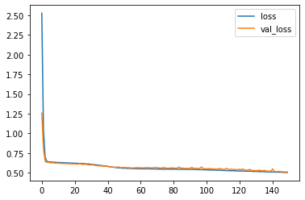
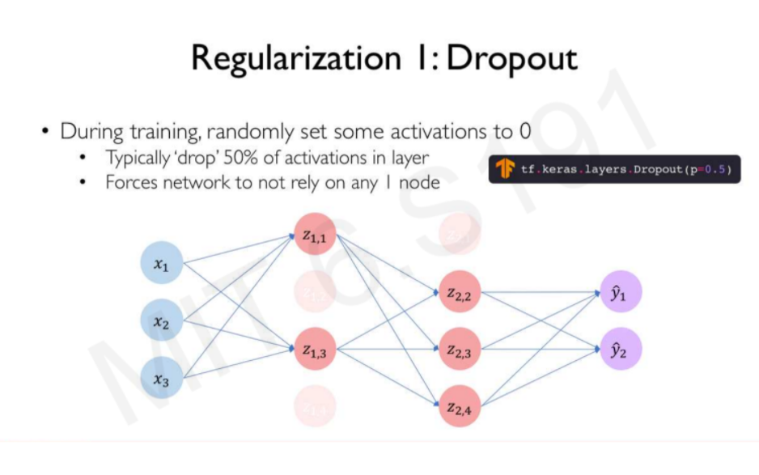
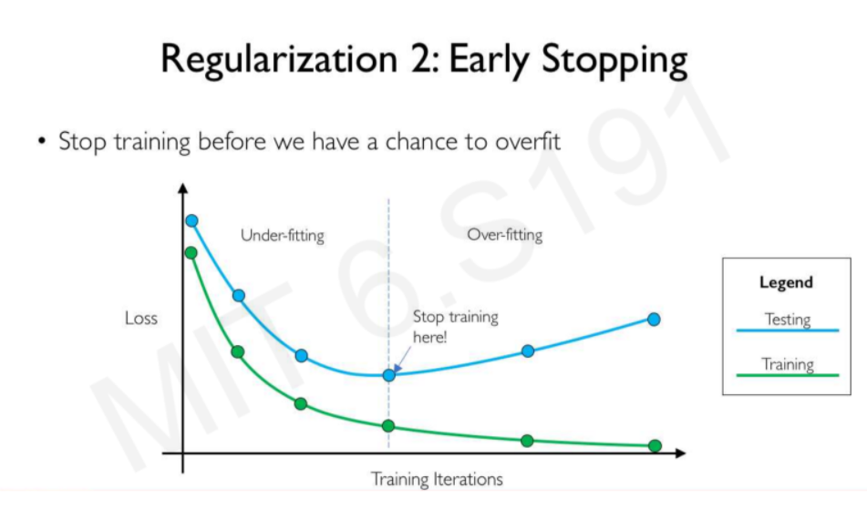
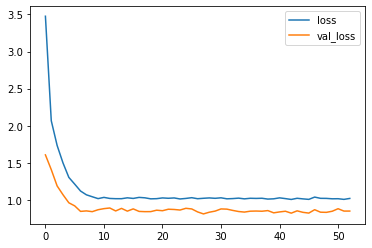
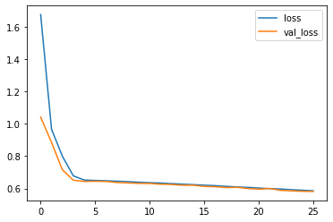
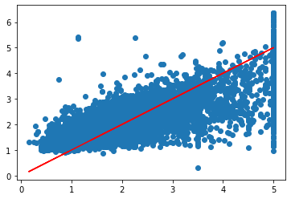
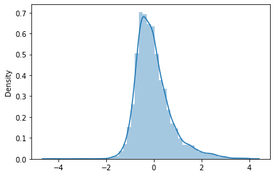

# Contoh Regression 


# Neural Network

### Library yang dibutuhkan

Di sini menggunakan Framework Tensorflow
Library yang akan digunakan adalah **pandas, numpy, matplotlib, seaborn, sklearn, dan tensorflow**. Jika belum diinstall, silahkan diinstal dahulu dengan mengetikkan `pip install nama-library` pada anaconda prompt.

note: Library tensorflow cukup besar sizenya, sekitar 300MB.


```python
%matplotlib inline
import numpy as np
import pandas as pd
import seaborn as sns
import matplotlib.pyplot as plt
import tensorflow as tf
```

  

### Sedikit penjelasan mengenai Deep Neural Network

**Neural network** adalah sebuah model yang berisikan node atau neuron atau perceptron yang saling terhubung dengan dengan node lain melalui koneksi yang disebut penimbang atau weight. Neural network terbagi menjadi tiga bagian utama:
Input Layer
Hidden Layer
Output Layer

Deep Neural Network (DNN) adalah perluasan dari metode neural network. Perbedaannya adalah dalam DNN mempunyai **lebih dari dua hidden layer**. 


### Activation Function

Activation function berfungsi untuk menentukan apakah neuron tersebut harus aktif atau tidak.
Activation yang biasanya digunakan:

    sigmoid = untuk binary classification
    tanh    = untuk binary classification
    softmax = untuk categorical classification
    ReLU
   lainnya bisa dilihat di `https://en.wikipedia.org/wiki/Activation_function`

 

### Loss Function 

Loss Functioin berfungsi untuk mengukur seberapa besar nilai error yang dihasilkan dari output terhadap nilai aslinya.
Loss function yang biasa digunakan adalah `binary_corssentropy`, `categorical_crossentropy` -> untuk klasifikasi. dan `mse` untuk regresi.

### Backpropagation

Mudahnya backpropagation adalah suatu cara untuk menyesuaikan penimbang dan bias yang dihasilkan untuk meminimalisir error pada output.

Caranya adalah
1. Menghitung nilai error menggunakan loss function
2. Hitung gradien dari loss funtion tersebut


3. Update parameter bias dan penimbang dari hasil gradien yang didapatkan

nb: belum terlalu paham dengan backpropagation

Optimizer yang biasa digunakan adalah `adam`, `rmsprop`

Penjelasannya juga bisa dilihat di sini `https://medium.com/@samuelsena/pengenalan-deep-learning-part-3-backpropagation-algorithm-720be9a5fbb8` dan bisa juga search sendiri ya

# Contoh 1 Regression

Import Data


```python
df = pd.read_csv('california_housing_sklearn.csv')
```


```python
df.head()
```


<div>
<table border="1" class="dataframe">
  <thead>
    <tr style="text-align: right;">
      <th></th>
      <th>MedInc</th>
      <th>HouseAge</th>
      <th>AveRooms</th>
      <th>AveBedrms</th>
      <th>Population</th>
      <th>AveOccup</th>
      <th>Latitude</th>
      <th>Longitude</th>
      <th>SalePrice</th>
    </tr>
  </thead>
  <tbody>
    <tr>
      <th>0</th>
      <td>8.3252</td>
      <td>41.0</td>
      <td>6.984127</td>
      <td>1.023810</td>
      <td>322.0</td>
      <td>2.555556</td>
      <td>37.88</td>
      <td>-122.23</td>
      <td>4.526</td>
    </tr>
    <tr>
      <th>1</th>
      <td>8.3014</td>
      <td>21.0</td>
      <td>6.238137</td>
      <td>0.971880</td>
      <td>2401.0</td>
      <td>2.109842</td>
      <td>37.86</td>
      <td>-122.22</td>
      <td>3.585</td>
    </tr>
    <tr>
      <th>2</th>
      <td>7.2574</td>
      <td>52.0</td>
      <td>8.288136</td>
      <td>1.073446</td>
      <td>496.0</td>
      <td>2.802260</td>
      <td>37.85</td>
      <td>-122.24</td>
      <td>3.521</td>
    </tr>
    <tr>
      <th>3</th>
      <td>5.6431</td>
      <td>52.0</td>
      <td>5.817352</td>
      <td>1.073059</td>
      <td>558.0</td>
      <td>2.547945</td>
      <td>37.85</td>
      <td>-122.25</td>
      <td>3.413</td>
    </tr>
    <tr>
      <th>4</th>
      <td>3.8462</td>
      <td>52.0</td>
      <td>6.281853</td>
      <td>1.081081</td>
      <td>565.0</td>
      <td>2.181467</td>
      <td>37.85</td>
      <td>-122.25</td>
      <td>3.422</td>
    </tr>
  </tbody>
</table>
</div>


Kita akan meregresikan SalePrice (Y) dengan variable independent MedInc, HouseAge, AveRooms, AveBedrms, Population, dan AveOccup.


```python
df.isnull().sum()
```


    MedInc        0
    HouseAge      0
    AveRooms      0
    AveBedrms     0
    Population    0
    AveOccup      0
    Latitude      0
    Longitude     0
    SalePrice     0
    dtype: int64


```python
df.describe().transpose()
```


<div>
<table border="1" class="dataframe">
  <thead>
    <tr style="text-align: right;">
      <th></th>
      <th>count</th>
      <th>mean</th>
      <th>std</th>
      <th>min</th>
      <th>25%</th>
      <th>50%</th>
      <th>75%</th>
      <th>max</th>
    </tr>
  </thead>
  <tbody>
    <tr>
      <th>MedInc</th>
      <td>20640.0</td>
      <td>3.870671</td>
      <td>1.899822</td>
      <td>0.499900</td>
      <td>2.563400</td>
      <td>3.534800</td>
      <td>4.743250</td>
      <td>15.000100</td>
    </tr>
    <tr>
      <th>HouseAge</th>
      <td>20640.0</td>
      <td>28.639486</td>
      <td>12.585558</td>
      <td>1.000000</td>
      <td>18.000000</td>
      <td>29.000000</td>
      <td>37.000000</td>
      <td>52.000000</td>
    </tr>
    <tr>
      <th>AveRooms</th>
      <td>20640.0</td>
      <td>5.429000</td>
      <td>2.474173</td>
      <td>0.846154</td>
      <td>4.440716</td>
      <td>5.229129</td>
      <td>6.052381</td>
      <td>141.909091</td>
    </tr>
    <tr>
      <th>AveBedrms</th>
      <td>20640.0</td>
      <td>1.096675</td>
      <td>0.473911</td>
      <td>0.333333</td>
      <td>1.006079</td>
      <td>1.048780</td>
      <td>1.099526</td>
      <td>34.066667</td>
    </tr>
    <tr>
      <th>Population</th>
      <td>20640.0</td>
      <td>1425.476744</td>
      <td>1132.462122</td>
      <td>3.000000</td>
      <td>787.000000</td>
      <td>1166.000000</td>
      <td>1725.000000</td>
      <td>35682.000000</td>
    </tr>
    <tr>
      <th>AveOccup</th>
      <td>20640.0</td>
      <td>3.070655</td>
      <td>10.386050</td>
      <td>0.692308</td>
      <td>2.429741</td>
      <td>2.818116</td>
      <td>3.282261</td>
      <td>1243.333333</td>
    </tr>
    <tr>
      <th>Latitude</th>
      <td>20640.0</td>
      <td>35.631861</td>
      <td>2.135952</td>
      <td>32.540000</td>
      <td>33.930000</td>
      <td>34.260000</td>
      <td>37.710000</td>
      <td>41.950000</td>
    </tr>
    <tr>
      <th>Longitude</th>
      <td>20640.0</td>
      <td>-119.569704</td>
      <td>2.003532</td>
      <td>-124.350000</td>
      <td>-121.800000</td>
      <td>-118.490000</td>
      <td>-118.010000</td>
      <td>-114.310000</td>
    </tr>
    <tr>
      <th>SalePrice</th>
      <td>20640.0</td>
      <td>2.068558</td>
      <td>1.153956</td>
      <td>0.149990</td>
      <td>1.196000</td>
      <td>1.797000</td>
      <td>2.647250</td>
      <td>5.000010</td>
    </tr>
  </tbody>
</table>
</div>


#### Distribution Plot dari Sale Price


```python
plt.figure(figsize=(10,8))
sns.distplot(df['SalePrice'])
```


#### Korelasi


```python
df.corr()
```


<div>

<table border="1" class="dataframe">
  <thead>
    <tr style="text-align: right;">
      <th></th>
      <th>MedInc</th>
      <th>HouseAge</th>
      <th>AveRooms</th>
      <th>AveBedrms</th>
      <th>Population</th>
      <th>AveOccup</th>
      <th>Latitude</th>
      <th>Longitude</th>
      <th>SalePrice</th>
    </tr>
  </thead>
  <tbody>
    <tr>
      <th>MedInc</th>
      <td>1.000000</td>
      <td>-0.119034</td>
      <td>0.326895</td>
      <td>-0.062040</td>
      <td>0.004834</td>
      <td>0.018766</td>
      <td>-0.079809</td>
      <td>-0.015176</td>
      <td>0.688075</td>
    </tr>
    <tr>
      <th>HouseAge</th>
      <td>-0.119034</td>
      <td>1.000000</td>
      <td>-0.153277</td>
      <td>-0.077747</td>
      <td>-0.296244</td>
      <td>0.013191</td>
      <td>0.011173</td>
      <td>-0.108197</td>
      <td>0.105623</td>
    </tr>
    <tr>
      <th>AveRooms</th>
      <td>0.326895</td>
      <td>-0.153277</td>
      <td>1.000000</td>
      <td>0.847621</td>
      <td>-0.072213</td>
      <td>-0.004852</td>
      <td>0.106389</td>
      <td>-0.027540</td>
      <td>0.151948</td>
    </tr>
    <tr>
      <th>AveBedrms</th>
      <td>-0.062040</td>
      <td>-0.077747</td>
      <td>0.847621</td>
      <td>1.000000</td>
      <td>-0.066197</td>
      <td>-0.006181</td>
      <td>0.069721</td>
      <td>0.013344</td>
      <td>-0.046701</td>
    </tr>
    <tr>
      <th>Population</th>
      <td>0.004834</td>
      <td>-0.296244</td>
      <td>-0.072213</td>
      <td>-0.066197</td>
      <td>1.000000</td>
      <td>0.069863</td>
      <td>-0.108785</td>
      <td>0.099773</td>
      <td>-0.024650</td>
    </tr>
    <tr>
      <th>AveOccup</th>
      <td>0.018766</td>
      <td>0.013191</td>
      <td>-0.004852</td>
      <td>-0.006181</td>
      <td>0.069863</td>
      <td>1.000000</td>
      <td>0.002366</td>
      <td>0.002476</td>
      <td>-0.023737</td>
    </tr>
    <tr>
      <th>Latitude</th>
      <td>-0.079809</td>
      <td>0.011173</td>
      <td>0.106389</td>
      <td>0.069721</td>
      <td>-0.108785</td>
      <td>0.002366</td>
      <td>1.000000</td>
      <td>-0.924664</td>
      <td>-0.144160</td>
    </tr>
    <tr>
      <th>Longitude</th>
      <td>-0.015176</td>
      <td>-0.108197</td>
      <td>-0.027540</td>
      <td>0.013344</td>
      <td>0.099773</td>
      <td>0.002476</td>
      <td>-0.924664</td>
      <td>1.000000</td>
      <td>-0.045967</td>
    </tr>
    <tr>
      <th>SalePrice</th>
      <td>0.688075</td>
      <td>0.105623</td>
      <td>0.151948</td>
      <td>-0.046701</td>
      <td>-0.024650</td>
      <td>-0.023737</td>
      <td>-0.144160</td>
      <td>-0.045967</td>
      <td>1.000000</td>
    </tr>
  </tbody>
</table>
</div>


```python
df.corr()['SalePrice'].sort_values()
```


    Latitude     -0.144160
    AveBedrms    -0.046701
    Longitude    -0.045967
    Population   -0.024650
    AveOccup     -0.023737
    HouseAge      0.105623
    AveRooms      0.151948
    MedInc        0.688075
    SalePrice     1.000000
    Name: SalePrice, dtype: float64


#### Scatter Plot


```python
sns.scatterplot(x='AveRooms', y='SalePrice', data=df)
```


```python
sns.scatterplot(x='Longitude', y='Latitude', data=df, edgecolor=None, alpha=0.2, hue='SalePrice')
```


### Creating a model


```python
data=df.drop(['Longitude', 'Latitude'], axis=1) #Membuang variabel Longitude dan Latitude #axis=1 untuk kolom, axis=0 untuk baris
```


```python
data.head()
```


<div>
<table border="1" class="dataframe">
  <thead>
    <tr style="text-align: right;">
      <th></th>
      <th>MedInc</th>
      <th>HouseAge</th>
      <th>AveRooms</th>
      <th>AveBedrms</th>
      <th>Population</th>
      <th>AveOccup</th>
      <th>SalePrice</th>
    </tr>
  </thead>
  <tbody>
    <tr>
      <th>0</th>
      <td>8.3252</td>
      <td>41.0</td>
      <td>6.984127</td>
      <td>1.023810</td>
      <td>322.0</td>
      <td>2.555556</td>
      <td>4.526</td>
    </tr>
    <tr>
      <th>1</th>
      <td>8.3014</td>
      <td>21.0</td>
      <td>6.238137</td>
      <td>0.971880</td>
      <td>2401.0</td>
      <td>2.109842</td>
      <td>3.585</td>
    </tr>
    <tr>
      <th>2</th>
      <td>7.2574</td>
      <td>52.0</td>
      <td>8.288136</td>
      <td>1.073446</td>
      <td>496.0</td>
      <td>2.802260</td>
      <td>3.521</td>
    </tr>
    <tr>
      <th>3</th>
      <td>5.6431</td>
      <td>52.0</td>
      <td>5.817352</td>
      <td>1.073059</td>
      <td>558.0</td>
      <td>2.547945</td>
      <td>3.413</td>
    </tr>
    <tr>
      <th>4</th>
      <td>3.8462</td>
      <td>52.0</td>
      <td>6.281853</td>
      <td>1.081081</td>
      <td>565.0</td>
      <td>2.181467</td>
      <td>3.422</td>
    </tr>
  </tbody>
</table>
</div>


```python
X = data.drop('SalePrice', axis=1).values
y = data['SalePrice']
```


```python
from sklearn.model_selection import train_test_split
```


```python
#Split data menjadi data training dan testing

X_train, X_test, y_train, y_test = train_test_split(X,y,test_size=0.3,random_state=221810445)
```

#### Normalizing (MinMaxScaler)


```python
from sklearn.preprocessing import MinMaxScaler
```


```python
scaler = MinMaxScaler()
```


```python
X_train= scaler.fit_transform(X_train)
```


```python
X_test = scaler.transform(X_test)
```


```python
X_train.shape #ada 6 kolom dan 14449 baris
```


    (14448, 6)


### Creating Model


```python
from tensorflow.keras.models import Sequential
from tensorflow.keras.layers import Dense, Activation
from tensorflow.keras.optimizers import Adam
```


```python
model = Sequential()

model.add(Dense(6,activation='relu')) #input layer
model.add(Dense(6,activation='relu')) #hidden layer
model.add(Dense(1)) #output layer

model.compile(optimizer='adam',loss='mse') 
```

Banyaknya hidden layer itu tidak ada patokannya, akan tetapi semakin rumit permasalahan, semakin banyak hidden layer. 
`https://stats.stackexchange.com/questions/181/how-to-choose-the-number-of-hidden-layers-and-nodes-in-a-feedforward-neural-netw`

### Training Model 

`batch size` adalah jumlah batch datanya (jadi datanya dipecah menjadi beberapa batch), semakin sedikit jumlah batch semakin lama runningnya. Batch berguna untuk data yang berukuran besar. Jumlah batch biasanya 2^n.

`epochs` adalah iterasi untuk update penimbang dan bias. 1 epoch sama dengan menjalankan network dari input sampai ke output. epoch ke 2 (iterasi ke-2) meng-update penimbang dan bias kemudian menjalankan networknya lagi, dst. Standarnya berapa? kira-kira aja wkwkwk nnti diganti2 aja jumlahnya


```python
model.fit(x=X_train,
          y=y_train.values,
          validation_data=(X_test,y_test.values),
          batch_size=32,epochs=150)

#kalau ada error, coba di bagian deklarasi variabel X dan y, belakangnya ditambahin/diilangin values(), yg ini misal e X = data.drop('SalePrice', axis=1).values()
```

    Epoch 1/150
    452/452 [==============================] - 1s 2ms/step - loss: 2.5296 - val_loss: 1.2579
    Epoch 2/150
    452/452 [==============================] - 0s 1ms/step - loss: 1.0529 - val_loss: 0.8099
    Epoch 3/150
    452/452 [==============================] - 1s 1ms/step - loss: 0.6999 - val_loss: 0.6442
    Epoch 4/150
    452/452 [==============================] - 0s 1ms/step - loss: 0.6446 - val_loss: 0.6298
    Epoch 5/150
    452/452 [==============================] - 1s 1ms/step - loss: 0.6380 - val_loss: 0.6333
    Epoch 6/150
    452/452 [==============================] - 0s 1ms/step - loss: 0.6361 - val_loss: 0.6253
    Epoch 7/150
    452/452 [==============================] - 1s 1ms/step - loss: 0.6339 - val_loss: 0.6257
    Epoch 8/150
    452/452 [==============================] - 1s 1ms/step - loss: 0.6325 - val_loss: 0.6233
    Epoch 9/150
    452/452 [==============================] - 1s 1ms/step - loss: 0.6317 - val_loss: 0.6211
    Epoch 10/150
    452/452 [==============================] - 0s 1ms/step - loss: 0.6295 - val_loss: 0.6204
    Epoch 11/150
    452/452 [==============================] - 1s 1ms/step - loss: 0.6290 - val_loss: 0.6208
    Epoch 12/150
    452/452 [==============================] - 0s 1ms/step - loss: 0.6289 - val_loss: 0.6194
    Epoch 13/150
    452/452 [==============================] - 1s 1ms/step - loss: 0.6277 - val_loss: 0.6163
    Epoch 14/150
    452/452 [==============================] - 0s 1ms/step - loss: 0.6257 - val_loss: 0.6155
    Epoch 15/150
    452/452 [==============================] - 0s 1ms/step - loss: 0.6253 - val_loss: 0.6151
    Epoch 16/150
    452/452 [==============================] - 1s 1ms/step - loss: 0.6240 - val_loss: 0.6141
    Epoch 17/150
    452/452 [==============================] - 0s 1ms/step - loss: 0.6241 - val_loss: 0.6137
    Epoch 18/150
    452/452 [==============================] - 1s 1ms/step - loss: 0.6226 - val_loss: 0.6123
    Epoch 19/150
    452/452 [==============================] - 0s 1ms/step - loss: 0.6206 - val_loss: 0.6121
    Epoch 20/150
    452/452 [==============================] - 1s 1ms/step - loss: 0.6211 - val_loss: 0.6113
    Epoch 21/150
    452/452 [==============================] - 0s 1ms/step - loss: 0.6196 - val_loss: 0.6111
    Epoch 22/150
    452/452 [==============================] - 1s 1ms/step - loss: 0.6189 - val_loss: 0.6096
    Epoch 23/150
    452/452 [==============================] - 1s 1ms/step - loss: 0.6179 - val_loss: 0.6082
    Epoch 24/150
    452/452 [==============================] - 1s 1ms/step - loss: 0.6165 - val_loss: 0.6148
    Epoch 25/150
    452/452 [==============================] - 0s 1ms/step - loss: 0.6161 - val_loss: 0.6071
    Epoch 26/150
    452/452 [==============================] - 1s 1ms/step - loss: 0.6145 - val_loss: 0.6047
    Epoch 27/150
    452/452 [==============================] - 0s 1ms/step - loss: 0.6137 - val_loss: 0.6066
    Epoch 28/150
    452/452 [==============================] - 1s 1ms/step - loss: 0.6110 - val_loss: 0.6054
    Epoch 29/150
    452/452 [==============================] - 0s 1ms/step - loss: 0.6098 - val_loss: 0.5999
    Epoch 30/150
    452/452 [==============================] - 1s 1ms/step - loss: 0.6083 - val_loss: 0.5982
    Epoch 31/150
    452/452 [==============================] - 0s 1ms/step - loss: 0.6053 - val_loss: 0.5981
    Epoch 32/150
    452/452 [==============================] - 1s 1ms/step - loss: 0.6039 - val_loss: 0.5997
    Epoch 33/150
    452/452 [==============================] - 0s 1ms/step - loss: 0.6010 - val_loss: 0.5923
    Epoch 34/150
    452/452 [==============================] - 1s 1ms/step - loss: 0.5979 - val_loss: 0.5917
    Epoch 35/150
    452/452 [==============================] - 0s 1ms/step - loss: 0.5963 - val_loss: 0.5879
    Epoch 36/150
    452/452 [==============================] - 0s 1ms/step - loss: 0.5928 - val_loss: 0.5860
    Epoch 37/150
    452/452 [==============================] - 1s 1ms/step - loss: 0.5904 - val_loss: 0.5860
    Epoch 38/150
    452/452 [==============================] - 0s 1ms/step - loss: 0.5871 - val_loss: 0.5816
    Epoch 39/150
    452/452 [==============================] - 1s 1ms/step - loss: 0.5850 - val_loss: 0.5795
    Epoch 40/150
    452/452 [==============================] - 0s 1ms/step - loss: 0.5830 - val_loss: 0.5819
    Epoch 41/150
    452/452 [==============================] - 1s 1ms/step - loss: 0.5779 - val_loss: 0.5832
    Epoch 42/150
    452/452 [==============================] - 0s 1ms/step - loss: 0.5755 - val_loss: 0.5732
    Epoch 43/150
    452/452 [==============================] - 1s 1ms/step - loss: 0.5732 - val_loss: 0.5712
    Epoch 44/150
    452/452 [==============================] - 1s 1ms/step - loss: 0.5700 - val_loss: 0.5701
    Epoch 45/150
    452/452 [==============================] - 1s 1ms/step - loss: 0.5672 - val_loss: 0.5680
    Epoch 46/150
    452/452 [==============================] - 0s 1ms/step - loss: 0.5644 - val_loss: 0.5675
    Epoch 47/150
    452/452 [==============================] - 1s 1ms/step - loss: 0.5614 - val_loss: 0.5718
    Epoch 48/150
    452/452 [==============================] - 0s 1ms/step - loss: 0.5608 - val_loss: 0.5698
    Epoch 49/150
    452/452 [==============================] - 1s 1ms/step - loss: 0.5583 - val_loss: 0.5620
    Epoch 50/150
    452/452 [==============================] - 0s 1ms/step - loss: 0.5558 - val_loss: 0.5661
    Epoch 51/150
    452/452 [==============================] - 1s 1ms/step - loss: 0.5556 - val_loss: 0.5630
    Epoch 52/150
    452/452 [==============================] - 0s 1ms/step - loss: 0.5558 - val_loss: 0.5652
    Epoch 53/150
    452/452 [==============================] - 1s 1ms/step - loss: 0.5529 - val_loss: 0.5611
    Epoch 54/150
    452/452 [==============================] - 1s 1ms/step - loss: 0.5538 - val_loss: 0.5631
    Epoch 55/150
    452/452 [==============================] - 0s 1ms/step - loss: 0.5524 - val_loss: 0.5601
    Epoch 56/150
    452/452 [==============================] - 0s 1ms/step - loss: 0.5515 - val_loss: 0.5600
    Epoch 57/150
    452/452 [==============================] - 0s 1ms/step - loss: 0.5505 - val_loss: 0.5592
    Epoch 58/150
    452/452 [==============================] - 0s 1ms/step - loss: 0.5497 - val_loss: 0.5635
    Epoch 59/150
    452/452 [==============================] - 0s 1ms/step - loss: 0.5494 - val_loss: 0.5624
    Epoch 60/150
    452/452 [==============================] - 1s 1ms/step - loss: 0.5490 - val_loss: 0.5624
    Epoch 61/150
    452/452 [==============================] - 0s 1ms/step - loss: 0.5482 - val_loss: 0.5633
    Epoch 62/150
    452/452 [==============================] - 1s 1ms/step - loss: 0.5488 - val_loss: 0.5590
    Epoch 63/150
    452/452 [==============================] - 0s 1ms/step - loss: 0.5476 - val_loss: 0.5618
    Epoch 64/150
    452/452 [==============================] - 1s 1ms/step - loss: 0.5486 - val_loss: 0.5638
    Epoch 65/150
    452/452 [==============================] - 0s 865us/step - loss: 0.5478 - val_loss: 0.5629
    Epoch 66/150
    452/452 [==============================] - 0s 969us/step - loss: 0.5487 - val_loss: 0.5636
    Epoch 67/150
    452/452 [==============================] - 1s 1ms/step - loss: 0.5475 - val_loss: 0.5612
    Epoch 68/150
    452/452 [==============================] - 1s 1ms/step - loss: 0.5466 - val_loss: 0.5600
    Epoch 69/150
    452/452 [==============================] - 0s 1ms/step - loss: 0.5469 - val_loss: 0.5633
    Epoch 70/150
    452/452 [==============================] - 1s 1ms/step - loss: 0.5457 - val_loss: 0.5676
    Epoch 71/150
    452/452 [==============================] - 0s 960us/step - loss: 0.5462 - val_loss: 0.5622
    Epoch 72/150
    452/452 [==============================] - 0s 980us/step - loss: 0.5447 - val_loss: 0.5607
    Epoch 73/150
    452/452 [==============================] - 0s 995us/step - loss: 0.5450 - val_loss: 0.5574
    Epoch 74/150
    452/452 [==============================] - 0s 925us/step - loss: 0.5447 - val_loss: 0.5590
    Epoch 75/150
    452/452 [==============================] - 0s 989us/step - loss: 0.5439 - val_loss: 0.5676
    Epoch 76/150
    452/452 [==============================] - 0s 1ms/step - loss: 0.5448 - val_loss: 0.5575
    Epoch 77/150
    452/452 [==============================] - 1s 1ms/step - loss: 0.5447 - val_loss: 0.5571
    Epoch 78/150
    452/452 [==============================] - 0s 1ms/step - loss: 0.5436 - val_loss: 0.5556
    Epoch 79/150
    452/452 [==============================] - 0s 929us/step - loss: 0.5433 - val_loss: 0.5581
    Epoch 80/150
    452/452 [==============================] - 0s 911us/step - loss: 0.5433 - val_loss: 0.5619
    Epoch 81/150
    452/452 [==============================] - 0s 953us/step - loss: 0.5443 - val_loss: 0.5563
    Epoch 82/150
    452/452 [==============================] - 0s 1ms/step - loss: 0.5445 - val_loss: 0.5577
    Epoch 83/150
    452/452 [==============================] - 0s 1ms/step - loss: 0.5427 - val_loss: 0.5546
    Epoch 84/150
    452/452 [==============================] - 0s 997us/step - loss: 0.5420 - val_loss: 0.5701
    Epoch 85/150
    452/452 [==============================] - 0s 942us/step - loss: 0.5432 - val_loss: 0.5624
    Epoch 86/150
    452/452 [==============================] - 0s 900us/step - loss: 0.5417 - val_loss: 0.5553
    Epoch 87/150
    452/452 [==============================] - 1s 1ms/step - loss: 0.5418 - val_loss: 0.5578
    Epoch 88/150
    452/452 [==============================] - 0s 869us/step - loss: 0.5415 - val_loss: 0.5533
    Epoch 89/150
    452/452 [==============================] - 0s 986us/step - loss: 0.5414 - val_loss: 0.5555
    Epoch 90/150
    452/452 [==============================] - 0s 850us/step - loss: 0.5409 - val_loss: 0.5542
    Epoch 91/150
    452/452 [==============================] - 1s 1ms/step - loss: 0.5415 - val_loss: 0.5548
    Epoch 92/150
    452/452 [==============================] - 0s 825us/step - loss: 0.5413 - val_loss: 0.5671
    Epoch 93/150
    452/452 [==============================] - 0s 885us/step - loss: 0.5402 - val_loss: 0.5547
    Epoch 94/150
    452/452 [==============================] - 0s 1ms/step - loss: 0.5392 - val_loss: 0.5551
    Epoch 95/150
    452/452 [==============================] - 0s 988us/step - loss: 0.5380 - val_loss: 0.5547
    Epoch 96/150
    452/452 [==============================] - 0s 900us/step - loss: 0.5376 - val_loss: 0.5518
    Epoch 97/150
    452/452 [==============================] - 0s 852us/step - loss: 0.5379 - val_loss: 0.5566
    Epoch 98/150
    452/452 [==============================] - 0s 898us/step - loss: 0.5391 - val_loss: 0.5710
    Epoch 99/150
    452/452 [==============================] - 0s 969us/step - loss: 0.5375 - val_loss: 0.5491
    Epoch 100/150
    452/452 [==============================] - 1s 1ms/step - loss: 0.5351 - val_loss: 0.5488
    Epoch 101/150
    452/452 [==============================] - 0s 971us/step - loss: 0.5348 - val_loss: 0.5474
    Epoch 102/150
    452/452 [==============================] - 0s 823us/step - loss: 0.5351 - val_loss: 0.5513
    Epoch 103/150
    452/452 [==============================] - 0s 883us/step - loss: 0.5334 - val_loss: 0.5516
    Epoch 104/150
    452/452 [==============================] - 0s 933us/step - loss: 0.5345 - val_loss: 0.5465
    Epoch 105/150
    452/452 [==============================] - 0s 847us/step - loss: 0.5323 - val_loss: 0.5474
    Epoch 106/150
    452/452 [==============================] - 0s 1ms/step - loss: 0.5320 - val_loss: 0.5461
    Epoch 107/150
    452/452 [==============================] - 0s 902us/step - loss: 0.5307 - val_loss: 0.5473
    Epoch 108/150
    452/452 [==============================] - 1s 1ms/step - loss: 0.5311 - val_loss: 0.5439
    Epoch 109/150
    452/452 [==============================] - 1s 1ms/step - loss: 0.5298 - val_loss: 0.5535
    Epoch 110/150
    452/452 [==============================] - 0s 885us/step - loss: 0.5292 - val_loss: 0.5462
    Epoch 111/150
    452/452 [==============================] - 0s 949us/step - loss: 0.5278 - val_loss: 0.5417
    Epoch 112/150
    452/452 [==============================] - 1s 1ms/step - loss: 0.5274 - val_loss: 0.5427
    Epoch 113/150
    452/452 [==============================] - 0s 1ms/step - loss: 0.5261 - val_loss: 0.5533
    Epoch 114/150
    452/452 [==============================] - 0s 982us/step - loss: 0.5253 - val_loss: 0.5453
    Epoch 115/150
    452/452 [==============================] - 0s 936us/step - loss: 0.5246 - val_loss: 0.5393
    Epoch 116/150
    452/452 [==============================] - 0s 834us/step - loss: 0.5237 - val_loss: 0.5452
    Epoch 117/150
    452/452 [==============================] - 0s 889us/step - loss: 0.5241 - val_loss: 0.5385
    Epoch 118/150
    452/452 [==============================] - 0s 883us/step - loss: 0.5230 - val_loss: 0.5402
    Epoch 119/150
    452/452 [==============================] - 0s 821us/step - loss: 0.5226 - val_loss: 0.5385
    Epoch 120/150
    452/452 [==============================] - 0s 872us/step - loss: 0.5210 - val_loss: 0.5344
    Epoch 121/150
    452/452 [==============================] - 0s 878us/step - loss: 0.5202 - val_loss: 0.5453
    Epoch 122/150
    452/452 [==============================] - 0s 886us/step - loss: 0.5209 - val_loss: 0.5349
    Epoch 123/150
    452/452 [==============================] - 0s 951us/step - loss: 0.5199 - val_loss: 0.5467
    Epoch 124/150
    452/452 [==============================] - 0s 880us/step - loss: 0.5193 - val_loss: 0.5338
    Epoch 125/150
    452/452 [==============================] - 0s 887us/step - loss: 0.5181 - val_loss: 0.5317
    Epoch 126/150
    452/452 [==============================] - 0s 883us/step - loss: 0.5180 - val_loss: 0.5320
    Epoch 127/150
    452/452 [==============================] - 0s 814us/step - loss: 0.5185 - val_loss: 0.5415
    Epoch 128/150
    452/452 [==============================] - 0s 891us/step - loss: 0.5167 - val_loss: 0.5311
    Epoch 129/150
    452/452 [==============================] - 0s 827us/step - loss: 0.5155 - val_loss: 0.5273
    Epoch 130/150
    452/452 [==============================] - 0s 885us/step - loss: 0.5140 - val_loss: 0.5268
    Epoch 131/150
    452/452 [==============================] - 0s 918us/step - loss: 0.5157 - val_loss: 0.5257
    Epoch 132/150
    452/452 [==============================] - 0s 878us/step - loss: 0.5148 - val_loss: 0.5269
    Epoch 133/150
    452/452 [==============================] - 0s 872us/step - loss: 0.5126 - val_loss: 0.5311
    Epoch 134/150
    452/452 [==============================] - 0s 929us/step - loss: 0.5120 - val_loss: 0.5259
    Epoch 135/150
    452/452 [==============================] - 0s 869us/step - loss: 0.5130 - val_loss: 0.5226
    Epoch 136/150
    452/452 [==============================] - 0s 911us/step - loss: 0.5114 - val_loss: 0.5298
    Epoch 137/150
    452/452 [==============================] - 0s 883us/step - loss: 0.5098 - val_loss: 0.5212
    Epoch 138/150
    452/452 [==============================] - 0s 887us/step - loss: 0.5099 - val_loss: 0.5186
    Epoch 139/150
    452/452 [==============================] - 0s 927us/step - loss: 0.5094 - val_loss: 0.5204
    Epoch 140/150
    452/452 [==============================] - 0s 1ms/step - loss: 0.5076 - val_loss: 0.5174
    Epoch 141/150
    452/452 [==============================] - 0s 1ms/step - loss: 0.5076 - val_loss: 0.5473
    Epoch 142/150
    452/452 [==============================] - 0s 847us/step - loss: 0.5074 - val_loss: 0.5153
    Epoch 143/150
    452/452 [==============================] - 0s 836us/step - loss: 0.5062 - val_loss: 0.5135
    Epoch 144/150
    452/452 [==============================] - 0s 944us/step - loss: 0.5058 - val_loss: 0.5123
    Epoch 145/150
    452/452 [==============================] - 0s 814us/step - loss: 0.5054 - val_loss: 0.5164
    Epoch 146/150
    452/452 [==============================] - 0s 878us/step - loss: 0.5064 - val_loss: 0.5117
    Epoch 147/150
    452/452 [==============================] - 0s 854us/step - loss: 0.5030 - val_loss: 0.5105
    Epoch 148/150
    452/452 [==============================] - 0s 898us/step - loss: 0.5029 - val_loss: 0.5091
    Epoch 149/150
    452/452 [==============================] - 0s 913us/step - loss: 0.5021 - val_loss: 0.5084
    Epoch 150/150
    452/452 [==============================] - 0s 909us/step - loss: 0.5013 - val_loss: 0.5089
    


    <tensorflow.python.keras.callbacks.History at 0x1e1534146d0>


hasil di atas bakal beda2 klo di run ulang yak, karna inisialisasi dan updating nilai penimbang dan bias itu random

membandingkan loss dengan validation loss


```python
losses = pd.DataFrame(model.history.history)
```


```python
losses
```


<div>

<table border="1" class="dataframe">
  <thead>
    <tr style="text-align: right;">
      <th></th>
      <th>loss</th>
      <th>val_loss</th>
    </tr>
  </thead>
  <tbody>
    <tr>
      <th>0</th>
      <td>2.529569</td>
      <td>1.257901</td>
    </tr>
    <tr>
      <th>1</th>
      <td>1.052858</td>
      <td>0.809851</td>
    </tr>
    <tr>
      <th>2</th>
      <td>0.699860</td>
      <td>0.644197</td>
    </tr>
    <tr>
      <th>3</th>
      <td>0.644635</td>
      <td>0.629762</td>
    </tr>
    <tr>
      <th>4</th>
      <td>0.637997</td>
      <td>0.633275</td>
    </tr>
    <tr>
      <th>...</th>
      <td>...</td>
      <td>...</td>
    </tr>
    <tr>
      <th>145</th>
      <td>0.506402</td>
      <td>0.511656</td>
    </tr>
    <tr>
      <th>146</th>
      <td>0.503025</td>
      <td>0.510455</td>
    </tr>
    <tr>
      <th>147</th>
      <td>0.502878</td>
      <td>0.509100</td>
    </tr>
    <tr>
      <th>148</th>
      <td>0.502139</td>
      <td>0.508422</td>
    </tr>
    <tr>
      <th>149</th>
      <td>0.501287</td>
      <td>0.508858</td>
    </tr>
  </tbody>
</table>
<p>150 rows × 2 columns</p>
</div>


```python
losses.plot()
```


    <AxesSubplot:>





Jika garis oranye semakin lama semakin ke atas, itu berarti overfitting. Jika garis biru yang ke atas, berarti underfitting
Beberapa cara mengatasinya yaitu mengubuah jumlah epochs, menambah/mengurangi jumlah hidden layer, menambah/mengurangi perceptron/node/neuron.

Lalu ada juga yang namanya fungsi Dropout. Jadi kita membuang sebagian fungsi aktivasi


Selain itu bisa juga menambahkan fungsi Early Stopping, yang berguna untuk memberhentikan pembelajaran kalau diindikasikan over/underfit.



Misal aja nih, ternyata hasilnya overfit. Nah kita lakuin ini:


```python
from tensorflow.keras.layers import Dropout
from tensorflow.keras.callbacks import EarlyStopping
```


```python
early_stop = EarlyStopping(monitor='val_loss', mode='min', verbose=1, patience=25)
```

mode ada `min`, `max`, dan `auto`.

`min` bakal ngeberhentiin training kalau nilai yang dimonitor berhenti berkurang.

`max` bakal ngeberhentiin training kalau nilai yang dimonitor berhenti berhenti naik. 

`auto` pokoknya bakal ngeberhentiin klo ada kejadian di atas.

`patience` itu misalnya gini, diindikasiin di epoch ke 100 dia overfitting, nah dia bakal berhenti melakukan training ketika epochnya 100+`patience`, di atas patience=25, jadi dia bakal berhenti pas epoch ke 125. bisa juga diisi 0.


```python
model = Sequential()

model.add(Dense(6,activation='relu')) #input layer
model.add(Dropout(0.5))
model.add(Dense(6,activation='relu')) #hidden layer
model.add(Dropout(0.5))
model.add(Dense(1)) #output layer

model.compile(optimizer='adam',loss='mse') 
```

`Dropout`(0.5) itu mksdnya memberhentikan setengah aktivation function, jadi networknya ga jalan


```python
model.fit(x=X_train, 
          y=y_train, 
          epochs=150,
          validation_data=(X_test, y_test), verbose=2,
          callbacks=[early_stop])
```

    Epoch 1/150
    452/452 - 1s - loss: 3.4759 - val_loss: 1.6069
    Epoch 2/150
    452/452 - 0s - loss: 2.0671 - val_loss: 1.4080
    Epoch 3/150
    452/452 - 0s - loss: 1.7340 - val_loss: 1.1885
    Epoch 4/150
    452/452 - 0s - loss: 1.4991 - val_loss: 1.0701
    Epoch 5/150
    452/452 - 0s - loss: 1.3037 - val_loss: 0.9613
    Epoch 6/150
    452/452 - 0s - loss: 1.2129 - val_loss: 0.9199
    Epoch 7/150
    452/452 - 0s - loss: 1.1198 - val_loss: 0.8453
    Epoch 8/150
    452/452 - 0s - loss: 1.0688 - val_loss: 0.8519
    Epoch 9/150
    452/452 - 0s - loss: 1.0427 - val_loss: 0.8417
    Epoch 10/150
    452/452 - 0s - loss: 1.0174 - val_loss: 0.8677
    Epoch 11/150
    452/452 - 0s - loss: 1.0341 - val_loss: 0.8824
    Epoch 12/150
    452/452 - 0s - loss: 1.0198 - val_loss: 0.8910
    Epoch 13/150
    452/452 - 0s - loss: 1.0166 - val_loss: 0.8512
    Epoch 14/150
    452/452 - 0s - loss: 1.0164 - val_loss: 0.8857
    Epoch 15/150
    452/452 - 0s - loss: 1.0283 - val_loss: 0.8487
    Epoch 16/150
    452/452 - 0s - loss: 1.0199 - val_loss: 0.8789
    Epoch 17/150
    452/452 - 0s - loss: 1.0339 - val_loss: 0.8450
    Epoch 18/150
    452/452 - 0s - loss: 1.0282 - val_loss: 0.8418
    Epoch 19/150
    452/452 - 0s - loss: 1.0144 - val_loss: 0.8423
    Epoch 20/150
    452/452 - 0s - loss: 1.0168 - val_loss: 0.8614
    Epoch 21/150
    452/452 - 1s - loss: 1.0269 - val_loss: 0.8543
    Epoch 22/150
    452/452 - 0s - loss: 1.0221 - val_loss: 0.8745
    Epoch 23/150
    452/452 - 0s - loss: 1.0266 - val_loss: 0.8710
    Epoch 24/150
    452/452 - 0s - loss: 1.0128 - val_loss: 0.8636
    Epoch 25/150
    452/452 - 0s - loss: 1.0201 - val_loss: 0.8868
    Epoch 26/150
    452/452 - 0s - loss: 1.0299 - val_loss: 0.8782
    Epoch 27/150
    452/452 - 0s - loss: 1.0161 - val_loss: 0.8382
    Epoch 28/150
    452/452 - 0s - loss: 1.0220 - val_loss: 0.8112
    Epoch 29/150
    452/452 - 0s - loss: 1.0268 - val_loss: 0.8342
    Epoch 30/150
    452/452 - 0s - loss: 1.0215 - val_loss: 0.8493
    Epoch 31/150
    452/452 - 0s - loss: 1.0284 - val_loss: 0.8784
    Epoch 32/150
    452/452 - 0s - loss: 1.0148 - val_loss: 0.8757
    Epoch 33/150
    452/452 - 0s - loss: 1.0179 - val_loss: 0.8586
    Epoch 34/150
    452/452 - 0s - loss: 1.0239 - val_loss: 0.8436
    Epoch 35/150
    452/452 - 0s - loss: 1.0143 - val_loss: 0.8359
    Epoch 36/150
    452/452 - 0s - loss: 1.0220 - val_loss: 0.8480
    Epoch 37/150
    452/452 - 0s - loss: 1.0201 - val_loss: 0.8500
    Epoch 38/150
    452/452 - 0s - loss: 1.0223 - val_loss: 0.8475
    Epoch 39/150
    452/452 - 0s - loss: 1.0112 - val_loss: 0.8560
    Epoch 40/150
    452/452 - 0s - loss: 1.0148 - val_loss: 0.8258
    Epoch 41/150
    452/452 - 0s - loss: 1.0278 - val_loss: 0.8380
    Epoch 42/150
    452/452 - 0s - loss: 1.0176 - val_loss: 0.8474
    Epoch 43/150
    452/452 - 0s - loss: 1.0063 - val_loss: 0.8215
    Epoch 44/150
    452/452 - 0s - loss: 1.0220 - val_loss: 0.8526
    Epoch 45/150
    452/452 - 0s - loss: 1.0139 - val_loss: 0.8325
    Epoch 46/150
    452/452 - 0s - loss: 1.0072 - val_loss: 0.8225
    Epoch 47/150
    452/452 - 0s - loss: 1.0381 - val_loss: 0.8681
    Epoch 48/150
    452/452 - 0s - loss: 1.0214 - val_loss: 0.8345
    Epoch 49/150
    452/452 - 0s - loss: 1.0205 - val_loss: 0.8323
    Epoch 50/150
    452/452 - 0s - loss: 1.0151 - val_loss: 0.8473
    Epoch 51/150
    452/452 - 0s - loss: 1.0161 - val_loss: 0.8813
    Epoch 52/150
    452/452 - 0s - loss: 1.0072 - val_loss: 0.8494
    Epoch 53/150
    452/452 - 0s - loss: 1.0199 - val_loss: 0.8496
    Epoch 00053: early stopping
    


    <tensorflow.python.keras.callbacks.History at 0x1e154a571c0>


```python
losses = pd.DataFrame(model.history.history)
```


```python
losses.plot()
```


    <AxesSubplot:>





```python
early_stop = EarlyStopping(monitor='val_loss', mode='max', verbose=1, patience=25)
```


```python
model = Sequential()

model.add(Dense(6,activation='relu')) #input layer
model.add(Dense(6,activation='relu')) #hidden layer
model.add(Dense(1)) #output layer

model.compile(optimizer='adam',loss='mse') 
```


```python
model.fit(x=X_train, 
          y=y_train, 
          epochs=400,
          validation_data=(X_test, y_test), verbose=2,
          callbacks=[early_stop])
```

    Epoch 1/400
    452/452 - 1s - loss: 1.6750 - val_loss: 1.0413
    Epoch 2/400
    452/452 - 0s - loss: 0.9655 - val_loss: 0.8837
    Epoch 3/400
    452/452 - 0s - loss: 0.7980 - val_loss: 0.7144
    Epoch 4/400
    452/452 - 0s - loss: 0.6778 - val_loss: 0.6508
    Epoch 5/400
    452/452 - 0s - loss: 0.6517 - val_loss: 0.6433
    Epoch 6/400
    452/452 - 0s - loss: 0.6494 - val_loss: 0.6443
    Epoch 7/400
    452/452 - 0s - loss: 0.6474 - val_loss: 0.6433
    Epoch 8/400
    452/452 - 0s - loss: 0.6445 - val_loss: 0.6367
    Epoch 9/400
    452/452 - 0s - loss: 0.6420 - val_loss: 0.6342
    Epoch 10/400
    452/452 - 0s - loss: 0.6384 - val_loss: 0.6314
    Epoch 11/400
    452/452 - 0s - loss: 0.6356 - val_loss: 0.6306
    Epoch 12/400
    452/452 - 0s - loss: 0.6333 - val_loss: 0.6263
    Epoch 13/400
    452/452 - 0s - loss: 0.6298 - val_loss: 0.6244
    Epoch 14/400
    452/452 - 0s - loss: 0.6263 - val_loss: 0.6199
    Epoch 15/400
    452/452 - 0s - loss: 0.6234 - val_loss: 0.6198
    Epoch 16/400
    452/452 - 0s - loss: 0.6201 - val_loss: 0.6125
    Epoch 17/400
    452/452 - 0s - loss: 0.6173 - val_loss: 0.6106
    Epoch 18/400
    452/452 - 0s - loss: 0.6129 - val_loss: 0.6056
    Epoch 19/400
    452/452 - 0s - loss: 0.6092 - val_loss: 0.6070
    Epoch 20/400
    452/452 - 0s - loss: 0.6065 - val_loss: 0.5995
    Epoch 21/400
    452/452 - 0s - loss: 0.6025 - val_loss: 0.5951
    Epoch 22/400
    452/452 - 0s - loss: 0.5989 - val_loss: 0.6000
    Epoch 23/400
    452/452 - 0s - loss: 0.5965 - val_loss: 0.5882
    Epoch 24/400
    452/452 - 0s - loss: 0.5923 - val_loss: 0.5850
    Epoch 25/400
    452/452 - 0s - loss: 0.5890 - val_loss: 0.5825
    Epoch 26/400
    452/452 - 0s - loss: 0.5855 - val_loss: 0.5811
    Epoch 00026: early stopping
    


    <tensorflow.python.keras.callbacks.History at 0x1e15502ad00>


```python
losses = pd.DataFrame(model.history.history)
```


```python
losses.plot()
```


    <AxesSubplot:>





Ternyata dipakein dropout malah gabagus hasilnya.

### Model Evaluation 


```python
from sklearn.metrics import mean_squared_error,mean_absolute_error,explained_variance_score
```


```python
X_test
```


    array([[0.24712763, 0.33333333, 0.07578484, 0.09767782, 0.00238235,
            0.00112374],
           [0.17579068, 0.62745098, 0.02492117, 0.02775877, 0.03615572,
            0.00171913],
           [0.17912167, 0.47058824, 0.02131895, 0.02652413, 0.15569383,
            0.00439971],
           ...,
           [0.11674322, 0.82352941, 0.02469675, 0.0268154 , 0.05092632,
            0.00187474],
           [0.16959766, 0.01960784, 0.02578037, 0.02685689, 0.04492839,
            0.00124809],
           [0.1200811 , 0.90196078, 0.02225972, 0.02197632, 0.02183357,
            0.00229658]])


```python
predictions = model.predict(X_test)
```


```python
mean_absolute_error(y_test,predictions) #mean absolute error antara y test (nilai asli) dengan y prediction
```


    0.5641443566477006


```python
np.sqrt(mean_squared_error(y_test,predictions)) #root mean square error antara y test (nilai asli) dengan y prediction
```


    0.7623115015482161


```python
explained_variance_score(y_test,predictions) #nilai varians yang bisa dijelaskan oleh model
```


    0.5653730032807149


```python
# Our predictions
plt.scatter(y_test,predictions)

# Perfect predictions
plt.plot(y_test,y_test,'r')
```


    [<matplotlib.lines.Line2D at 0x1e15641ee20>]





```python
errors = y_test.values.reshape(6192, 1) - predictions
```


```python
sns.distplot(errors)
```

    C:\Users\ASUS\anaconda3\lib\site-packages\seaborn\distributions.py:2551: FutureWarning: `distplot` is a deprecated function and will be removed in a future version. Please adapt your code to use either `displot` (a figure-level function with similar flexibility) or `histplot` (an axes-level function for histograms).
      warnings.warn(msg, FutureWarning)
    


    <AxesSubplot:ylabel='Density'>





### Predicting


```python
single_house = df.drop(['SalePrice','Latitude', 'Longitude'],axis=1).iloc[0]
#iloc[0] untuk mengambil data pada baris pertama
```


```python
single_house
```


    MedInc          8.325200
    HouseAge       41.000000
    AveRooms        6.984127
    AveBedrms       1.023810
    Population    322.000000
    AveOccup        2.555556
    Name: 0, dtype: float64


```python
single_house = single_house.values.reshape(-1, 6) 
```

Kita reshape menjadi bentuk array

-1 berarti semua variabel ikut

6 mksdnya banyak variabel


```python
single_house
```


    array([[  8.3252    ,  41.        ,   6.98412698,   1.02380952,
            322.        ,   2.55555556]])


```python
single_house = scaler.transform(single_house) #minmaxscaler
```


```python
model.predict(single_house)
```


    array([[4.587323]], dtype=float32)


```python
df.head(1)
```


<div>

<table border="1" class="dataframe">
  <thead>
    <tr style="text-align: right;">
      <th></th>
      <th>MedInc</th>
      <th>HouseAge</th>
      <th>AveRooms</th>
      <th>AveBedrms</th>
      <th>Population</th>
      <th>AveOccup</th>
      <th>Latitude</th>
      <th>Longitude</th>
      <th>SalePrice</th>
    </tr>
  </thead>
  <tbody>
    <tr>
      <th>0</th>
      <td>8.3252</td>
      <td>41.0</td>
      <td>6.984127</td>
      <td>1.02381</td>
      <td>322.0</td>
      <td>2.555556</td>
      <td>37.88</td>
      <td>-122.23</td>
      <td>4.526</td>
    </tr>
  </tbody>
</table>
</div>


Harga aslinya 4.526, harga yg dipredict 4.568731
mayan lah ya

 
