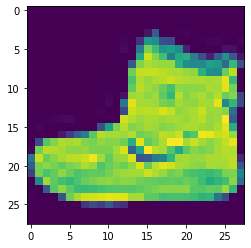

# CNN - Tensorflow 


Data yang digunakan adalah datasets gambar tentang fashion dari library keras

    Label    Description
    0        T-shirt/top
    1        Trouser
    2        Pullover
    3        Dress
    4        Coat
    5        Sandal
    6        Shirt
    7        Sneaker
    8        Bag
    9        Ankle boot

Ada 60k training data dan 10k testing data


```python
from tensorflow.keras.datasets import fashion_mnist

(x_train, y_train), (x_test, y_test) = fashion_mnist.load_data()
```

## Visualisasi Data


```python
import matplotlib.pyplot as plt
%matplotlib inline
```


```python
x_train[0]
```


    array([[  0,   0,   0,   0,   0,   0,   0,   0,   0,   0,   0,   0,   0,
              0,   0,   0,   0,   0,   0,   0,   0,   0,   0,   0,   0,   0,
              0,   0],
           [  0,   0,   0,   0,   0,   0,   0,   0,   0,   0,   0,   0,   0,
              0,   0,   0,   0,   0,   0,   0,   0,   0,   0,   0,   0,   0,
              0,   0],
           [  0,   0,   0,   0,   0,   0,   0,   0,   0,   0,   0,   0,   0,
              0,   0,   0,   0,   0,   0,   0,   0,   0,   0,   0,   0,   0,
              0,   0],
           [  0,   0,   0,   0,   0,   0,   0,   0,   0,   0,   0,   0,   1,
              0,   0,  13,  73,   0,   0,   1,   4,   0,   0,   0,   0,   1,
              1,   0],
           [  0,   0,   0,   0,   0,   0,   0,   0,   0,   0,   0,   0,   3,
              0,  36, 136, 127,  62,  54,   0,   0,   0,   1,   3,   4,   0,
              0,   3],
           [  0,   0,   0,   0,   0,   0,   0,   0,   0,   0,   0,   0,   6,
              0, 102, 204, 176, 134, 144, 123,  23,   0,   0,   0,   0,  12,
             10,   0],
           [  0,   0,   0,   0,   0,   0,   0,   0,   0,   0,   0,   0,   0,
              0, 155, 236, 207, 178, 107, 156, 161, 109,  64,  23,  77, 130,
             72,  15],
           [  0,   0,   0,   0,   0,   0,   0,   0,   0,   0,   0,   1,   0,
             69, 207, 223, 218, 216, 216, 163, 127, 121, 122, 146, 141,  88,
            172,  66],
           [  0,   0,   0,   0,   0,   0,   0,   0,   0,   1,   1,   1,   0,
            200, 232, 232, 233, 229, 223, 223, 215, 213, 164, 127, 123, 196,
            229,   0],
           [  0,   0,   0,   0,   0,   0,   0,   0,   0,   0,   0,   0,   0,
            183, 225, 216, 223, 228, 235, 227, 224, 222, 224, 221, 223, 245,
            173,   0],
           [  0,   0,   0,   0,   0,   0,   0,   0,   0,   0,   0,   0,   0,
            193, 228, 218, 213, 198, 180, 212, 210, 211, 213, 223, 220, 243,
            202,   0],
           [  0,   0,   0,   0,   0,   0,   0,   0,   0,   1,   3,   0,  12,
            219, 220, 212, 218, 192, 169, 227, 208, 218, 224, 212, 226, 197,
            209,  52],
           [  0,   0,   0,   0,   0,   0,   0,   0,   0,   0,   6,   0,  99,
            244, 222, 220, 218, 203, 198, 221, 215, 213, 222, 220, 245, 119,
            167,  56],
           [  0,   0,   0,   0,   0,   0,   0,   0,   0,   4,   0,   0,  55,
            236, 228, 230, 228, 240, 232, 213, 218, 223, 234, 217, 217, 209,
             92,   0],
           [  0,   0,   1,   4,   6,   7,   2,   0,   0,   0,   0,   0, 237,
            226, 217, 223, 222, 219, 222, 221, 216, 223, 229, 215, 218, 255,
             77,   0],
           [  0,   3,   0,   0,   0,   0,   0,   0,   0,  62, 145, 204, 228,
            207, 213, 221, 218, 208, 211, 218, 224, 223, 219, 215, 224, 244,
            159,   0],
           [  0,   0,   0,   0,  18,  44,  82, 107, 189, 228, 220, 222, 217,
            226, 200, 205, 211, 230, 224, 234, 176, 188, 250, 248, 233, 238,
            215,   0],
           [  0,  57, 187, 208, 224, 221, 224, 208, 204, 214, 208, 209, 200,
            159, 245, 193, 206, 223, 255, 255, 221, 234, 221, 211, 220, 232,
            246,   0],
           [  3, 202, 228, 224, 221, 211, 211, 214, 205, 205, 205, 220, 240,
             80, 150, 255, 229, 221, 188, 154, 191, 210, 204, 209, 222, 228,
            225,   0],
           [ 98, 233, 198, 210, 222, 229, 229, 234, 249, 220, 194, 215, 217,
            241,  65,  73, 106, 117, 168, 219, 221, 215, 217, 223, 223, 224,
            229,  29],
           [ 75, 204, 212, 204, 193, 205, 211, 225, 216, 185, 197, 206, 198,
            213, 240, 195, 227, 245, 239, 223, 218, 212, 209, 222, 220, 221,
            230,  67],
           [ 48, 203, 183, 194, 213, 197, 185, 190, 194, 192, 202, 214, 219,
            221, 220, 236, 225, 216, 199, 206, 186, 181, 177, 172, 181, 205,
            206, 115],
           [  0, 122, 219, 193, 179, 171, 183, 196, 204, 210, 213, 207, 211,
            210, 200, 196, 194, 191, 195, 191, 198, 192, 176, 156, 167, 177,
            210,  92],
           [  0,   0,  74, 189, 212, 191, 175, 172, 175, 181, 185, 188, 189,
            188, 193, 198, 204, 209, 210, 210, 211, 188, 188, 194, 192, 216,
            170,   0],
           [  2,   0,   0,   0,  66, 200, 222, 237, 239, 242, 246, 243, 244,
            221, 220, 193, 191, 179, 182, 182, 181, 176, 166, 168,  99,  58,
              0,   0],
           [  0,   0,   0,   0,   0,   0,   0,  40,  61,  44,  72,  41,  35,
              0,   0,   0,   0,   0,   0,   0,   0,   0,   0,   0,   0,   0,
              0,   0],
           [  0,   0,   0,   0,   0,   0,   0,   0,   0,   0,   0,   0,   0,
              0,   0,   0,   0,   0,   0,   0,   0,   0,   0,   0,   0,   0,
              0,   0],
           [  0,   0,   0,   0,   0,   0,   0,   0,   0,   0,   0,   0,   0,
              0,   0,   0,   0,   0,   0,   0,   0,   0,   0,   0,   0,   0,
              0,   0]], dtype=uint8)


```python
plt.imshow(x_train[0])
```


    <matplotlib.image.AxesImage at 0x21ff01c87c0>





Setiap gambar terdiri dari 28 x 28 array yang bernilai antara 0-255, yang merepresentasikan warna dalam rgb (dalam kasus ini hanyalah warna hitam dan putih, untuk gambar di atas warna kuning hijau ungu itu bawaan dari python).


```python
y_train[0]
```


    9


Label 9 adalah sepatu, bisa di lihat pada keterangan di paling atas

## Preprocessing the Data

Normalisasi data (jadi nilai dari tiap array hanya 0-1 saja).


```python
x_train.max()
```


    255


```python
x_train = x_train/255
x_test = x_test/255
```


```python
x_train.shape
```


    (60000, 28, 28)


```python
x_train = x_train.reshape(60000,28,28,1)
x_test = x_test.reshape(10000,28,28,1)

#60k untuk ukuran data
#28,28 untuk ukuran pixel
#1 untuk hitam putih, isi 3 jika RGB
```

One Hot Encoding


```python
from tensorflow.keras.utils import to_categorical
```


```python
y_train
```


    array([9, 0, 0, ..., 3, 0, 5], dtype=uint8)


```python
y_cat_train = to_categorical(y_train)
```


```python
y_cat_test = to_categorical(y_test)
```

# Building the model

* 2D Convolutional Layer, filters=32 and kernel_size=(4,4)
* Pooling Layer di mana pool_size = (2,2)

* Flatten Layer
* Dense Layer (128 Neurons, ini terserah boleh diubah2, nilainya 2^n yaa sabeb), RELU activation

* Final Dense Layer of 10 Neurons with a softmax activation


```python
from tensorflow.keras.models import Sequential
from tensorflow.keras.layers import Dense, Conv2D, MaxPool2D, Flatten
```


```python
model = Sequential()

# CONVOLUTIONAL LAYER
model.add(Conv2D(filters=32, kernel_size=(4,4),input_shape=(28, 28, 1), activation='relu',))
# POOLING LAYER
model.add(MaxPool2D(pool_size=(2, 2)))

# FLATTEN IMAGES 
model.add(Flatten())

# 128 NEURONS DI DENSE HIDDEN LAYER (BOLEH DIUBAH)
model.add(Dense(128, activation='relu'))

# TERAKHIR LAYER KLASIFIKASI, ADA 10 KATEGORI
model.add(Dense(10, activation='softmax'))


model.compile(loss='categorical_crossentropy',
              optimizer='rmsprop',
              metrics=['accuracy'])
```


```python
model.summary()
```

    Model: "sequential"
    _________________________________________________________________
    Layer (type)                 Output Shape              Param #   
    =================================================================
    conv2d (Conv2D)              (None, 25, 25, 32)        544       
    _________________________________________________________________
    max_pooling2d (MaxPooling2D) (None, 12, 12, 32)        0         
    _________________________________________________________________
    flatten (Flatten)            (None, 4608)              0         
    _________________________________________________________________
    dense (Dense)                (None, 128)               589952    
    _________________________________________________________________
    dense_1 (Dense)              (None, 10)                1290      
    =================================================================
    Total params: 591,786
    Trainable params: 591,786
    Non-trainable params: 0
    _________________________________________________________________
    


```python
model.fit(x_train,y_cat_train,epochs=10)
```

    Epoch 1/10
    1875/1875 [==============================] - 53s 28ms/step - loss: 0.4014 - accuracy: 0.8577
    Epoch 2/10
    1875/1875 [==============================] - 51s 27ms/step - loss: 0.2749 - accuracy: 0.90140s - loss:
    Epoch 3/10
    1875/1875 [==============================] - 53s 28ms/step - loss: 0.2373 - accuracy: 0.9158
    Epoch 4/10
    1875/1875 [==============================] - 50s 27ms/step - loss: 0.2132 - accuracy: 0.9237
    Epoch 5/10
    1875/1875 [==============================] - 51s 27ms/step - loss: 0.1945 - accuracy: 0.9313
    Epoch 6/10
    1875/1875 [==============================] - 48s 26ms/step - loss: 0.1819 - accuracy: 0.9362
    Epoch 7/10
    1875/1875 [==============================] - 43s 23ms/step - loss: 0.1721 - accuracy: 0.9393
    Epoch 8/10
    1875/1875 [==============================] - 46s 24ms/step - loss: 0.1593 - accuracy: 0.9442
    Epoch 9/10
    1875/1875 [==============================] - 49s 26ms/step - loss: 0.1517 - accuracy: 0.94710s - loss: 0.151
    Epoch 10/10
    1875/1875 [==============================] - 56s 30ms/step - loss: 0.1458 - accuracy: 0.9494
    


    <tensorflow.python.keras.callbacks.History at 0x21feec8f790>


# Evaluasi Model


```python
from sklearn.metrics import classification_report
```


```python
predictions = model.predict_classes(x_test)
```

    WARNING:tensorflow:From <ipython-input-19-7de0541c035a>:1: Sequential.predict_classes (from tensorflow.python.keras.engine.sequential) is deprecated and will be removed after 2021-01-01.
    Instructions for updating:
    Please use instead:* `np.argmax(model.predict(x), axis=-1)`,   if your model does multi-class classification   (e.g. if it uses a `softmax` last-layer activation).* `(model.predict(x) > 0.5).astype("int32")`,   if your model does binary classification   (e.g. if it uses a `sigmoid` last-layer activation).
    


```python
y_cat_test.shape
```


    (10000, 10)


```python
y_cat_test[0] 
```


    array([0., 0., 0., 0., 0., 0., 0., 0., 0., 1.], dtype=float32)


```python
predictions[0] #kite pen ngepredict gambar pertama itu gambar apa
```


    9


```python
y_test #hasilnya sama yak, labelnya sama-sama 9, yaitu ankle boot
```


    array([9, 2, 1, ..., 8, 1, 5], dtype=uint8)


```python
print(classification_report(y_test,predictions))
```

                  precision    recall  f1-score   support
    
               0       0.79      0.91      0.85      1000
               1       0.98      0.98      0.98      1000
               2       0.78      0.90      0.84      1000
               3       0.94      0.90      0.92      1000
               4       0.84      0.86      0.85      1000
               5       0.98      0.97      0.98      1000
               6       0.84      0.58      0.69      1000
               7       0.95      0.98      0.97      1000
               8       0.97      0.98      0.98      1000
               9       0.97      0.96      0.97      1000
    
        accuracy                           0.90     10000
       macro avg       0.91      0.90      0.90     10000
    weighted avg       0.91      0.90      0.90     10000
    
    

 
