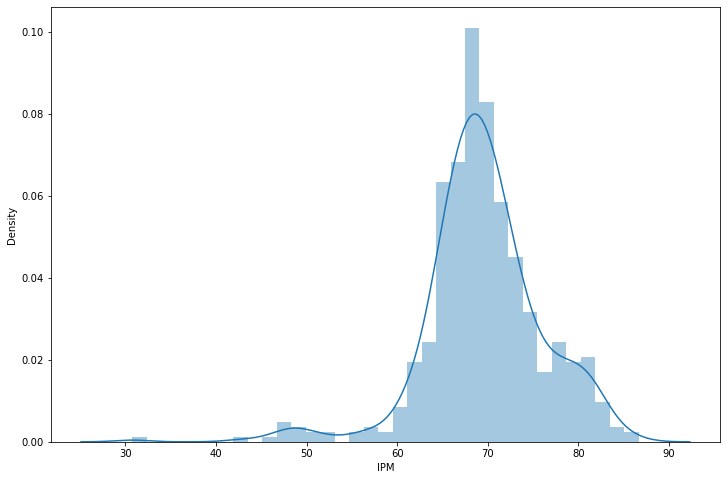
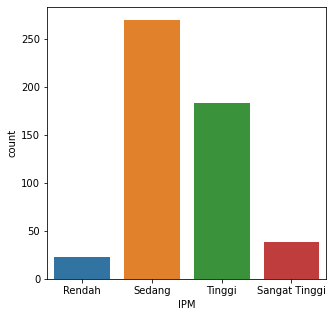
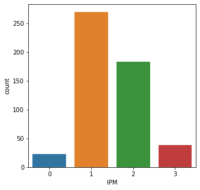
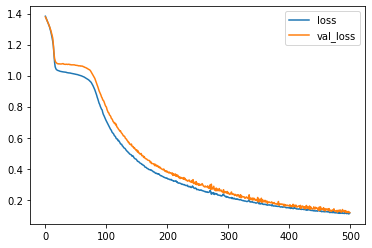

# Contoh Classification 


```python
%matplotlib inline
import numpy as np
import pandas as pd
import seaborn as sns
import matplotlib.pyplot as plt
import tensorflow as tf
```


```python
df = pd.read_excel('book2.xlsx')
```


```python
df.describe()
```


<div>
<style scoped>
    .dataframe tbody tr th:only-of-type {
        vertical-align: middle;
    }

    .dataframe tbody tr th {
        vertical-align: top;
    }

    .dataframe thead th {
        text-align: right;
    }
</style>
<table border="1" class="dataframe">
  <thead>
    <tr style="text-align: right;">
      <th></th>
      <th>UHH</th>
      <th>Pengeluaran</th>
      <th>HLS</th>
      <th>RLS</th>
      <th>IPM</th>
    </tr>
  </thead>
  <tbody>
    <tr>
      <th>count</th>
      <td>514.000000</td>
      <td>514.000000</td>
      <td>514.000000</td>
      <td>514.000000</td>
      <td>514.000000</td>
    </tr>
    <tr>
      <th>mean</th>
      <td>69.397160</td>
      <td>10443.103113</td>
      <td>12.888969</td>
      <td>8.216167</td>
      <td>69.524163</td>
    </tr>
    <tr>
      <th>std</th>
      <td>3.486261</td>
      <td>2712.097164</td>
      <td>1.341675</td>
      <td>1.649844</td>
      <td>6.548357</td>
    </tr>
    <tr>
      <th>min</th>
      <td>55.120000</td>
      <td>4181.000000</td>
      <td>3.290000</td>
      <td>0.970000</td>
      <td>30.750000</td>
    </tr>
    <tr>
      <th>25%</th>
      <td>67.087500</td>
      <td>8652.500000</td>
      <td>12.290000</td>
      <td>7.272500</td>
      <td>66.330000</td>
    </tr>
    <tr>
      <th>50%</th>
      <td>69.780000</td>
      <td>10293.500000</td>
      <td>12.815000</td>
      <td>8.110000</td>
      <td>69.170000</td>
    </tr>
    <tr>
      <th>75%</th>
      <td>71.747500</td>
      <td>11812.000000</td>
      <td>13.510000</td>
      <td>9.110000</td>
      <td>72.765000</td>
    </tr>
    <tr>
      <th>max</th>
      <td>77.550000</td>
      <td>23851.000000</td>
      <td>17.390000</td>
      <td>12.640000</td>
      <td>86.650000</td>
    </tr>
  </tbody>
</table>
</div>


NB: Sebenarnya membuat klasifikasi dari data IPM dari variabel pembangunnya (UHH, Pengeluaran, dll) ini tidak boleh, karena ga guna buat apa capek2 bikin model, padahal bisa disortir pake excel. Tapi gapapalah buat contoh ae

<60 rendah

60<= x <70 sedang

70<= x <80 tinggi

=>80 sangat tinggi


```python
df.head()
```


<div>
<style scoped>
    .dataframe tbody tr th:only-of-type {
        vertical-align: middle;
    }

    .dataframe tbody tr th {
        vertical-align: top;
    }

    .dataframe thead th {
        text-align: right;
    }
</style>
<table border="1" class="dataframe">
  <thead>
    <tr style="text-align: right;">
      <th></th>
      <th>Prov_Kab_Kota</th>
      <th>UHH</th>
      <th>Pengeluaran</th>
      <th>HLS</th>
      <th>RLS</th>
      <th>IPM</th>
    </tr>
  </thead>
  <tbody>
    <tr>
      <th>0</th>
      <td>Simeulue</td>
      <td>65.22</td>
      <td>7210</td>
      <td>13.51</td>
      <td>9.08</td>
      <td>65.70</td>
    </tr>
    <tr>
      <th>1</th>
      <td>Aceh Singkil</td>
      <td>67.36</td>
      <td>8715</td>
      <td>14.30</td>
      <td>8.52</td>
      <td>68.91</td>
    </tr>
    <tr>
      <th>2</th>
      <td>Aceh Selatan</td>
      <td>64.27</td>
      <td>8187</td>
      <td>14.41</td>
      <td>8.59</td>
      <td>66.90</td>
    </tr>
    <tr>
      <th>3</th>
      <td>Aceh Tenggara</td>
      <td>68.04</td>
      <td>8067</td>
      <td>13.99</td>
      <td>9.65</td>
      <td>69.36</td>
    </tr>
    <tr>
      <th>4</th>
      <td>Aceh Timur</td>
      <td>68.67</td>
      <td>8600</td>
      <td>13.02</td>
      <td>7.86</td>
      <td>67.39</td>
    </tr>
  </tbody>
</table>
</div>


```python
plt.figure(figsize=(12,8))
sns.distplot(df['IPM'])
```

    C:\Users\ASUS\anaconda3\lib\site-packages\seaborn\distributions.py:2551: FutureWarning: `distplot` is a deprecated function and will be removed in a future version. Please adapt your code to use either `displot` (a figure-level function with similar flexibility) or `histplot` (an axes-level function for histograms).
      warnings.warn(msg, FutureWarning)
    


    <AxesSubplot:xlabel='IPM', ylabel='Density'>





```python
#membuat klasifikasi
bins = [0,60,70,80,100]
```


```python
data = df.copy() #df.copy agar data di df tidak berubah
```


```python
name = ['Rendah', 'Sedang', 'Tinggi', 'Sangat Tinggi']
```


```python
df['IPM'] = pd.cut(df.IPM, bins, labels=name)
```


```python
df.head()
```


<div>
<style scoped>
    .dataframe tbody tr th:only-of-type {
        vertical-align: middle;
    }

    .dataframe tbody tr th {
        vertical-align: top;
    }

    .dataframe thead th {
        text-align: right;
    }
</style>
<table border="1" class="dataframe">
  <thead>
    <tr style="text-align: right;">
      <th></th>
      <th>Prov_Kab_Kota</th>
      <th>UHH</th>
      <th>Pengeluaran</th>
      <th>HLS</th>
      <th>RLS</th>
      <th>IPM</th>
    </tr>
  </thead>
  <tbody>
    <tr>
      <th>0</th>
      <td>Simeulue</td>
      <td>65.22</td>
      <td>7210</td>
      <td>13.51</td>
      <td>9.08</td>
      <td>Sedang</td>
    </tr>
    <tr>
      <th>1</th>
      <td>Aceh Singkil</td>
      <td>67.36</td>
      <td>8715</td>
      <td>14.30</td>
      <td>8.52</td>
      <td>Sedang</td>
    </tr>
    <tr>
      <th>2</th>
      <td>Aceh Selatan</td>
      <td>64.27</td>
      <td>8187</td>
      <td>14.41</td>
      <td>8.59</td>
      <td>Sedang</td>
    </tr>
    <tr>
      <th>3</th>
      <td>Aceh Tenggara</td>
      <td>68.04</td>
      <td>8067</td>
      <td>13.99</td>
      <td>9.65</td>
      <td>Sedang</td>
    </tr>
    <tr>
      <th>4</th>
      <td>Aceh Timur</td>
      <td>68.67</td>
      <td>8600</td>
      <td>13.02</td>
      <td>7.86</td>
      <td>Sedang</td>
    </tr>
  </tbody>
</table>
</div>


```python
plt.figure(figsize=(5,5))
sns.countplot(x='IPM', data=df)
```


    <AxesSubplot:xlabel='IPM', ylabel='count'>





eh ini gw gatau kenapa gabisa klasifikasi pake label nama wkwkwk, jadinya ditransform ke angka


```python
names = [0,1,2,3]
```


```python
data['IPM'] = pd.cut(data.IPM, bins, labels=names)
```


```python
data = data.drop('Prov_Kab_Kota', axis=1)
```


```python
data
```


<div>
<style scoped>
    .dataframe tbody tr th:only-of-type {
        vertical-align: middle;
    }

    .dataframe tbody tr th {
        vertical-align: top;
    }

    .dataframe thead th {
        text-align: right;
    }
</style>
<table border="1" class="dataframe">
  <thead>
    <tr style="text-align: right;">
      <th></th>
      <th>UHH</th>
      <th>Pengeluaran</th>
      <th>HLS</th>
      <th>RLS</th>
      <th>IPM</th>
    </tr>
  </thead>
  <tbody>
    <tr>
      <th>0</th>
      <td>65.22</td>
      <td>7210</td>
      <td>13.51</td>
      <td>9.08</td>
      <td>1</td>
    </tr>
    <tr>
      <th>1</th>
      <td>67.36</td>
      <td>8715</td>
      <td>14.30</td>
      <td>8.52</td>
      <td>1</td>
    </tr>
    <tr>
      <th>2</th>
      <td>64.27</td>
      <td>8187</td>
      <td>14.41</td>
      <td>8.59</td>
      <td>1</td>
    </tr>
    <tr>
      <th>3</th>
      <td>68.04</td>
      <td>8067</td>
      <td>13.99</td>
      <td>9.65</td>
      <td>1</td>
    </tr>
    <tr>
      <th>4</th>
      <td>68.67</td>
      <td>8600</td>
      <td>13.02</td>
      <td>7.86</td>
      <td>1</td>
    </tr>
    <tr>
      <th>...</th>
      <td>...</td>
      <td>...</td>
      <td>...</td>
      <td>...</td>
      <td>...</td>
    </tr>
    <tr>
      <th>509</th>
      <td>65.61</td>
      <td>5702</td>
      <td>5.19</td>
      <td>1.96</td>
      <td>0</td>
    </tr>
    <tr>
      <th>510</th>
      <td>65.60</td>
      <td>5709</td>
      <td>10.57</td>
      <td>4.92</td>
      <td>0</td>
    </tr>
    <tr>
      <th>511</th>
      <td>65.51</td>
      <td>5593</td>
      <td>7.36</td>
      <td>2.64</td>
      <td>0</td>
    </tr>
    <tr>
      <th>512</th>
      <td>65.11</td>
      <td>4958</td>
      <td>9.80</td>
      <td>3.00</td>
      <td>0</td>
    </tr>
    <tr>
      <th>513</th>
      <td>70.38</td>
      <td>15176</td>
      <td>15.00</td>
      <td>11.55</td>
      <td>3</td>
    </tr>
  </tbody>
</table>
<p>514 rows × 5 columns</p>
</div>


```python
X = data.drop('IPM', axis=1).values
y = data['IPM'].values
```


```python
y
```


    [1, 1, 1, 1, 1, ..., 0, 0, 0, 0, 3]
    Length: 514
    Categories (4, int64): [0 < 1 < 2 < 3]


```python
plt.figure(figsize=(5,5))
sns.countplot(x='IPM', data=data)
```


    <AxesSubplot:xlabel='IPM', ylabel='count'>





0 = rendah
1 = sedang
2 = tinggi
3 = sangat tinggi

One Hot Encoding

ngubah nilai klasifikasi tadi jadi bentuk array

rendah = 0 = [1. 0. 0. 0]

sedang = 1 = [0. 1. 0. 0]

dst

gw gatau alasan pake ini apa, pake ae
soale klo gapake gabisa awokawok


```python
from sklearn.preprocessing import LabelEncoder, OneHotEncoder

le = LabelEncoder()
ohe = OneHotEncoder(sparse=False)
y = le.fit_transform(y)
y = ohe.fit_transform(y.reshape(-1,1))
print(y)
```

    [[0. 1. 0. 0.]
     [0. 1. 0. 0.]
     [0. 1. 0. 0.]
     ...
     [1. 0. 0. 0.]
     [1. 0. 0. 0.]
     [0. 0. 0. 1.]]
    


```python
from sklearn.model_selection import train_test_split
X_train, X_test, y_train, y_test = train_test_split(X, y, test_size=0.30, random_state=221810445)
```


```python
from sklearn.preprocessing import MinMaxScaler
scaler = MinMaxScaler()
X_train = scaler.fit_transform(X_train)
X_test = scaler.transform(X_test)
```


```python
from tensorflow.keras.models import Sequential
from tensorflow.keras.layers import Dense, Activation
from tensorflow.keras.optimizers import Adam
```


```python
X_train.shape
```


    (359, 4)


```python
model = Sequential()

model.add(Dense(units=4,activation='relu'))
model.add(Dense(units=6,activation='relu'))
model.add(Dense(units=6,activation='relu'))
model.add(Dense(units=6,activation='relu'))
model.add(Dense(units=4,activation='softmax')) #klo binary classification diganti jadi sigmoid

# For a categorical classification problem
model.compile(loss='categorical_crossentropy', optimizer='adam')
# klo binary  classification diganti jadi binary_crossentropy
```


```python
model.fit(x=X_train, 
          y=y_train, 
          epochs=500,
          verbose=1, 
          validation_data=(X_test, y_test))
```

    Epoch 1/500
    12/12 [==============================] - 0s 15ms/step - loss: 1.3826 - val_loss: 1.3777
    Epoch 2/500
    12/12 [==============================] - 0s 3ms/step - loss: 1.3726 - val_loss: 1.3691
    Epoch 3/500
    12/12 [==============================] - 0s 3ms/step - loss: 1.3633 - val_loss: 1.3607
    Epoch 4/500
    12/12 [==============================] - 0s 2ms/step - loss: 1.3537 - val_loss: 1.3522
    Epoch 5/500
    12/12 [==============================] - 0s 3ms/step - loss: 1.3437 - val_loss: 1.3432
    Epoch 6/500
    12/12 [==============================] - 0s 2ms/step - loss: 1.3331 - val_loss: 1.3341
    Epoch 7/500
    12/12 [==============================] - 0s 2ms/step - loss: 1.3219 - val_loss: 1.3243
    Epoch 8/500
    12/12 [==============================] - 0s 3ms/step - loss: 1.3105 - val_loss: 1.3136
    Epoch 9/500
    12/12 [==============================] - 0s 3ms/step - loss: 1.2959 - val_loss: 1.3024
    Epoch 10/500
    12/12 [==============================] - 0s 2ms/step - loss: 1.2809 - val_loss: 1.2893
    Epoch 11/500
    12/12 [==============================] - 0s 3ms/step - loss: 1.2634 - val_loss: 1.2745
    Epoch 12/500
    12/12 [==============================] - 0s 2ms/step - loss: 1.2431 - val_loss: 1.2585
    Epoch 13/500
    12/12 [==============================] - 0s 2ms/step - loss: 1.2204 - val_loss: 1.2420
    Epoch 14/500
    12/12 [==============================] - 0s 2ms/step - loss: 1.1924 - val_loss: 1.1998
    Epoch 15/500
    12/12 [==============================] - 0s 2ms/step - loss: 1.1351 - val_loss: 1.1472
    Epoch 16/500
    12/12 [==============================] - 0s 2ms/step - loss: 1.0870 - val_loss: 1.1105
    Epoch 17/500
    12/12 [==============================] - 0s 2ms/step - loss: 1.0568 - val_loss: 1.0948
    Epoch 18/500
    12/12 [==============================] - 0s 3ms/step - loss: 1.0458 - val_loss: 1.0859
    Epoch 19/500
    12/12 [==============================] - 0s 2ms/step - loss: 1.0390 - val_loss: 1.0830
    Epoch 20/500
    12/12 [==============================] - 0s 2ms/step - loss: 1.0363 - val_loss: 1.0786
    Epoch 21/500
    12/12 [==============================] - 0s 3ms/step - loss: 1.0337 - val_loss: 1.0770
    Epoch 22/500
    12/12 [==============================] - 0s 3ms/step - loss: 1.0325 - val_loss: 1.0751
    Epoch 23/500
    12/12 [==============================] - 0s 2ms/step - loss: 1.0312 - val_loss: 1.0763
    Epoch 24/500
    12/12 [==============================] - 0s 2ms/step - loss: 1.0292 - val_loss: 1.0755
    Epoch 25/500
    12/12 [==============================] - 0s 2ms/step - loss: 1.0279 - val_loss: 1.0749
    Epoch 26/500
    12/12 [==============================] - 0s 2ms/step - loss: 1.0273 - val_loss: 1.0747
    Epoch 27/500
    12/12 [==============================] - 0s 3ms/step - loss: 1.0265 - val_loss: 1.0748
    Epoch 28/500
    12/12 [==============================] - 0s 2ms/step - loss: 1.0255 - val_loss: 1.0756
    Epoch 29/500
    12/12 [==============================] - 0s 3ms/step - loss: 1.0245 - val_loss: 1.0767
    Epoch 30/500
    12/12 [==============================] - 0s 3ms/step - loss: 1.0240 - val_loss: 1.0776
    Epoch 31/500
    12/12 [==============================] - 0s 3ms/step - loss: 1.0236 - val_loss: 1.0744
    Epoch 32/500
    12/12 [==============================] - 0s 3ms/step - loss: 1.0231 - val_loss: 1.0733
    Epoch 33/500
    12/12 [==============================] - 0s 3ms/step - loss: 1.0225 - val_loss: 1.0729
    Epoch 34/500
    12/12 [==============================] - 0s 3ms/step - loss: 1.0220 - val_loss: 1.0724
    Epoch 35/500
    12/12 [==============================] - 0s 2ms/step - loss: 1.0215 - val_loss: 1.0734
    Epoch 36/500
    12/12 [==============================] - 0s 2ms/step - loss: 1.0196 - val_loss: 1.0731
    Epoch 37/500
    12/12 [==============================] - 0s 3ms/step - loss: 1.0189 - val_loss: 1.0720
    Epoch 38/500
    12/12 [==============================] - 0s 2ms/step - loss: 1.0182 - val_loss: 1.0728
    Epoch 39/500
    12/12 [==============================] - 0s 4ms/step - loss: 1.0173 - val_loss: 1.0733
    Epoch 40/500
    12/12 [==============================] - 0s 3ms/step - loss: 1.0169 - val_loss: 1.0730
    Epoch 41/500
    12/12 [==============================] - 0s 2ms/step - loss: 1.0172 - val_loss: 1.0706
    Epoch 42/500
    12/12 [==============================] - 0s 3ms/step - loss: 1.0158 - val_loss: 1.0713
    Epoch 43/500
    12/12 [==============================] - 0s 3ms/step - loss: 1.0150 - val_loss: 1.0694
    Epoch 44/500
    12/12 [==============================] - 0s 2ms/step - loss: 1.0144 - val_loss: 1.0694
    Epoch 45/500
    12/12 [==============================] - 0s 2ms/step - loss: 1.0135 - val_loss: 1.0688
    Epoch 46/500
    12/12 [==============================] - 0s 3ms/step - loss: 1.0125 - val_loss: 1.0690
    Epoch 47/500
    12/12 [==============================] - 0s 2ms/step - loss: 1.0116 - val_loss: 1.0690
    Epoch 48/500
    12/12 [==============================] - 0s 2ms/step - loss: 1.0110 - val_loss: 1.0695
    Epoch 49/500
    12/12 [==============================] - 0s 2ms/step - loss: 1.0102 - val_loss: 1.0687
    Epoch 50/500
    12/12 [==============================] - 0s 2ms/step - loss: 1.0090 - val_loss: 1.0672
    Epoch 51/500
    12/12 [==============================] - 0s 3ms/step - loss: 1.0084 - val_loss: 1.0667
    Epoch 52/500
    12/12 [==============================] - 0s 2ms/step - loss: 1.0076 - val_loss: 1.0661
    Epoch 53/500
    12/12 [==============================] - 0s 2ms/step - loss: 1.0066 - val_loss: 1.0654
    Epoch 54/500
    12/12 [==============================] - 0s 3ms/step - loss: 1.0061 - val_loss: 1.0651
    Epoch 55/500
    12/12 [==============================] - 0s 2ms/step - loss: 1.0044 - val_loss: 1.0635
    Epoch 56/500
    12/12 [==============================] - 0s 2ms/step - loss: 1.0035 - val_loss: 1.0629
    Epoch 57/500
    12/12 [==============================] - 0s 3ms/step - loss: 1.0020 - val_loss: 1.0633
    Epoch 58/500
    12/12 [==============================] - 0s 2ms/step - loss: 1.0009 - val_loss: 1.0632
    Epoch 59/500
    12/12 [==============================] - 0s 3ms/step - loss: 1.0003 - val_loss: 1.0610
    Epoch 60/500
    12/12 [==============================] - 0s 3ms/step - loss: 0.9984 - val_loss: 1.0618
    Epoch 61/500
    12/12 [==============================] - 0s 3ms/step - loss: 0.9965 - val_loss: 1.0613
    Epoch 62/500
    12/12 [==============================] - 0s 3ms/step - loss: 0.9952 - val_loss: 1.0607
    Epoch 63/500
    12/12 [==============================] - 0s 2ms/step - loss: 0.9932 - val_loss: 1.0577
    Epoch 64/500
    12/12 [==============================] - 0s 2ms/step - loss: 0.9919 - val_loss: 1.0575
    Epoch 65/500
    12/12 [==============================] - 0s 2ms/step - loss: 0.9895 - val_loss: 1.0542
    Epoch 66/500
    12/12 [==============================] - 0s 2ms/step - loss: 0.9874 - val_loss: 1.0530
    Epoch 67/500
    12/12 [==============================] - 0s 3ms/step - loss: 0.9850 - val_loss: 1.0515
    Epoch 68/500
    12/12 [==============================] - 0s 3ms/step - loss: 0.9829 - val_loss: 1.0496
    Epoch 69/500
    12/12 [==============================] - 0s 4ms/step - loss: 0.9803 - val_loss: 1.0467
    Epoch 70/500
    12/12 [==============================] - 0s 3ms/step - loss: 0.9783 - val_loss: 1.0459
    Epoch 71/500
    12/12 [==============================] - 0s 3ms/step - loss: 0.9748 - val_loss: 1.0421
    Epoch 72/500
    12/12 [==============================] - 0s 3ms/step - loss: 0.9721 - val_loss: 1.0398
    Epoch 73/500
    12/12 [==============================] - 0s 3ms/step - loss: 0.9684 - val_loss: 1.0385
    Epoch 74/500
    12/12 [==============================] - 0s 2ms/step - loss: 0.9648 - val_loss: 1.0353
    Epoch 75/500
    12/12 [==============================] - 0s 3ms/step - loss: 0.9609 - val_loss: 1.0305
    Epoch 76/500
    12/12 [==============================] - 0s 2ms/step - loss: 0.9565 - val_loss: 1.0237
    Epoch 77/500
    12/12 [==============================] - 0s 3ms/step - loss: 0.9497 - val_loss: 1.0161
    Epoch 78/500
    12/12 [==============================] - 0s 3ms/step - loss: 0.9424 - val_loss: 1.0099
    Epoch 79/500
    12/12 [==============================] - 0s 3ms/step - loss: 0.9351 - val_loss: 1.0041
    Epoch 80/500
    12/12 [==============================] - 0s 3ms/step - loss: 0.9263 - val_loss: 0.9981
    Epoch 81/500
    12/12 [==============================] - 0s 3ms/step - loss: 0.9173 - val_loss: 0.9910
    Epoch 82/500
    12/12 [==============================] - 0s 3ms/step - loss: 0.9085 - val_loss: 0.9821
    Epoch 83/500
    12/12 [==============================] - 0s 3ms/step - loss: 0.8975 - val_loss: 0.9706
    Epoch 84/500
    12/12 [==============================] - 0s 3ms/step - loss: 0.8852 - val_loss: 0.9599
    Epoch 85/500
    12/12 [==============================] - 0s 2ms/step - loss: 0.8740 - val_loss: 0.9486
    Epoch 86/500
    12/12 [==============================] - 0s 3ms/step - loss: 0.8597 - val_loss: 0.9377
    Epoch 87/500
    12/12 [==============================] - 0s 3ms/step - loss: 0.8486 - val_loss: 0.9272
    Epoch 88/500
    12/12 [==============================] - 0s 2ms/step - loss: 0.8347 - val_loss: 0.9139
    Epoch 89/500
    12/12 [==============================] - 0s 3ms/step - loss: 0.8220 - val_loss: 0.9018
    Epoch 90/500
    12/12 [==============================] - 0s 3ms/step - loss: 0.8142 - val_loss: 0.8924
    Epoch 91/500
    12/12 [==============================] - 0s 3ms/step - loss: 0.8018 - val_loss: 0.8822
    Epoch 92/500
    12/12 [==============================] - 0s 3ms/step - loss: 0.7934 - val_loss: 0.8749
    Epoch 93/500
    12/12 [==============================] - 0s 2ms/step - loss: 0.7834 - val_loss: 0.8623
    Epoch 94/500
    12/12 [==============================] - 0s 3ms/step - loss: 0.7790 - val_loss: 0.8561
    Epoch 95/500
    12/12 [==============================] - 0s 2ms/step - loss: 0.7619 - val_loss: 0.8433
    Epoch 96/500
    12/12 [==============================] - 0s 2ms/step - loss: 0.7497 - val_loss: 0.8406
    Epoch 97/500
    12/12 [==============================] - 0s 3ms/step - loss: 0.7421 - val_loss: 0.8329
    Epoch 98/500
    12/12 [==============================] - 0s 2ms/step - loss: 0.7324 - val_loss: 0.8213
    Epoch 99/500
    12/12 [==============================] - 0s 4ms/step - loss: 0.7226 - val_loss: 0.8100
    Epoch 100/500
    12/12 [==============================] - 0s 2ms/step - loss: 0.7145 - val_loss: 0.8017
    Epoch 101/500
    12/12 [==============================] - 0s 2ms/step - loss: 0.7067 - val_loss: 0.7971
    Epoch 102/500
    12/12 [==============================] - 0s 2ms/step - loss: 0.6980 - val_loss: 0.7810
    Epoch 103/500
    12/12 [==============================] - 0s 2ms/step - loss: 0.6899 - val_loss: 0.7713
    Epoch 104/500
    12/12 [==============================] - 0s 2ms/step - loss: 0.6838 - val_loss: 0.7617
    Epoch 105/500
    12/12 [==============================] - 0s 2ms/step - loss: 0.6744 - val_loss: 0.7596
    Epoch 106/500
    12/12 [==============================] - 0s 3ms/step - loss: 0.6663 - val_loss: 0.7469
    Epoch 107/500
    12/12 [==============================] - 0s 2ms/step - loss: 0.6597 - val_loss: 0.7432
    Epoch 108/500
    12/12 [==============================] - 0s 3ms/step - loss: 0.6523 - val_loss: 0.7374
    Epoch 109/500
    12/12 [==============================] - 0s 2ms/step - loss: 0.6485 - val_loss: 0.7251
    Epoch 110/500
    12/12 [==============================] - 0s 3ms/step - loss: 0.6373 - val_loss: 0.7215
    Epoch 111/500
    12/12 [==============================] - 0s 3ms/step - loss: 0.6321 - val_loss: 0.7145
    Epoch 112/500
    12/12 [==============================] - 0s 3ms/step - loss: 0.6281 - val_loss: 0.7036
    Epoch 113/500
    12/12 [==============================] - 0s 3ms/step - loss: 0.6230 - val_loss: 0.7008
    Epoch 114/500
    12/12 [==============================] - 0s 3ms/step - loss: 0.6134 - val_loss: 0.6922
    Epoch 115/500
    12/12 [==============================] - 0s 3ms/step - loss: 0.6101 - val_loss: 0.6950
    Epoch 116/500
    12/12 [==============================] - 0s 3ms/step - loss: 0.6053 - val_loss: 0.6827
    Epoch 117/500
    12/12 [==============================] - 0s 3ms/step - loss: 0.5952 - val_loss: 0.6874
    Epoch 118/500
    12/12 [==============================] - 0s 3ms/step - loss: 0.5925 - val_loss: 0.6699
    Epoch 119/500
    12/12 [==============================] - 0s 3ms/step - loss: 0.5916 - val_loss: 0.6669
    Epoch 120/500
    12/12 [==============================] - 0s 3ms/step - loss: 0.5808 - val_loss: 0.6604
    Epoch 121/500
    12/12 [==============================] - 0s 3ms/step - loss: 0.5823 - val_loss: 0.6537
    Epoch 122/500
    12/12 [==============================] - 0s 3ms/step - loss: 0.5759 - val_loss: 0.6494
    Epoch 123/500
    12/12 [==============================] - 0s 3ms/step - loss: 0.5696 - val_loss: 0.6422
    Epoch 124/500
    12/12 [==============================] - 0s 2ms/step - loss: 0.5609 - val_loss: 0.6450
    Epoch 125/500
    12/12 [==============================] - 0s 3ms/step - loss: 0.5580 - val_loss: 0.6342
    Epoch 126/500
    12/12 [==============================] - 0s 3ms/step - loss: 0.5577 - val_loss: 0.6296
    Epoch 127/500
    12/12 [==============================] - 0s 4ms/step - loss: 0.5474 - val_loss: 0.6247
    Epoch 128/500
    12/12 [==============================] - 0s 3ms/step - loss: 0.5451 - val_loss: 0.6181
    Epoch 129/500
    12/12 [==============================] - 0s 2ms/step - loss: 0.5383 - val_loss: 0.6109
    Epoch 130/500
    12/12 [==============================] - 0s 3ms/step - loss: 0.5334 - val_loss: 0.6109
    Epoch 131/500
    12/12 [==============================] - 0s 3ms/step - loss: 0.5319 - val_loss: 0.6069
    Epoch 132/500
    12/12 [==============================] - 0s 3ms/step - loss: 0.5281 - val_loss: 0.5969
    Epoch 133/500
    12/12 [==============================] - 0s 3ms/step - loss: 0.5212 - val_loss: 0.5930
    Epoch 134/500
    12/12 [==============================] - 0s 3ms/step - loss: 0.5163 - val_loss: 0.5901
    Epoch 135/500
    12/12 [==============================] - 0s 3ms/step - loss: 0.5122 - val_loss: 0.5815
    Epoch 136/500
    12/12 [==============================] - 0s 3ms/step - loss: 0.5094 - val_loss: 0.5780
    Epoch 137/500
    12/12 [==============================] - 0s 3ms/step - loss: 0.5034 - val_loss: 0.5694
    Epoch 138/500
    12/12 [==============================] - 0s 3ms/step - loss: 0.5012 - val_loss: 0.5698
    Epoch 139/500
    12/12 [==============================] - 0s 3ms/step - loss: 0.4951 - val_loss: 0.5589
    Epoch 140/500
    12/12 [==============================] - 0s 3ms/step - loss: 0.4927 - val_loss: 0.5576
    Epoch 141/500
    12/12 [==============================] - 0s 3ms/step - loss: 0.4909 - val_loss: 0.5539
    Epoch 142/500
    12/12 [==============================] - 0s 3ms/step - loss: 0.4887 - val_loss: 0.5589
    Epoch 143/500
    12/12 [==============================] - 0s 3ms/step - loss: 0.4806 - val_loss: 0.5454
    Epoch 144/500
    12/12 [==============================] - 0s 3ms/step - loss: 0.4829 - val_loss: 0.5419
    Epoch 145/500
    12/12 [==============================] - 0s 3ms/step - loss: 0.4814 - val_loss: 0.5429
    Epoch 146/500
    12/12 [==============================] - 0s 3ms/step - loss: 0.4715 - val_loss: 0.5322
    Epoch 147/500
    12/12 [==============================] - 0s 3ms/step - loss: 0.4677 - val_loss: 0.5353
    Epoch 148/500
    12/12 [==============================] - 0s 2ms/step - loss: 0.4641 - val_loss: 0.5257
    Epoch 149/500
    12/12 [==============================] - 0s 3ms/step - loss: 0.4621 - val_loss: 0.5243
    Epoch 150/500
    12/12 [==============================] - 0s 3ms/step - loss: 0.4607 - val_loss: 0.5164
    Epoch 151/500
    12/12 [==============================] - 0s 3ms/step - loss: 0.4545 - val_loss: 0.5212
    Epoch 152/500
    12/12 [==============================] - 0s 5ms/step - loss: 0.4481 - val_loss: 0.5079
    Epoch 153/500
    12/12 [==============================] - 0s 2ms/step - loss: 0.4466 - val_loss: 0.5146
    Epoch 154/500
    12/12 [==============================] - 0s 4ms/step - loss: 0.4460 - val_loss: 0.5014
    Epoch 155/500
    12/12 [==============================] - 0s 4ms/step - loss: 0.4407 - val_loss: 0.5006
    Epoch 156/500
    12/12 [==============================] - 0s 3ms/step - loss: 0.4369 - val_loss: 0.4945
    Epoch 157/500
    12/12 [==============================] - 0s 3ms/step - loss: 0.4351 - val_loss: 0.4969
    Epoch 158/500
    12/12 [==============================] - 0s 2ms/step - loss: 0.4328 - val_loss: 0.4981
    Epoch 159/500
    12/12 [==============================] - 0s 3ms/step - loss: 0.4279 - val_loss: 0.4840
    Epoch 160/500
    12/12 [==============================] - 0s 3ms/step - loss: 0.4278 - val_loss: 0.4851
    Epoch 161/500
    12/12 [==============================] - 0s 3ms/step - loss: 0.4233 - val_loss: 0.4835
    Epoch 162/500
    12/12 [==============================] - 0s 3ms/step - loss: 0.4218 - val_loss: 0.4726
    Epoch 163/500
    12/12 [==============================] - 0s 3ms/step - loss: 0.4189 - val_loss: 0.4783
    Epoch 164/500
    12/12 [==============================] - 0s 3ms/step - loss: 0.4113 - val_loss: 0.4690
    Epoch 165/500
    12/12 [==============================] - 0s 3ms/step - loss: 0.4097 - val_loss: 0.4657
    Epoch 166/500
    12/12 [==============================] - 0s 3ms/step - loss: 0.4091 - val_loss: 0.4635
    Epoch 167/500
    12/12 [==============================] - 0s 3ms/step - loss: 0.4046 - val_loss: 0.4626
    Epoch 168/500
    12/12 [==============================] - 0s 3ms/step - loss: 0.4015 - val_loss: 0.4579
    Epoch 169/500
    12/12 [==============================] - 0s 3ms/step - loss: 0.4008 - val_loss: 0.4551
    Epoch 170/500
    12/12 [==============================] - 0s 3ms/step - loss: 0.3967 - val_loss: 0.4536
    Epoch 171/500
    12/12 [==============================] - 0s 3ms/step - loss: 0.3945 - val_loss: 0.4533
    Epoch 172/500
    12/12 [==============================] - 0s 3ms/step - loss: 0.3937 - val_loss: 0.4511
    Epoch 173/500
    12/12 [==============================] - 0s 3ms/step - loss: 0.3938 - val_loss: 0.4396
    Epoch 174/500
    12/12 [==============================] - 0s 3ms/step - loss: 0.3898 - val_loss: 0.4442
    Epoch 175/500
    12/12 [==============================] - 0s 3ms/step - loss: 0.3911 - val_loss: 0.4331
    Epoch 176/500
    12/12 [==============================] - 0s 3ms/step - loss: 0.3863 - val_loss: 0.4342
    Epoch 177/500
    12/12 [==============================] - 0s 3ms/step - loss: 0.3847 - val_loss: 0.4327
    Epoch 178/500
    12/12 [==============================] - 0s 3ms/step - loss: 0.3793 - val_loss: 0.4314
    Epoch 179/500
    12/12 [==============================] - 0s 3ms/step - loss: 0.3792 - val_loss: 0.4315
    Epoch 180/500
    12/12 [==============================] - 0s 3ms/step - loss: 0.3772 - val_loss: 0.4201
    Epoch 181/500
    12/12 [==============================] - 0s 5ms/step - loss: 0.3723 - val_loss: 0.4287
    Epoch 182/500
    12/12 [==============================] - 0s 3ms/step - loss: 0.3697 - val_loss: 0.4185
    Epoch 183/500
    12/12 [==============================] - 0s 3ms/step - loss: 0.3713 - val_loss: 0.4232
    Epoch 184/500
    12/12 [==============================] - 0s 3ms/step - loss: 0.3673 - val_loss: 0.4155
    Epoch 185/500
    12/12 [==============================] - 0s 3ms/step - loss: 0.3684 - val_loss: 0.4207
    Epoch 186/500
    12/12 [==============================] - 0s 3ms/step - loss: 0.3643 - val_loss: 0.4107
    Epoch 187/500
    12/12 [==============================] - 0s 3ms/step - loss: 0.3670 - val_loss: 0.4142
    Epoch 188/500
    12/12 [==============================] - 0s 3ms/step - loss: 0.3620 - val_loss: 0.4055
    Epoch 189/500
    12/12 [==============================] - 0s 3ms/step - loss: 0.3575 - val_loss: 0.4097
    Epoch 190/500
    12/12 [==============================] - 0s 3ms/step - loss: 0.3549 - val_loss: 0.4050
    Epoch 191/500
    12/12 [==============================] - 0s 3ms/step - loss: 0.3553 - val_loss: 0.3993
    Epoch 192/500
    12/12 [==============================] - 0s 3ms/step - loss: 0.3522 - val_loss: 0.3979
    Epoch 193/500
    12/12 [==============================] - 0s 2ms/step - loss: 0.3502 - val_loss: 0.3958
    Epoch 194/500
    12/12 [==============================] - 0s 3ms/step - loss: 0.3486 - val_loss: 0.3927
    Epoch 195/500
    12/12 [==============================] - 0s 3ms/step - loss: 0.3453 - val_loss: 0.3983
    Epoch 196/500
    12/12 [==============================] - 0s 3ms/step - loss: 0.3446 - val_loss: 0.3907
    Epoch 197/500
    12/12 [==============================] - 0s 4ms/step - loss: 0.3420 - val_loss: 0.3836
    Epoch 198/500
    12/12 [==============================] - 0s 4ms/step - loss: 0.3409 - val_loss: 0.3858
    Epoch 199/500
    12/12 [==============================] - 0s 4ms/step - loss: 0.3388 - val_loss: 0.3798
    Epoch 200/500
    12/12 [==============================] - 0s 3ms/step - loss: 0.3406 - val_loss: 0.3859
    Epoch 201/500
    12/12 [==============================] - 0s 4ms/step - loss: 0.3370 - val_loss: 0.3782
    Epoch 202/500
    12/12 [==============================] - 0s 3ms/step - loss: 0.3332 - val_loss: 0.3781
    Epoch 203/500
    12/12 [==============================] - 0s 3ms/step - loss: 0.3337 - val_loss: 0.3730
    Epoch 204/500
    12/12 [==============================] - 0s 3ms/step - loss: 0.3322 - val_loss: 0.3784
    Epoch 205/500
    12/12 [==============================] - 0s 3ms/step - loss: 0.3296 - val_loss: 0.3728
    Epoch 206/500
    12/12 [==============================] - 0s 4ms/step - loss: 0.3293 - val_loss: 0.3740
    Epoch 207/500
    12/12 [==============================] - 0s 3ms/step - loss: 0.3313 - val_loss: 0.3714
    Epoch 208/500
    12/12 [==============================] - 0s 2ms/step - loss: 0.3260 - val_loss: 0.3661
    Epoch 209/500
    12/12 [==============================] - 0s 3ms/step - loss: 0.3257 - val_loss: 0.3730
    Epoch 210/500
    12/12 [==============================] - 0s 3ms/step - loss: 0.3234 - val_loss: 0.3569
    Epoch 211/500
    12/12 [==============================] - 0s 3ms/step - loss: 0.3191 - val_loss: 0.3683
    Epoch 212/500
    12/12 [==============================] - 0s 3ms/step - loss: 0.3210 - val_loss: 0.3612
    Epoch 213/500
    12/12 [==============================] - 0s 3ms/step - loss: 0.3203 - val_loss: 0.3573
    Epoch 214/500
    12/12 [==============================] - 0s 3ms/step - loss: 0.3189 - val_loss: 0.3665
    Epoch 215/500
    12/12 [==============================] - 0s 3ms/step - loss: 0.3227 - val_loss: 0.3511
    Epoch 216/500
    12/12 [==============================] - 0s 3ms/step - loss: 0.3142 - val_loss: 0.3618
    Epoch 217/500
    12/12 [==============================] - 0s 3ms/step - loss: 0.3163 - val_loss: 0.3511
    Epoch 218/500
    12/12 [==============================] - 0s 3ms/step - loss: 0.3096 - val_loss: 0.3580
    Epoch 219/500
    12/12 [==============================] - 0s 3ms/step - loss: 0.3069 - val_loss: 0.3462
    Epoch 220/500
    12/12 [==============================] - 0s 3ms/step - loss: 0.3080 - val_loss: 0.3421
    Epoch 221/500
    12/12 [==============================] - 0s 3ms/step - loss: 0.3076 - val_loss: 0.3479
    Epoch 222/500
    12/12 [==============================] - 0s 3ms/step - loss: 0.3053 - val_loss: 0.3369
    Epoch 223/500
    12/12 [==============================] - 0s 3ms/step - loss: 0.3050 - val_loss: 0.3446
    Epoch 224/500
    12/12 [==============================] - 0s 4ms/step - loss: 0.3012 - val_loss: 0.3389
    Epoch 225/500
    12/12 [==============================] - 0s 2ms/step - loss: 0.2990 - val_loss: 0.3414
    Epoch 226/500
    12/12 [==============================] - 0s 3ms/step - loss: 0.3008 - val_loss: 0.3403
    Epoch 227/500
    12/12 [==============================] - 0s 3ms/step - loss: 0.2974 - val_loss: 0.3323
    Epoch 228/500
    12/12 [==============================] - 0s 2ms/step - loss: 0.2967 - val_loss: 0.3432
    Epoch 229/500
    12/12 [==============================] - 0s 2ms/step - loss: 0.2978 - val_loss: 0.3308
    Epoch 230/500
    12/12 [==============================] - 0s 2ms/step - loss: 0.2939 - val_loss: 0.3376
    Epoch 231/500
    12/12 [==============================] - 0s 2ms/step - loss: 0.2918 - val_loss: 0.3272
    Epoch 232/500
    12/12 [==============================] - 0s 2ms/step - loss: 0.2920 - val_loss: 0.3278
    Epoch 233/500
    12/12 [==============================] - 0s 2ms/step - loss: 0.2906 - val_loss: 0.3243
    Epoch 234/500
    12/12 [==============================] - 0s 4ms/step - loss: 0.2938 - val_loss: 0.3199
    Epoch 235/500
    12/12 [==============================] - 0s 2ms/step - loss: 0.2848 - val_loss: 0.3251
    Epoch 236/500
    12/12 [==============================] - 0s 2ms/step - loss: 0.2846 - val_loss: 0.3229
    Epoch 237/500
    12/12 [==============================] - 0s 2ms/step - loss: 0.2842 - val_loss: 0.3271
    Epoch 238/500
    12/12 [==============================] - 0s 2ms/step - loss: 0.2862 - val_loss: 0.3171
    Epoch 239/500
    12/12 [==============================] - 0s 2ms/step - loss: 0.2811 - val_loss: 0.3170
    Epoch 240/500
    12/12 [==============================] - 0s 2ms/step - loss: 0.2788 - val_loss: 0.3125
    Epoch 241/500
    12/12 [==============================] - 0s 2ms/step - loss: 0.2804 - val_loss: 0.3238
    Epoch 242/500
    12/12 [==============================] - 0s 2ms/step - loss: 0.2889 - val_loss: 0.3108
    Epoch 243/500
    12/12 [==============================] - 0s 2ms/step - loss: 0.2845 - val_loss: 0.3296
    Epoch 244/500
    12/12 [==============================] - 0s 2ms/step - loss: 0.2769 - val_loss: 0.3043
    Epoch 245/500
    12/12 [==============================] - 0s 2ms/step - loss: 0.2739 - val_loss: 0.3126
    Epoch 246/500
    12/12 [==============================] - 0s 2ms/step - loss: 0.2726 - val_loss: 0.3090
    Epoch 247/500
    12/12 [==============================] - 0s 2ms/step - loss: 0.2760 - val_loss: 0.2998
    Epoch 248/500
    12/12 [==============================] - 0s 2ms/step - loss: 0.2730 - val_loss: 0.3172
    Epoch 249/500
    12/12 [==============================] - 0s 2ms/step - loss: 0.2654 - val_loss: 0.2973
    Epoch 250/500
    12/12 [==============================] - 0s 2ms/step - loss: 0.2666 - val_loss: 0.3066
    Epoch 251/500
    12/12 [==============================] - 0s 2ms/step - loss: 0.2655 - val_loss: 0.3030
    Epoch 252/500
    12/12 [==============================] - 0s 2ms/step - loss: 0.2659 - val_loss: 0.2929
    Epoch 253/500
    12/12 [==============================] - 0s 2ms/step - loss: 0.2624 - val_loss: 0.3030
    Epoch 254/500
    12/12 [==============================] - 0s 2ms/step - loss: 0.2610 - val_loss: 0.2938
    Epoch 255/500
    12/12 [==============================] - 0s 2ms/step - loss: 0.2626 - val_loss: 0.2952
    Epoch 256/500
    12/12 [==============================] - 0s 2ms/step - loss: 0.2639 - val_loss: 0.2989
    Epoch 257/500
    12/12 [==============================] - 0s 2ms/step - loss: 0.2598 - val_loss: 0.2958
    Epoch 258/500
    12/12 [==============================] - 0s 2ms/step - loss: 0.2598 - val_loss: 0.3039
    Epoch 259/500
    12/12 [==============================] - 0s 2ms/step - loss: 0.2574 - val_loss: 0.2955
    Epoch 260/500
    12/12 [==============================] - 0s 2ms/step - loss: 0.2570 - val_loss: 0.2887
    Epoch 261/500
    12/12 [==============================] - 0s 2ms/step - loss: 0.2544 - val_loss: 0.2855
    Epoch 262/500
    12/12 [==============================] - 0s 2ms/step - loss: 0.2527 - val_loss: 0.2825
    Epoch 263/500
    12/12 [==============================] - 0s 2ms/step - loss: 0.2538 - val_loss: 0.2889
    Epoch 264/500
    12/12 [==============================] - 0s 2ms/step - loss: 0.2499 - val_loss: 0.2832
    Epoch 265/500
    12/12 [==============================] - 0s 2ms/step - loss: 0.2498 - val_loss: 0.2829
    Epoch 266/500
    12/12 [==============================] - 0s 4ms/step - loss: 0.2518 - val_loss: 0.2843
    Epoch 267/500
    12/12 [==============================] - ETA: 0s - loss: 0.232 - 0s 2ms/step - loss: 0.2475 - val_loss: 0.2895
    Epoch 268/500
    12/12 [==============================] - 0s 2ms/step - loss: 0.2475 - val_loss: 0.2760
    Epoch 269/500
    12/12 [==============================] - 0s 2ms/step - loss: 0.2481 - val_loss: 0.2807
    Epoch 270/500
    12/12 [==============================] - 0s 2ms/step - loss: 0.2521 - val_loss: 0.2734
    Epoch 271/500
    12/12 [==============================] - 0s 2ms/step - loss: 0.2603 - val_loss: 0.2959
    Epoch 272/500
    12/12 [==============================] - 0s 2ms/step - loss: 0.2540 - val_loss: 0.2668
    Epoch 273/500
    12/12 [==============================] - 0s 2ms/step - loss: 0.2357 - val_loss: 0.3008
    Epoch 274/500
    12/12 [==============================] - 0s 2ms/step - loss: 0.2439 - val_loss: 0.2703
    Epoch 275/500
    12/12 [==============================] - 0s 2ms/step - loss: 0.2444 - val_loss: 0.2694
    Epoch 276/500
    12/12 [==============================] - 0s 2ms/step - loss: 0.2376 - val_loss: 0.2775
    Epoch 277/500
    12/12 [==============================] - 0s 2ms/step - loss: 0.2458 - val_loss: 0.2870
    Epoch 278/500
    12/12 [==============================] - 0s 2ms/step - loss: 0.2340 - val_loss: 0.2638
    Epoch 279/500
    12/12 [==============================] - 0s 2ms/step - loss: 0.2367 - val_loss: 0.2694
    Epoch 280/500
    12/12 [==============================] - 0s 2ms/step - loss: 0.2401 - val_loss: 0.2585
    Epoch 281/500
    12/12 [==============================] - 0s 2ms/step - loss: 0.2378 - val_loss: 0.2756
    Epoch 282/500
    12/12 [==============================] - 0s 2ms/step - loss: 0.2390 - val_loss: 0.2581
    Epoch 283/500
    12/12 [==============================] - 0s 2ms/step - loss: 0.2323 - val_loss: 0.2695
    Epoch 284/500
    12/12 [==============================] - 0s 2ms/step - loss: 0.2296 - val_loss: 0.2589
    Epoch 285/500
    12/12 [==============================] - 0s 2ms/step - loss: 0.2305 - val_loss: 0.2595
    Epoch 286/500
    12/12 [==============================] - 0s 2ms/step - loss: 0.2288 - val_loss: 0.2722
    Epoch 287/500
    12/12 [==============================] - 0s 2ms/step - loss: 0.2278 - val_loss: 0.2568
    Epoch 288/500
    12/12 [==============================] - 0s 2ms/step - loss: 0.2286 - val_loss: 0.2593
    Epoch 289/500
    12/12 [==============================] - 0s 2ms/step - loss: 0.2241 - val_loss: 0.2627
    Epoch 290/500
    12/12 [==============================] - 0s 2ms/step - loss: 0.2249 - val_loss: 0.2528
    Epoch 291/500
    12/12 [==============================] - 0s 2ms/step - loss: 0.2268 - val_loss: 0.2527
    Epoch 292/500
    12/12 [==============================] - 0s 2ms/step - loss: 0.2351 - val_loss: 0.2482
    Epoch 293/500
    12/12 [==============================] - 0s 2ms/step - loss: 0.2364 - val_loss: 0.2650
    Epoch 294/500
    12/12 [==============================] - 0s 2ms/step - loss: 0.2268 - val_loss: 0.2437
    Epoch 295/500
    12/12 [==============================] - 0s 3ms/step - loss: 0.2261 - val_loss: 0.2509
    Epoch 296/500
    12/12 [==============================] - 0s 2ms/step - loss: 0.2206 - val_loss: 0.2525
    Epoch 297/500
    12/12 [==============================] - 0s 2ms/step - loss: 0.2181 - val_loss: 0.2458
    Epoch 298/500
    12/12 [==============================] - 0s 3ms/step - loss: 0.2217 - val_loss: 0.2431
    Epoch 299/500
    12/12 [==============================] - 0s 3ms/step - loss: 0.2167 - val_loss: 0.2534
    Epoch 300/500
    12/12 [==============================] - 0s 2ms/step - loss: 0.2180 - val_loss: 0.2403
    Epoch 301/500
    12/12 [==============================] - 0s 2ms/step - loss: 0.2160 - val_loss: 0.2471
    Epoch 302/500
    12/12 [==============================] - 0s 2ms/step - loss: 0.2129 - val_loss: 0.2378
    Epoch 303/500
    12/12 [==============================] - 0s 2ms/step - loss: 0.2132 - val_loss: 0.2346
    Epoch 304/500
    12/12 [==============================] - 0s 2ms/step - loss: 0.2121 - val_loss: 0.2364
    Epoch 305/500
    12/12 [==============================] - 0s 2ms/step - loss: 0.2125 - val_loss: 0.2412
    Epoch 306/500
    12/12 [==============================] - 0s 2ms/step - loss: 0.2145 - val_loss: 0.2502
    Epoch 307/500
    12/12 [==============================] - 0s 2ms/step - loss: 0.2070 - val_loss: 0.2344
    Epoch 308/500
    12/12 [==============================] - 0s 2ms/step - loss: 0.2130 - val_loss: 0.2368
    Epoch 309/500
    12/12 [==============================] - 0s 2ms/step - loss: 0.2067 - val_loss: 0.2380
    Epoch 310/500
    12/12 [==============================] - 0s 3ms/step - loss: 0.2066 - val_loss: 0.2352
    Epoch 311/500
    12/12 [==============================] - 0s 2ms/step - loss: 0.2094 - val_loss: 0.2275
    Epoch 312/500
    12/12 [==============================] - 0s 3ms/step - loss: 0.2054 - val_loss: 0.2352
    Epoch 313/500
    12/12 [==============================] - 0s 2ms/step - loss: 0.2034 - val_loss: 0.2289
    Epoch 314/500
    12/12 [==============================] - 0s 2ms/step - loss: 0.2039 - val_loss: 0.2296
    Epoch 315/500
    12/12 [==============================] - 0s 2ms/step - loss: 0.2066 - val_loss: 0.2233
    Epoch 316/500
    12/12 [==============================] - 0s 3ms/step - loss: 0.2023 - val_loss: 0.2326
    Epoch 317/500
    12/12 [==============================] - 0s 2ms/step - loss: 0.2026 - val_loss: 0.2276
    Epoch 318/500
    12/12 [==============================] - 0s 2ms/step - loss: 0.2015 - val_loss: 0.2305
    Epoch 319/500
    12/12 [==============================] - 0s 2ms/step - loss: 0.1991 - val_loss: 0.2162
    Epoch 320/500
    12/12 [==============================] - 0s 3ms/step - loss: 0.2009 - val_loss: 0.2218
    Epoch 321/500
    12/12 [==============================] - 0s 3ms/step - loss: 0.2017 - val_loss: 0.2326
    Epoch 322/500
    12/12 [==============================] - 0s 2ms/step - loss: 0.1981 - val_loss: 0.2133
    Epoch 323/500
    12/12 [==============================] - 0s 2ms/step - loss: 0.1968 - val_loss: 0.2239
    Epoch 324/500
    12/12 [==============================] - 0s 2ms/step - loss: 0.1960 - val_loss: 0.2200
    Epoch 325/500
    12/12 [==============================] - 0s 3ms/step - loss: 0.1939 - val_loss: 0.2181
    Epoch 326/500
    12/12 [==============================] - 0s 3ms/step - loss: 0.1950 - val_loss: 0.2196
    Epoch 327/500
    12/12 [==============================] - 0s 2ms/step - loss: 0.1919 - val_loss: 0.2183
    Epoch 328/500
    12/12 [==============================] - 0s 2ms/step - loss: 0.1918 - val_loss: 0.2093
    Epoch 329/500
    12/12 [==============================] - 0s 2ms/step - loss: 0.1918 - val_loss: 0.2149
    Epoch 330/500
    12/12 [==============================] - 0s 3ms/step - loss: 0.1904 - val_loss: 0.2133
    Epoch 331/500
    12/12 [==============================] - 0s 2ms/step - loss: 0.1886 - val_loss: 0.2184
    Epoch 332/500
    12/12 [==============================] - 0s 2ms/step - loss: 0.1893 - val_loss: 0.2126
    Epoch 333/500
    12/12 [==============================] - 0s 2ms/step - loss: 0.1894 - val_loss: 0.2103
    Epoch 334/500
    12/12 [==============================] - 0s 2ms/step - loss: 0.1955 - val_loss: 0.2068
    Epoch 335/500
    12/12 [==============================] - 0s 2ms/step - loss: 0.2011 - val_loss: 0.2320
    Epoch 336/500
    12/12 [==============================] - 0s 2ms/step - loss: 0.1870 - val_loss: 0.2001
    Epoch 337/500
    12/12 [==============================] - 0s 3ms/step - loss: 0.1868 - val_loss: 0.2093
    Epoch 338/500
    12/12 [==============================] - 0s 2ms/step - loss: 0.1847 - val_loss: 0.2112
    Epoch 339/500
    12/12 [==============================] - 0s 2ms/step - loss: 0.1864 - val_loss: 0.2060
    Epoch 340/500
    12/12 [==============================] - 0s 2ms/step - loss: 0.1882 - val_loss: 0.1982
    Epoch 341/500
    12/12 [==============================] - 0s 2ms/step - loss: 0.1844 - val_loss: 0.2113
    Epoch 342/500
    12/12 [==============================] - 0s 2ms/step - loss: 0.1825 - val_loss: 0.1993
    Epoch 343/500
    12/12 [==============================] - 0s 2ms/step - loss: 0.1829 - val_loss: 0.2094
    Epoch 344/500
    12/12 [==============================] - 0s 2ms/step - loss: 0.1819 - val_loss: 0.2063
    Epoch 345/500
    12/12 [==============================] - 0s 2ms/step - loss: 0.1811 - val_loss: 0.1961
    Epoch 346/500
    12/12 [==============================] - 0s 2ms/step - loss: 0.1782 - val_loss: 0.2006
    Epoch 347/500
    12/12 [==============================] - 0s 2ms/step - loss: 0.1791 - val_loss: 0.1953
    Epoch 348/500
    12/12 [==============================] - 0s 2ms/step - loss: 0.1798 - val_loss: 0.1973
    Epoch 349/500
    12/12 [==============================] - 0s 2ms/step - loss: 0.1872 - val_loss: 0.2150
    Epoch 350/500
    12/12 [==============================] - 0s 2ms/step - loss: 0.1846 - val_loss: 0.1857
    Epoch 351/500
    12/12 [==============================] - 0s 2ms/step - loss: 0.1743 - val_loss: 0.2053
    Epoch 352/500
    12/12 [==============================] - 0s 2ms/step - loss: 0.1791 - val_loss: 0.1914
    Epoch 353/500
    12/12 [==============================] - 0s 2ms/step - loss: 0.1726 - val_loss: 0.2004
    Epoch 354/500
    12/12 [==============================] - 0s 2ms/step - loss: 0.1770 - val_loss: 0.1892
    Epoch 355/500
    12/12 [==============================] - 0s 2ms/step - loss: 0.1747 - val_loss: 0.2100
    Epoch 356/500
    12/12 [==============================] - 0s 2ms/step - loss: 0.1789 - val_loss: 0.1835
    Epoch 357/500
    12/12 [==============================] - 0s 2ms/step - loss: 0.1716 - val_loss: 0.2007
    Epoch 358/500
    12/12 [==============================] - 0s 2ms/step - loss: 0.1718 - val_loss: 0.1917
    Epoch 359/500
    12/12 [==============================] - 0s 2ms/step - loss: 0.1696 - val_loss: 0.1865
    Epoch 360/500
    12/12 [==============================] - 0s 2ms/step - loss: 0.1699 - val_loss: 0.1877
    Epoch 361/500
    12/12 [==============================] - 0s 2ms/step - loss: 0.1719 - val_loss: 0.1965
    Epoch 362/500
    12/12 [==============================] - 0s 3ms/step - loss: 0.1691 - val_loss: 0.1851
    Epoch 363/500
    12/12 [==============================] - 0s 3ms/step - loss: 0.1677 - val_loss: 0.1894
    Epoch 364/500
    12/12 [==============================] - 0s 2ms/step - loss: 0.1700 - val_loss: 0.1925
    Epoch 365/500
    12/12 [==============================] - 0s 3ms/step - loss: 0.1651 - val_loss: 0.1762
    Epoch 366/500
    12/12 [==============================] - 0s 2ms/step - loss: 0.1662 - val_loss: 0.1857
    Epoch 367/500
    12/12 [==============================] - 0s 2ms/step - loss: 0.1671 - val_loss: 0.1834
    Epoch 368/500
    12/12 [==============================] - 0s 2ms/step - loss: 0.1678 - val_loss: 0.1860
    Epoch 369/500
    12/12 [==============================] - 0s 2ms/step - loss: 0.1651 - val_loss: 0.1819
    Epoch 370/500
    12/12 [==============================] - 0s 2ms/step - loss: 0.1656 - val_loss: 0.1814
    Epoch 371/500
    12/12 [==============================] - 0s 2ms/step - loss: 0.1657 - val_loss: 0.1822
    Epoch 372/500
    12/12 [==============================] - 0s 2ms/step - loss: 0.1611 - val_loss: 0.1867
    Epoch 373/500
    12/12 [==============================] - 0s 2ms/step - loss: 0.1679 - val_loss: 0.1770
    Epoch 374/500
    12/12 [==============================] - 0s 2ms/step - loss: 0.1610 - val_loss: 0.1786
    Epoch 375/500
    12/12 [==============================] - 0s 2ms/step - loss: 0.1597 - val_loss: 0.1757
    Epoch 376/500
    12/12 [==============================] - 0s 2ms/step - loss: 0.1596 - val_loss: 0.1822
    Epoch 377/500
    12/12 [==============================] - 0s 3ms/step - loss: 0.1600 - val_loss: 0.1737
    Epoch 378/500
    12/12 [==============================] - 0s 2ms/step - loss: 0.1603 - val_loss: 0.1740
    Epoch 379/500
    12/12 [==============================] - 0s 2ms/step - loss: 0.1579 - val_loss: 0.1756
    Epoch 380/500
    12/12 [==============================] - 0s 3ms/step - loss: 0.1593 - val_loss: 0.1717
    Epoch 381/500
    12/12 [==============================] - 0s 2ms/step - loss: 0.1572 - val_loss: 0.1725
    Epoch 382/500
    12/12 [==============================] - 0s 2ms/step - loss: 0.1575 - val_loss: 0.1695
    Epoch 383/500
    12/12 [==============================] - 0s 2ms/step - loss: 0.1577 - val_loss: 0.1888
    Epoch 384/500
    12/12 [==============================] - 0s 3ms/step - loss: 0.1571 - val_loss: 0.1642
    Epoch 385/500
    12/12 [==============================] - 0s 2ms/step - loss: 0.1564 - val_loss: 0.1733
    Epoch 386/500
    12/12 [==============================] - 0s 2ms/step - loss: 0.1539 - val_loss: 0.1698
    Epoch 387/500
    12/12 [==============================] - 0s 2ms/step - loss: 0.1531 - val_loss: 0.1723
    Epoch 388/500
    12/12 [==============================] - 0s 2ms/step - loss: 0.1544 - val_loss: 0.1729
    Epoch 389/500
    12/12 [==============================] - 0s 2ms/step - loss: 0.1545 - val_loss: 0.1686
    Epoch 390/500
    12/12 [==============================] - 0s 2ms/step - loss: 0.1515 - val_loss: 0.1710
    Epoch 391/500
    12/12 [==============================] - 0s 2ms/step - loss: 0.1528 - val_loss: 0.1707
    Epoch 392/500
    12/12 [==============================] - 0s 2ms/step - loss: 0.1544 - val_loss: 0.1604
    Epoch 393/500
    12/12 [==============================] - 0s 2ms/step - loss: 0.1538 - val_loss: 0.1701
    Epoch 394/500
    12/12 [==============================] - 0s 3ms/step - loss: 0.1521 - val_loss: 0.1603
    Epoch 395/500
    12/12 [==============================] - 0s 2ms/step - loss: 0.1497 - val_loss: 0.1684
    Epoch 396/500
    12/12 [==============================] - 0s 2ms/step - loss: 0.1480 - val_loss: 0.1616
    Epoch 397/500
    12/12 [==============================] - 0s 2ms/step - loss: 0.1502 - val_loss: 0.1634
    Epoch 398/500
    12/12 [==============================] - 0s 2ms/step - loss: 0.1492 - val_loss: 0.1651
    Epoch 399/500
    12/12 [==============================] - 0s 2ms/step - loss: 0.1480 - val_loss: 0.1613
    Epoch 400/500
    12/12 [==============================] - 0s 2ms/step - loss: 0.1483 - val_loss: 0.1628
    Epoch 401/500
    12/12 [==============================] - 0s 2ms/step - loss: 0.1474 - val_loss: 0.1599
    Epoch 402/500
    12/12 [==============================] - 0s 2ms/step - loss: 0.1518 - val_loss: 0.1682
    Epoch 403/500
    12/12 [==============================] - 0s 2ms/step - loss: 0.1438 - val_loss: 0.1561
    Epoch 404/500
    12/12 [==============================] - 0s 2ms/step - loss: 0.1522 - val_loss: 0.1586
    Epoch 405/500
    12/12 [==============================] - 0s 2ms/step - loss: 0.1462 - val_loss: 0.1622
    Epoch 406/500
    12/12 [==============================] - 0s 2ms/step - loss: 0.1452 - val_loss: 0.1546
    Epoch 407/500
    12/12 [==============================] - 0s 3ms/step - loss: 0.1425 - val_loss: 0.1708
    Epoch 408/500
    12/12 [==============================] - 0s 2ms/step - loss: 0.1440 - val_loss: 0.1586
    Epoch 409/500
    12/12 [==============================] - 0s 2ms/step - loss: 0.1506 - val_loss: 0.1582
    Epoch 410/500
    12/12 [==============================] - 0s 2ms/step - loss: 0.1479 - val_loss: 0.1656
    Epoch 411/500
    12/12 [==============================] - 0s 2ms/step - loss: 0.1440 - val_loss: 0.1546
    Epoch 412/500
    12/12 [==============================] - 0s 2ms/step - loss: 0.1428 - val_loss: 0.1649
    Epoch 413/500
    12/12 [==============================] - 0s 2ms/step - loss: 0.1407 - val_loss: 0.1531
    Epoch 414/500
    12/12 [==============================] - 0s 2ms/step - loss: 0.1411 - val_loss: 0.1540
    Epoch 415/500
    12/12 [==============================] - 0s 2ms/step - loss: 0.1401 - val_loss: 0.1575
    Epoch 416/500
    12/12 [==============================] - 0s 2ms/step - loss: 0.1396 - val_loss: 0.1575
    Epoch 417/500
    12/12 [==============================] - 0s 2ms/step - loss: 0.1415 - val_loss: 0.1619
    Epoch 418/500
    12/12 [==============================] - 0s 2ms/step - loss: 0.1403 - val_loss: 0.1508
    Epoch 419/500
    12/12 [==============================] - 0s 2ms/step - loss: 0.1428 - val_loss: 0.1640
    Epoch 420/500
    12/12 [==============================] - 0s 2ms/step - loss: 0.1376 - val_loss: 0.1436
    Epoch 421/500
    12/12 [==============================] - 0s 2ms/step - loss: 0.1379 - val_loss: 0.1530
    Epoch 422/500
    12/12 [==============================] - 0s 2ms/step - loss: 0.1391 - val_loss: 0.1603
    Epoch 423/500
    12/12 [==============================] - 0s 2ms/step - loss: 0.1391 - val_loss: 0.1538
    Epoch 424/500
    12/12 [==============================] - 0s 2ms/step - loss: 0.1372 - val_loss: 0.1571
    Epoch 425/500
    12/12 [==============================] - 0s 2ms/step - loss: 0.1376 - val_loss: 0.1441
    Epoch 426/500
    12/12 [==============================] - 0s 4ms/step - loss: 0.1366 - val_loss: 0.1547
    Epoch 427/500
    12/12 [==============================] - 0s 2ms/step - loss: 0.1387 - val_loss: 0.1413
    Epoch 428/500
    12/12 [==============================] - 0s 2ms/step - loss: 0.1341 - val_loss: 0.1591
    Epoch 429/500
    12/12 [==============================] - 0s 2ms/step - loss: 0.1361 - val_loss: 0.1632
    Epoch 430/500
    12/12 [==============================] - 0s 2ms/step - loss: 0.1324 - val_loss: 0.1442
    Epoch 431/500
    12/12 [==============================] - 0s 3ms/step - loss: 0.1347 - val_loss: 0.1557
    Epoch 432/500
    12/12 [==============================] - 0s 2ms/step - loss: 0.1349 - val_loss: 0.1489
    Epoch 433/500
    12/12 [==============================] - 0s 2ms/step - loss: 0.1412 - val_loss: 0.1420
    Epoch 434/500
    12/12 [==============================] - 0s 2ms/step - loss: 0.1337 - val_loss: 0.1600
    Epoch 435/500
    12/12 [==============================] - 0s 2ms/step - loss: 0.1336 - val_loss: 0.1384
    Epoch 436/500
    12/12 [==============================] - 0s 2ms/step - loss: 0.1315 - val_loss: 0.1539
    Epoch 437/500
    12/12 [==============================] - 0s 2ms/step - loss: 0.1308 - val_loss: 0.1433
    Epoch 438/500
    12/12 [==============================] - 0s 2ms/step - loss: 0.1328 - val_loss: 0.1422
    Epoch 439/500
    12/12 [==============================] - 0s 2ms/step - loss: 0.1300 - val_loss: 0.1414
    Epoch 440/500
    12/12 [==============================] - 0s 2ms/step - loss: 0.1324 - val_loss: 0.1426
    Epoch 441/500
    12/12 [==============================] - 0s 2ms/step - loss: 0.1279 - val_loss: 0.1545
    Epoch 442/500
    12/12 [==============================] - 0s 2ms/step - loss: 0.1288 - val_loss: 0.1414
    Epoch 443/500
    12/12 [==============================] - 0s 2ms/step - loss: 0.1279 - val_loss: 0.1398
    Epoch 444/500
    12/12 [==============================] - 0s 3ms/step - loss: 0.1273 - val_loss: 0.1516
    Epoch 445/500
    12/12 [==============================] - 0s 2ms/step - loss: 0.1294 - val_loss: 0.1458
    Epoch 446/500
    12/12 [==============================] - 0s 2ms/step - loss: 0.1282 - val_loss: 0.1487
    Epoch 447/500
    12/12 [==============================] - 0s 2ms/step - loss: 0.1264 - val_loss: 0.1409
    Epoch 448/500
    12/12 [==============================] - 0s 2ms/step - loss: 0.1300 - val_loss: 0.1358
    Epoch 449/500
    12/12 [==============================] - 0s 3ms/step - loss: 0.1334 - val_loss: 0.1315
    Epoch 450/500
    12/12 [==============================] - 0s 2ms/step - loss: 0.1278 - val_loss: 0.1533
    Epoch 451/500
    12/12 [==============================] - 0s 2ms/step - loss: 0.1266 - val_loss: 0.1309
    Epoch 452/500
    12/12 [==============================] - 0s 2ms/step - loss: 0.1332 - val_loss: 0.1545
    Epoch 453/500
    12/12 [==============================] - 0s 2ms/step - loss: 0.1249 - val_loss: 0.1383
    Epoch 454/500
    12/12 [==============================] - 0s 2ms/step - loss: 0.1228 - val_loss: 0.1413
    Epoch 455/500
    12/12 [==============================] - 0s 2ms/step - loss: 0.1250 - val_loss: 0.1396
    Epoch 456/500
    12/12 [==============================] - 0s 2ms/step - loss: 0.1240 - val_loss: 0.1355
    Epoch 457/500
    12/12 [==============================] - 0s 2ms/step - loss: 0.1235 - val_loss: 0.1490
    Epoch 458/500
    12/12 [==============================] - 0s 4ms/step - loss: 0.1230 - val_loss: 0.1314
    Epoch 459/500
    12/12 [==============================] - 0s 3ms/step - loss: 0.1224 - val_loss: 0.1415
    Epoch 460/500
    12/12 [==============================] - 0s 2ms/step - loss: 0.1230 - val_loss: 0.1282
    Epoch 461/500
    12/12 [==============================] - 0s 2ms/step - loss: 0.1247 - val_loss: 0.1415
    Epoch 462/500
    12/12 [==============================] - 0s 2ms/step - loss: 0.1238 - val_loss: 0.1401
    Epoch 463/500
    12/12 [==============================] - 0s 2ms/step - loss: 0.1215 - val_loss: 0.1354
    Epoch 464/500
    12/12 [==============================] - 0s 2ms/step - loss: 0.1229 - val_loss: 0.1406
    Epoch 465/500
    12/12 [==============================] - 0s 2ms/step - loss: 0.1236 - val_loss: 0.1309
    Epoch 466/500
    12/12 [==============================] - 0s 2ms/step - loss: 0.1207 - val_loss: 0.1432
    Epoch 467/500
    12/12 [==============================] - 0s 2ms/step - loss: 0.1175 - val_loss: 0.1277
    Epoch 468/500
    12/12 [==============================] - 0s 2ms/step - loss: 0.1203 - val_loss: 0.1296
    Epoch 469/500
    12/12 [==============================] - 0s 2ms/step - loss: 0.1176 - val_loss: 0.1336
    Epoch 470/500
    12/12 [==============================] - 0s 2ms/step - loss: 0.1203 - val_loss: 0.1250
    Epoch 471/500
    12/12 [==============================] - 0s 3ms/step - loss: 0.1176 - val_loss: 0.1293
    Epoch 472/500
    12/12 [==============================] - 0s 2ms/step - loss: 0.1176 - val_loss: 0.1339
    Epoch 473/500
    12/12 [==============================] - 0s 2ms/step - loss: 0.1287 - val_loss: 0.1320
    Epoch 474/500
    12/12 [==============================] - 0s 3ms/step - loss: 0.1165 - val_loss: 0.1419
    Epoch 475/500
    12/12 [==============================] - 0s 2ms/step - loss: 0.1176 - val_loss: 0.1259
    Epoch 476/500
    12/12 [==============================] - 0s 2ms/step - loss: 0.1158 - val_loss: 0.1278
    Epoch 477/500
    12/12 [==============================] - 0s 2ms/step - loss: 0.1159 - val_loss: 0.1278
    Epoch 478/500
    12/12 [==============================] - 0s 2ms/step - loss: 0.1162 - val_loss: 0.1241
    Epoch 479/500
    12/12 [==============================] - 0s 2ms/step - loss: 0.1161 - val_loss: 0.1314
    Epoch 480/500
    12/12 [==============================] - 0s 2ms/step - loss: 0.1145 - val_loss: 0.1198
    Epoch 481/500
    12/12 [==============================] - 0s 2ms/step - loss: 0.1152 - val_loss: 0.1314
    Epoch 482/500
    12/12 [==============================] - 0s 2ms/step - loss: 0.1126 - val_loss: 0.1312
    Epoch 483/500
    12/12 [==============================] - 0s 2ms/step - loss: 0.1220 - val_loss: 0.1259
    Epoch 484/500
    12/12 [==============================] - 0s 2ms/step - loss: 0.1124 - val_loss: 0.1348
    Epoch 485/500
    12/12 [==============================] - 0s 2ms/step - loss: 0.1307 - val_loss: 0.1239
    Epoch 486/500
    12/12 [==============================] - 0s 2ms/step - loss: 0.1139 - val_loss: 0.1193
    Epoch 487/500
    12/12 [==============================] - 0s 2ms/step - loss: 0.1160 - val_loss: 0.1237
    Epoch 488/500
    12/12 [==============================] - 0s 2ms/step - loss: 0.1124 - val_loss: 0.1371
    Epoch 489/500
    12/12 [==============================] - 0s 2ms/step - loss: 0.1148 - val_loss: 0.1286
    Epoch 490/500
    12/12 [==============================] - 0s 4ms/step - loss: 0.1131 - val_loss: 0.1237
    Epoch 491/500
    12/12 [==============================] - 0s 2ms/step - loss: 0.1111 - val_loss: 0.1253
    Epoch 492/500
    12/12 [==============================] - 0s 2ms/step - loss: 0.1185 - val_loss: 0.1306
    Epoch 493/500
    12/12 [==============================] - 0s 2ms/step - loss: 0.1171 - val_loss: 0.1178
    Epoch 494/500
    12/12 [==============================] - 0s 2ms/step - loss: 0.1114 - val_loss: 0.1274
    Epoch 495/500
    12/12 [==============================] - 0s 2ms/step - loss: 0.1110 - val_loss: 0.1209
    Epoch 496/500
    12/12 [==============================] - 0s 2ms/step - loss: 0.1137 - val_loss: 0.1241
    Epoch 497/500
    12/12 [==============================] - 0s 2ms/step - loss: 0.1116 - val_loss: 0.1165
    Epoch 498/500
    12/12 [==============================] - 0s 2ms/step - loss: 0.1088 - val_loss: 0.1245
    Epoch 499/500
    12/12 [==============================] - 0s 2ms/step - loss: 0.1100 - val_loss: 0.1211
    Epoch 500/500
    12/12 [==============================] - 0s 3ms/step - loss: 0.1147 - val_loss: 0.1172
    


    <tensorflow.python.keras.callbacks.History at 0x20753f2b340>


```python
losses = pd.DataFrame(model.history.history)
```


```python
losses.plot()
```


    <AxesSubplot:>





```python
X_test
```


    array([[ 0.73898858,  0.59490717,  0.76095947,  0.91883768],
           [ 0.49755302,  0.36375895,  0.59801489,  0.58316633],
           [ 0.81674823,  0.63655222,  0.63771712,  0.87875752],
           [ 0.63023382,  0.15377036,  0.62531017,  0.68036072],
           [ 0.38607939,  0.11881548,  0.54755997,  0.65831663],
           [ 0.52202284,  0.288663  ,  0.54177006,  0.5240481 ],
           [ 0.72756933,  0.34109532,  0.63606286,  0.60621242],
           [ 0.80097879,  0.40861944,  0.71133168,  0.9008016 ],
           [ 0.30723219,  0.26060575,  0.56741108,  0.54408818],
           [ 0.20989668,  0.35338658,  0.6038048 ,  0.73146293],
           [ 0.58781947,  0.27243025,  0.58064516,  0.51402806],
           [ 0.28983143,  0.21522664,  0.68403639,  0.501002  ],
           [ 0.65579119,  0.36723369,  0.65756824,  0.58517034],
           [ 0.48287113,  0.18540608,  0.5318445 ,  0.46593186],
           [ 0.38662316,  0.11399232,  0.4375517 ,  0.24248497],
           [ 0.50570962,  0.33668707,  0.6120761 ,  0.65831663],
           [ 0.6639478 ,  0.28632922,  0.58312655,  0.40380762],
           [ 0.47036433,  0.25484908,  0.52191894,  0.56412826],
           [ 0.50842849,  0.41769526,  0.60959471,  0.65230461],
           [ 0.63295269,  0.37599834,  0.57154673,  0.59719439],
           [ 0.32517673,  0.16575044,  0.58395368,  0.64328657],
           [ 0.47525829,  0.38071777,  0.51033912,  0.44689379],
           [-0.21968461, -0.02012239, -0.15715467, -0.0991984 ],
           [ 0.69276781,  0.37662068,  0.52274607,  0.62024048],
           [ 0.76237085,  0.72591018,  0.61455749,  0.8757515 ],
           [ 0.65959761,  0.28218027,  0.60297767,  0.66533066],
           [ 0.40674279,  0.3670781 ,  0.68569065,  0.44188377],
           [ 0.9564981 ,  0.41204232,  0.71298594,  0.83867735],
           [ 0.43610658,  0.20900322,  0.62861869,  0.59118236],
           [ 0.54540511,  0.23545275,  0.58229942,  0.6753507 ],
           [ 0.77052746,  0.41499844,  0.74607113,  0.92084168],
           [ 0.6536161 ,  0.21408568,  0.63110008,  0.63827655],
           [ 0.48667754,  0.1730111 ,  0.54755997,  0.40480962],
           [ 0.61392061,  0.35655015,  0.71298594,  0.91883768],
           [ 0.53017945,  0.32890779,  0.69313482,  0.6012024 ],
           [ 0.58564437,  0.40483352,  0.66914806,  0.84168337],
           [ 0.5976074 ,  0.29504201,  0.57154673,  0.59118236],
           [ 0.89505166,  0.42272586,  0.62034739,  0.53907816],
           [ 0.5747689 ,  0.3184317 ,  0.75516956,  0.6503006 ],
           [ 0.56606852,  0.19738616,  0.6344086 ,  0.65831663],
           [ 0.75421425,  0.34368841,  0.62779156,  0.72344689],
           [ 0.77705275,  0.40286277,  0.75434243,  0.90781563],
           [ 0.51223491,  0.34171766,  0.69727047,  0.59118236],
           [ 0.68733007,  0.50114096,  0.74028122,  0.93186373],
           [ 0.5372485 ,  0.46763821,  0.6757651 ,  0.78657315],
           [ 0.69874932,  0.30811119,  0.79321754,  0.81362725],
           [ 0.77161501,  0.26470283,  0.57154673,  0.54308617],
           [ 0.91952148,  0.25189296,  0.60297767,  0.50901804],
           [ 0.53344209,  0.28669225,  0.65756824,  0.41683367],
           [ 0.48722132,  0.25235971,  0.64764268,  0.52705411],
           [ 0.30723219,  0.53168758,  0.71960298,  0.67735471],
           [ 0.6949429 ,  0.42303703,  0.67162945,  0.73046092],
           [ 0.78520935,  0.4813816 ,  0.75434243,  0.81563126],
           [ 0.95269168,  0.38922311,  0.66583954,  0.63627255],
           [ 0.66068515,  0.37044912,  0.62034739,  0.79859719],
           [ 0.78303426,  0.36515922,  0.65260546,  0.68937876],
           [ 0.49918434,  0.29768696,  0.64846981,  0.59018036],
           [ 0.63404024,  0.40887875,  0.65425972,  0.79058116],
           [ 0.54703643,  0.20946997,  0.745244  ,  0.76953908],
           [ 0.61228929,  0.3642257 ,  0.56575682,  0.45290581],
           [ 0.67482327,  0.5337102 ,  0.71546733,  0.87074148],
           [ 0.59325721,  0.31614978,  0.56658395,  0.69238477],
           [ 0.42468733,  0.15065865,  0.59636063,  0.62625251],
           [ 0.52528548,  0.32221761,  0.75020678,  0.7745491 ],
           [ 0.37302882,  0.30214708,  0.59305211,  0.61523046],
           [ 0.5519304 ,  0.35001556,  0.55996691,  0.56913828],
           [ 0.11582382,  0.12389794,  0.57237386,  0.61422846],
           [ 0.38934203,  0.12374235,  0.60959471,  0.47695391],
           [ 0.60739532,  0.35820973,  0.6120761 ,  0.68336673],
           [ 0.57857531,  0.37293849,  0.59884202,  0.69038076],
           [ 0.4045677 ,  0.4491754 ,  0.65839537,  0.77955912],
           [ 0.66340402,  0.63909346,  1.00909843,  1.07014028],
           [ 0.62805873,  0.39243854,  0.58808933,  0.59719439],
           [ 0.81620446,  0.52090032,  0.7866005 ,  0.85270541],
           [ 0.76291463,  0.49382844,  0.80645161,  0.95691383],
           [ 0.32680805,  0.24613629,  0.70967742,  0.58517034],
           [ 0.71615008,  0.16922518,  0.57568238,  0.54008016],
           [ 0.76073953,  0.13919718,  0.69396195,  0.60721443],
           [ 0.59651985,  0.24992221,  0.66253102,  0.57815631],
           [ 0.22729744,  0.09475158,  0.58643507,  0.76052104],
           [ 0.80750408,  0.25816824,  0.51778329,  0.45490982],
           [ 0.5976074 ,  0.43506898,  0.77253929,  0.84268537],
           [-0.08754758,  0.01234312,  0.54507858,  0.36973948],
           [ 0.51495378,  0.34830412,  0.55996691,  0.58316633],
           [ 0.58618815,  0.24400996,  0.54673284,  0.42685371],
           [ 0.30614464,  0.17212945,  0.63688999,  0.65631263],
           [ 0.46383904,  0.30655534,  0.63854425,  0.54809619],
           [ 0.87819467,  0.29950213,  0.64681555,  0.56012024],
           [ 0.43610658,  0.02764236,  0.5318445 ,  0.31262525],
           [ 0.49918434,  0.23125194,  0.60297767,  0.56813627],
           [ 0.8194671 ,  0.27102998,  0.5789909 ,  0.46292585],
           [ 0.78303426,  0.52141894,  0.71215881,  0.6993988 ],
           [ 0.66557912,  0.27118556,  0.61124897,  0.49098196],
           [ 0.98368679,  0.56949487,  0.85359801,  0.85771543],
           [ 0.89559543,  0.39140131,  0.64102564,  0.60621242],
           [ 0.30125068,  0.17575978,  0.56492969,  0.58517034],
           [ 0.55845568,  0.25282647,  0.62365591,  0.57915832],
           [ 0.58455682,  0.31044497,  0.5955335 ,  0.56212425],
           [ 0.37901033,  0.16030495,  0.65260546,  0.61723447],
           [ 0.64056552,  0.47157971,  0.55004136,  0.64629259],
           [ 0.67645459,  0.32683332,  0.54177006,  0.48096192],
           [ 0.45513866,  0.19650451,  0.63027295,  0.55611222],
           [ 0.47634584,  0.14505757,  0.70719603,  0.55611222],
           [ 0.36160957,  0.06487916,  0.62365591,  0.66533066],
           [ 0.28167482,  0.055181  ,  0.07857734,  0.06513026],
           [ 0.68841762,  0.31640909,  0.58312655,  0.4759519 ],
           [ 0.42033714,  0.27253397,  0.76592225,  0.68737475],
           [ 0.75367047,  0.28845555,  0.56162117,  0.51903808],
           [ 0.41816204,  0.18773986,  0.60297767,  0.59118236],
           [ 0.56715606,  0.38740795,  0.64019851,  0.58817635],
           [ 0.76182708,  0.58676486,  0.64516129,  0.78557114],
           [ 0.50570962,  0.37454621,  0.70223325,  0.77655311],
           [-0.08863513,  0.07763717,  0.2936311 ,  0.28657315],
           [ 0.78303426,  0.24987035,  0.60711332,  0.58216433],
           [ 0.82544861,  0.45021263,  0.64929694,  0.63627255],
           [ 0.84393692,  0.79986516,  0.72787428,  0.92885772],
           [ 0.72158782,  0.42998652,  0.61373036,  0.65430862],
           [ 0.66340402,  0.29540504,  0.59305211,  0.51402806],
           [ 0.32354541,  0.02017426,  0.38130687,  0.10420842],
           [ 0.57857531,  0.38045846,  0.62034739,  0.61723447],
           [ 0.45948885,  0.36785603,  0.61373036,  0.62024048],
           [ 0.38934203,  0.30240639,  0.64764268,  0.65130261],
           [ 0.69820555,  0.64412405,  0.85773366,  0.9258517 ],
           [ 0.53996737,  0.36873768,  0.58478081,  0.58116232],
           [ 0.41870582,  0.09905611,  0.67080232,  0.55611222],
           [ 0.80859163,  0.26153926,  0.6426799 ,  0.51803607],
           [ 0.59162588,  0.21102583,  0.58560794,  0.73046092],
           [ 0.59434475,  0.44098123,  0.63771712,  0.77755511],
           [ 0.22349103,  0.21175189,  0.56162117,  0.58717435],
           [ 0.58183796,  0.34353283,  0.61869313,  0.72845691],
           [ 0.11636759,  0.28316565,  0.69561621,  0.65731463],
           [ 0.64709081,  0.35862462,  0.64433416,  0.61723447],
           [ 0.12615552,  0.21444871,  0.68072787,  0.69138277],
           [ 0.42958129,  0.38875635,  0.62531017,  0.49599198],
           [ 0.58129418,  0.29664973,  0.63110008,  0.6242485 ],
           [ 0.52528548,  0.34788922,  0.67328371,  0.71643287],
           [ 0.47960848,  0.07001348,  0.53763441,  0.49198397],
           [ 0.6307776 ,  0.43180168,  0.62200165,  0.83366733],
           [ 0.58238173,  0.29400477,  0.6592225 ,  0.80260521],
           [ 0.52582926,  0.22326522,  0.59884202,  0.45891784],
           [ 0.0581838 ,  0.04071154,  0.65674111,  0.43787575],
           [ 0.04187058,  0.18820662,  0.50868486,  0.49198397],
           [ 0.90647091,  0.44134426,  0.59884202,  0.56112224],
           [ 0.75149538,  0.54268229,  0.78908189,  0.94388778],
           [ 0.62914628,  0.22839954,  0.58147229,  0.50701403],
           [ 0.82218597,  0.42065138,  0.63192721,  0.67635271],
           [ 0.80587276,  0.52069287,  0.80397022,  0.83066132],
           [ 0.74007613,  0.3341977 ,  0.81555004,  0.9509018 ],
           [ 0.90157694,  0.31324551,  0.62448304,  0.5490982 ],
           [ 0.605764  ,  0.52696816,  0.64185277,  0.64128257],
           [ 0.69113649,  0.48646406,  0.79487179,  0.8997996 ],
           [ 0.53398586,  0.33253812,  0.64764268,  0.5511022 ],
           [ 0.78901577,  0.23923867,  0.56989247,  0.45791583],
           [ 0.51223491,  0.13152163,  0.58147229,  0.35771543],
           [ 0.4252311 ,  0.15646717,  0.63688999,  0.45791583]])


```python
predictions = model.predict_classes(X_test) #klo ada warning biarin ae
```

    WARNING:tensorflow:From <ipython-input-29-529745924a47>:1: Sequential.predict_classes (from tensorflow.python.keras.engine.sequential) is deprecated and will be removed after 2021-01-01.
    Instructions for updating:
    Please use instead:* `np.argmax(model.predict(x), axis=-1)`,   if your model does multi-class classification   (e.g. if it uses a `softmax` last-layer activation).* `(model.predict(x) > 0.5).astype("int32")`,   if your model does binary classification   (e.g. if it uses a `sigmoid` last-layer activation).
    


```python
predictions
```


    array([3, 1, 3, 1, 1, 1, 2, 2, 1, 1, 1, 1, 2, 1, 0, 2, 1, 1, 2, 2, 1, 1,
           0, 2, 3, 2, 1, 2, 1, 1, 2, 1, 1, 2, 1, 2, 1, 2, 2, 1, 2, 2, 1, 3,
           2, 2, 1, 2, 1, 1, 2, 2, 2, 2, 2, 2, 1, 2, 2, 1, 2, 2, 1, 2, 1, 1,
           1, 1, 2, 2, 2, 3, 2, 3, 3, 1, 1, 1, 1, 1, 1, 2, 0, 1, 1, 1, 1, 2,
           0, 1, 1, 2, 1, 3, 2, 1, 1, 1, 1, 2, 1, 1, 1, 1, 0, 1, 1, 1, 1, 2,
           3, 2, 0, 2, 2, 3, 2, 1, 0, 2, 1, 1, 3, 1, 1, 1, 1, 2, 1, 2, 1, 2,
           1, 1, 1, 2, 1, 2, 2, 1, 0, 1, 2, 3, 1, 2, 2, 2, 2, 2, 2, 1, 1, 1,
           1], dtype=int64)


```python
from sklearn.metrics import classification_report,confusion_matrix
```

ini nge-invers one hot encoding tadi biar balik ke awal (0,1,2,3)


```python
inv_y = ohe.inverse_transform(y_test)
inv_y = le.inverse_transform(inv_y.astype(int).ravel())
inv_y
```


    array([3, 1, 3, 1, 1, 1, 2, 2, 1, 1, 1, 1, 2, 1, 0, 2, 1, 1, 2, 2, 1, 1,
           0, 2, 3, 2, 1, 2, 1, 1, 2, 1, 1, 2, 2, 2, 1, 2, 2, 1, 2, 2, 2, 2,
           2, 2, 1, 1, 1, 1, 2, 2, 2, 2, 2, 2, 1, 2, 2, 1, 2, 2, 1, 2, 1, 1,
           1, 1, 2, 2, 2, 3, 2, 3, 3, 1, 1, 1, 1, 1, 1, 2, 0, 1, 1, 1, 1, 2,
           0, 1, 1, 2, 1, 3, 2, 1, 1, 1, 1, 2, 1, 1, 1, 1, 0, 1, 2, 1, 1, 2,
           2, 2, 0, 1, 2, 3, 2, 1, 0, 2, 1, 1, 3, 1, 1, 1, 1, 2, 1, 2, 1, 2,
           1, 1, 1, 2, 1, 2, 2, 1, 0, 0, 2, 3, 1, 2, 3, 2, 2, 2, 2, 1, 1, 1,
           1], dtype=int64)


```python
print(classification_report(inv_y,predictions))
```

                  precision    recall  f1-score   support
    
               0       1.00      0.89      0.94         9
               1       0.95      0.97      0.96        75
               2       0.95      0.92      0.93        60
               3       0.83      0.91      0.87        11
    
        accuracy                           0.94       155
       macro avg       0.93      0.92      0.93       155
    weighted avg       0.94      0.94      0.94       155
    
    

akurasi 97% cuy
yaiyalah orang yg jadi variabelnya, variabel pembangun IPM

# Nyoba


```python
simeulue = data.drop('IPM', axis=1).iloc[0]
#iloc[0] untuk mengambil data pada baris pertama
```


```python
simeulue
```


    UHH              65.22
    Pengeluaran    7210.00
    HLS              13.51
    RLS               9.08
    Name: 0, dtype: float64


```python
simeulue = simeulue.values.reshape(-1, 4) 
```


```python
simeulue
```


    array([[  65.22, 7210.  ,   13.51,    9.08]])


```python
simeulue = scaler.transform(simeulue) #minmaxscaler
```


```python
model.predict_classes(simeulue)
```


    array([1], dtype=int64)


```python
df.head(1)
```


<div>
<style scoped>
    .dataframe tbody tr th:only-of-type {
        vertical-align: middle;
    }

    .dataframe tbody tr th {
        vertical-align: top;
    }

    .dataframe thead th {
        text-align: right;
    }
</style>
<table border="1" class="dataframe">
  <thead>
    <tr style="text-align: right;">
      <th></th>
      <th>Prov_Kab_Kota</th>
      <th>UHH</th>
      <th>Pengeluaran</th>
      <th>HLS</th>
      <th>RLS</th>
      <th>IPM</th>
    </tr>
  </thead>
  <tbody>
    <tr>
      <th>0</th>
      <td>Simeulue</td>
      <td>65.22</td>
      <td>7210</td>
      <td>13.51</td>
      <td>9.08</td>
      <td>Sedang</td>
    </tr>
  </tbody>
</table>
</div>


1 = sedang, bener lah ya


