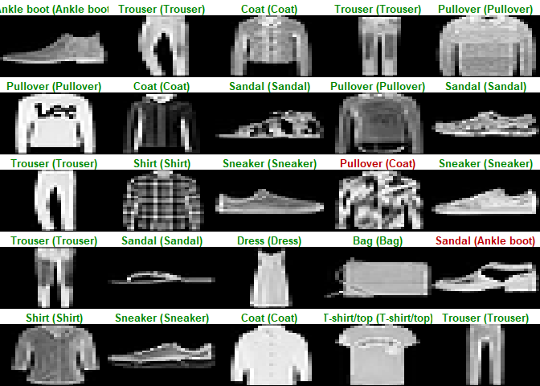
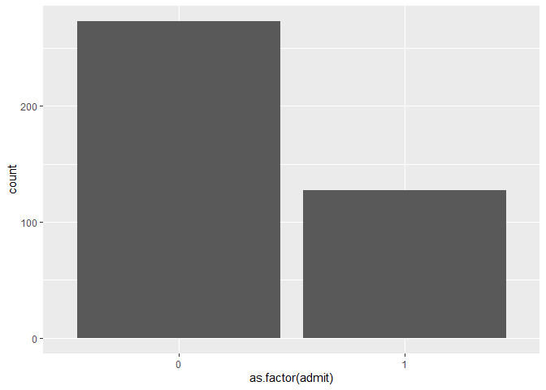
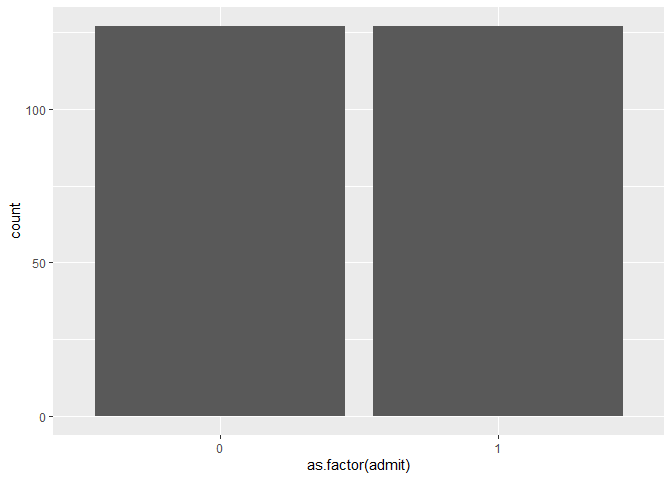

# Deep Neural Network - TensorFlow  

Untuk menjalankan kode dibawah perlu install `tensorflow` terliebih
dahulu. Untuk menginstallnya perlu install Anaconda terlebih dahulu.
Untuk lengkapnya silahkan ikuti video
[ini](https://www.youtube.com/watch?v=Maf6xmQI-wM) atau langsung dari
dokumentasi resminya
[disini](https://tensorflow.rstudio.com/installation/)

Kodean dibahwa ini beracu pada artikel
[ini](https://tensorflow.rstudio.com/tutorials/beginners/basic-ml/tutorial_basic_classification/)

Load Library
============

``` r
library(keras)
library(knitr)
library(dplyr)
library(tidyr)
library(ggplot2)
```

Import Data
===========

Data yang digunakan adalah datasets gambar tentang fashion dari library
keras

``` r
fashion_mnist <- dataset_fashion_mnist()

train_images <- fashion_mnist$train$x
train_labels <- fashion_mnist$train$y

test_images <- fashion_mnist$test$x
test_labels <- fashion_mnist$test$y
```

Setiap gambar terdiri dari 28 x 28 array yang bernilai antara 0-255,
yang merepresentasikan warna dalam rgb. Terdapat 10 label dari gambar,
sebagai berikut

``` r
class_names <- c('T-shirt/top',
                'Trouser',
                'Pullover',
                'Dress',
                'Coat', 
                'Sandal',
                'Shirt',
                'Sneaker',
                'Bag',
                'Ankle boot')

data.frame(Digit = 0:9,
           Class = class_names) %>%
      kable()
```

|  Digit| Class       |
|------:|:------------|
|      0| T-shirt/top |
|      1| Trouser     |
|      2| Pullover    |
|      3| Dress       |
|      4| Coat        |
|      5| Sandal      |
|      6| Shirt       |
|      7| Sneaker     |
|      8| Bag         |
|      9| Ankle boot  |

Explore Data
============

Cek Dimensi Data
----------------

``` r
dim(train_images)
```

    ## [1] 60000    28    28

``` r
dim(train_labels)
```

    ## [1] 60000

``` r
train_labels[1:20]
```

    ##  [1] 9 0 0 3 0 2 7 2 5 5 0 9 5 5 7 9 1 0 6 4

``` r
dim(test_images)
```

    ## [1] 10000    28    28

``` r
dim(test_labels)
```

    ## [1] 10000

Liat Gambar
-----------

``` r
image_1 <- as.data.frame(train_images[1, , ])
colnames(image_1) <- seq_len(ncol(image_1))
image_1$y <- seq_len(nrow(image_1))
image_1 <- gather(image_1, "x", "value", -y)
image_1$x <- as.integer(image_1$x)

ggplot(image_1, aes(x = x, y = y, fill = value)) +
  geom_tile() +
  scale_fill_gradient(low = "white", high = "black", na.value = NA) +
  scale_y_reverse() +
  theme_minimal() +
  theme(panel.grid = element_blank())   +
  theme(aspect.ratio = 1) +
  xlab("") +
  ylab("")
```


``` r
par(mfcol=c(5,5))
par(mar=c(0, 0, 1.5, 0), xaxs='i', yaxs='i')
for (i in 1:25) { 
  img <- train_images[i, , ]
  img <- t(apply(img, 2, rev)) 
  image(1:28, 1:28, img, col = gray((0:255)/255), xaxt = 'n', yaxt = 'n',
        main = paste(class_names[train_labels[i] + 1]))
}
```


Preprocess Data
===============

Memperkecil skala dari data. Dibagi 255 karena kita tau batas atasnya
255, sehingga data akan berubah menjadi 0-1

``` r
train_images <- train_images / 255
test_images <- test_images / 255
```

BUild MOdel
===========

Setup Layer
-----------

``` r
model <- keras_model_sequential()
model %>%
  layer_flatten(input_shape = c(28, 28)) %>%
  layer_dense(units = 128, activation = 'relu') %>%
  layer_dense(units = 64, activation = 'relu') %>%
  layer_dense(units = 10, activation = 'softmax')
```

Layer pertama adalah input layer yang akan disesuaikan dengan jumlah
pixel pada gambar, yaitu 28 x 28. Layer kedua adalah hidden layer
pertama dengan node sebanyak 128 dan activation function relu Layer
ketiga adalah hidden layer kedua dengan jumla node 64 dan serta
activation function relu. Terakhir adalah output layer yang jumlahnya
disesuaikan dengan jumlah labels, activation yang digunakan adalah
softmax agar menjamin nilainya antara 0-1

Jika ingin menggunakan lebih banyak hidden layer silahkan ditambahkan
saja

Compile Model
-------------

Tahap ini digunakan untuk mendefinisikan loss function, optimizer yang
digunakan dan matriks penilaian yang akan digunakan

``` r
model %>% compile(
  optimizer = 'adam', 
  loss = 'sparse_categorical_crossentropy',
  metrics = c('accuracy')
)
```

Train Model
-----------

argumen `epochs` digunakan untuk mengatur berapa kali model akan melihat
data yang. Semakin besar nilainya diharapkan akan semakin bagus modelnya
akan tetapi akan memakan waktu penghitngan yang lama. Selain itu semakin
besar nilainya akan memungkinkan terjadinya overfitting karena model
akan cenderung mengingat data

`verbose` bernilai 0,1,2. Jika 0 maka progress iterasi tiap epochs tidak
akan ditampilkan, jika 1 akan ditampilkan dengan jelas, dan jika
bernilai 2 akan tampil seperti dibawah ini

``` r
model %>% 
      fit(train_images, train_labels, epochs = 5, verbose = 2)

class(train_labels)
```

    ## [1] "array"

Evaluate Model
--------------

``` r
score <- model %>% 
      evaluate(test_images, test_labels, verbose = 0)

score %>%
      t() %>%
      as.data.frame() %>%
      kable()
```

|      loss|  accuracy|
|---------:|---------:|
|  0.372153|    0.8667|

Make Predictions
----------------

``` r
predictions <- model %>% 
      predict(test_images)
predictions[1, ]
```

    ##  [1] 5.666955e-06 2.547826e-07 1.768744e-07 3.066127e-08 1.269903e-06
    ##  [6] 3.705100e-01 1.502483e-06 3.151799e-02 9.242844e-06 5.979539e-01

Sebagai contoh diatas adalah prediksi untuk data pertama. 10 nilai
diatas merupakan peluang data tersebut masuk ke setiap label. Peluang
terbesar yang akan dipilih

``` r
which.max(predictions[1, ])
```

    ## [1] 10

Sebagai alternatif kita bisa langsung memprediksi label classnya

``` r
class_pred <- model %>% 
      predict_classes(test_images)
class_pred[1:20]
```

    ##  [1] 9 2 1 1 6 1 4 6 5 7 4 5 5 3 4 1 2 2 8 0

### Visualisasi

``` r
par(mfcol=c(5,5))
par(mar=c(0, 0, 1.5, 0), xaxs='i', yaxs='i')
for (i in 1:25) { 
  img <- test_images[i, , ]
  img <- t(apply(img, 2, rev)) 
  predicted_label <- which.max(predictions[i, ]) - 1
  true_label <- test_labels[i]
  if (predicted_label == true_label) {
    color <- '#008800' 
  } else {
    color <- '#bb0000'
  }
  image(1:28, 1:28, img, col = gray((0:255)/255), xaxt = 'n', yaxt = 'n',
        main = paste0(class_names[predicted_label + 1], " (",
                      class_names[true_label + 1], ")"),
        col.main = color)
}
```



Menggunakan Data Sendiri
========================

Load data
---------

``` r
ipeh <- read.csv("data_Ipeh.csv", header=T)
ipeh %>%
  head(10) %>%
  kable()
```

|  admit|  gre|   gpa|  rank|
|------:|----:|-----:|-----:|
|      0|  380|  3.61|     3|
|      1|  660|  3.67|     3|
|      1|  800|  4.00|     1|
|      1|  640|  3.19|     4|
|      0|  520|  2.93|     4|
|      1|  760|  3.00|     2|
|      1|  560|  2.98|     1|
|      0|  400|  3.08|     2|
|      1|  540|  3.39|     3|
|      0|  700|  3.92|     2|

Normalisasi Data
----------------

``` r
normalisasi <- function(r){
  return((r-min(r))/(max(r)-min(r)))
}

# normalisasi semua atribut kecuali target class
for(i in colnames(ipeh[-1])){
    ipeh[ ,i]=normalisasi(ipeh[ ,i])
}
str(ipeh)
```

    ## 'data.frame':    400 obs. of  4 variables:
    ##  $ admit: int  0 1 1 1 0 1 1 0 1 0 ...
    ##  $ gre  : num  0.276 0.759 1 0.724 0.517 ...
    ##  $ gpa  : num  0.776 0.81 1 0.534 0.385 ...
    ##  $ rank : num  0.667 0.667 0 1 1 ...

Eksplorsi Data
--------------

``` r
ipeh %>% 
  ggplot(aes(x = as.factor(admit))) + 
  geom_bar()
```



``` r
ipeh %>% 
  group_by(admit) %>% 
  summarise(banyak=n()) %>%
  kable()
```

|  admit|  banyak|
|------:|-------:|
|      0|     273|
|      1|     127|

Karena kelas tidak balance, maka kelas 0=273 diambil sebanyak kelas
1=127. sehingga tiap kelas sama sama memiliki 127 observasi.

``` r
ipehadmit0 <- ipeh %>% filter(admit==0)
ipehadmit1 <- ipeh %>% filter(admit==1)

sample <- sample(273, 127, T)

ipehadmit0fix <- ipehadmit0[sample, ]
ipehfix <- rbind(ipehadmit0fix,ipehadmit1)

ipehfix %>% 
  ggplot(aes(x = as.factor(admit))) + 
  geom_bar()
```



Terlihat data sudah balance

Split Data
----------

``` r
set.seed(666)
ipehmat <- as.matrix(ipehfix)
dimnames(ipehmat) <- NULL

sampel <- sample(2,nrow(ipehmat),replace = T, prob = c(0.8,0.2))
trainingdat <- ipehmat[sampel==1, ]
testingdat <- ipehmat[sampel==2, ]

print(paste("Jumlah train data :", nrow(trainingdat), " || Jumlah test data :", nrow(testingdat)))
```

    ## [1] "Jumlah train data : 206  || Jumlah test data : 48"

``` r
trainingdatfeature <- trainingdat[ ,2:4]
testingdatfeature <- testingdat[ ,2:4]
trainingdattarget <- to_categorical(trainingdat[,1])
testingdattarget <- to_categorical(testingdat[,1])
```

Buat Model
----------

Membuat model deep neural network dengan 3 hidden layer

``` r
modelkeras <- keras_model_sequential()
modelkeras %>% 
    layer_dense(units = 20, activation = 'relu', input_shape = c(3)) %>% 
    layer_dense(units = 20, activation = 'relu') %>% 
    layer_dense(units = 20, activation = 'relu') %>% 
    layer_dense(units = 2, activation = 'sigmoid')

summary(modelkeras)
```

    ## Model: "sequential_1"
    ## ________________________________________________________________________________
    ## Layer (type)                        Output Shape                    Param #     
    ## ================================================================================
    ## dense_3 (Dense)                     (None, 20)                      80          
    ## ________________________________________________________________________________
    ## dense_4 (Dense)                     (None, 20)                      420         
    ## ________________________________________________________________________________
    ## dense_5 (Dense)                     (None, 20)                      420         
    ## ________________________________________________________________________________
    ## dense_6 (Dense)                     (None, 2)                       42          
    ## ================================================================================
    ## Total params: 962
    ## Trainable params: 962
    ## Non-trainable params: 0
    ## ________________________________________________________________________________

units pada layer\_dense pertama berarti bahwa hidden layer pertama
memiliki 20 node, activation merupakan fungsi aktivasi yang digunakan,
pada kasus ini digunakan relu, input\_shape merupakan banyaknya kolom
pada data training. layer\_dense yang kedua merupakan hidden layer
kedua, layer\_Dense ketiga merupakan hidden layer ketiga, dst,
layer\_dense terakhir merupakan layer output, units pada layer ini
menggambarkan banyaknya kelas yang akan diprediksi, karena kita
menggunakan admit dan tidak admit (2 kelas), maka units yang digunakan
adalah 2. sigmoid digunakan untuk karena memiliki nilai 0-1, yang
digunakan sebagai estimasi peluang masuk ke kelas tertentu.

kompilasi
---------

``` r
modelkeras %>% compile(
     loss = 'binary_crossentropy',
     optimizer = 'adam',
     metrics = 'accuracy'
 )
```

loss merupakan fungsi los, digunakan binary cross entropy karena kelas
yang digunakan hanya dua (categorical\_crossentropy untuk ), optimizer
merupakan metode yang digunakan untuk mengoptimasi loss (seperti
gradient descent), metrics, merupakan pengukuran yang akan ditampilkan
saat training model.

Training Model
--------------

Silahkan ganti `verbose` jadi 1 atau 2 untuk melihat proses runningnya

``` r
modelkeras %>% fit(
     trainingdatfeature, 
     trainingdattarget, 
     epochs = 300, 
     batch_size = 20, 
     validation_split = 0.2,
     verbose = 0
 )
```

epoch merupakan banyaknya pengulangan model melakukan training, semakin
banyak perulangan semakin banyak waktu yang diperlukan, semakin tinggi
akurasi yang dihasilkan. batch size merupakan banyaknya data yang
digunakan dalam sekali epoch. validation split merupakan proporsi data
yang digunakan untuk validasi.

Testing
-------

``` r
set.seed(27)
classes <- modelkeras %>% predict_classes(testingdatfeature, batch_size = 20)
table(testingdattarget[,2],classes)
```

    ##    classes
    ##      0  1
    ##   0 27  3
    ##   1 12  6

Evaluate
--------

``` r
score <- modelkeras %>%
  evaluate(testingdatfeature, testingdattarget, verbose = 0)
score
```

    ##      loss  accuracy 
    ## 0.7211607 0.6875000


